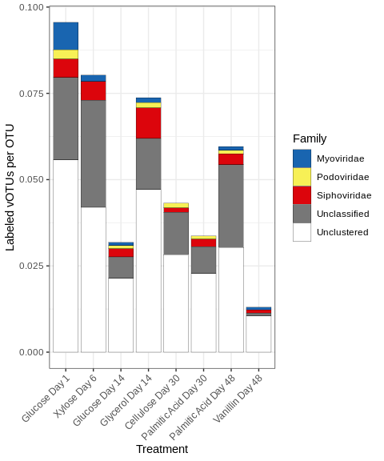

Phage metagenomic-SIP
================
Sam Barnett
20 July, 2021

## Introduction

In a previous study, we used metagenomic-SIP to identify 13C-labeled
contigs in soil microcosms treated with 9 distinct carbon substrates.
Here we expand upon those findings by examining the 13C-labeled viral
populations (vOTUs). If a vOTU is 13C-labeled its host is likely an
organism that assimilated C from the substrates and is therefore
involved in soil carbon cycling in the microcosms. Thus, these vOTUs are
themselves involved in the soil carbon cycle by potentially lysing these
active organisms releasing their biomass into the soil organic matter
pool.

Here we will identify these vOTUs, examine their diversity, and attempt
to identify bacterial hosts. The raw sequencing data, assembled contigs,
and IMG annotations are available through the JGI genome portal under
proposal 503502.

### Initialization

``` r
# Libraries
library(dplyr)
library(ggplot2)
library(grid)
library(gridExtra)
library(ggtext)
library(knitr)


# Legend extraction function
g_legend<-function(a.gplot){
  tmp <- ggplot_gtable(ggplot_build(a.gplot))
  leg <- which(sapply(tmp$grobs, function(x) x$name) == "guide-box")
  legend <- tmp$grobs[[leg]]
  return(legend)}

# Color scheme function from Paul Tol colors
source("/home/sam/new_repo/paul_tol_colors.R")

# Handy dataframes and lists including read depths and treatment name levels for ordering
read.depths = data.frame(Microcosm = c("Control_Day1", "Control_Day6", "Control_Day14", "Control_Day30", "Control_Day48",
                                       "Glucose_Day1", "Xylose_Day6", "Glucose_Day14", "Glycerol_Day14", 
                                       "Cellulose_Day30", "PalmiticAcid_Day30", "PalmiticAcid_Day48", "Vanillin_Day48"),
                         n_reads = c(600398782, 537771884, 778966874, 1279583274, 1326945180, 
                                     818866782, 750644734, 662897402, 685015110, 707180514, 632500566, 602121814, 548508008))

treat.read.depths = data.frame(Substrate = c("Glucose", "Xylose", "Glucose", "Glycerol", "Cellulose", "PalmiticAcid", "PalmiticAcid", "Vanillin"),
                               Day = c(1, 6, 14, 14, 30, 30, 48, 48),
                               n_reads = c(818866782, 750644734, 662897402, 685015110, 707180514, 632500566, 602121814, 548508008))

treatment_levels = c("Glucose Day 1", "Xylose Day 6", "Glucose Day 14", "Glycerol Day 14", 
                     "Cellulose Day 30", "Palmitic Acid Day 30", "Palmitic Acid Day 48", "Vanillin Day 48")
```

### Data import and merging

#### FullCyc1 bacterial OTU data

This data includes the assimilation and growth patterns of 13C-labeled
bacterial OTUs from the original MW-HR-SIP study \[LINK?\]

``` r
# Dataframe for converting microcosm name into substrate and day
treat_conversions = data.frame(Sub = c("13C-Glu", "13C-Xyl", "13C-Gly", "13C-Cel", "13C-Pal", "13C-Van", "13C-Oxa", "13C-Lac", "13C-Ami"),
                               Substrate = c("Glucose", "Xylose", "Glycerol", "Cellulose", "PalmiticAcid", "Vanillin", "Oxalate", "Lactate", "AminoAcids"))


# Import growth dynamic data
DNA_yields.df = data.frame(Day = c(0, 1, 3, 6, 14, 30, 48),
                           DNA_yield = c(11.152, 14.9336, 15.69485714, 16.95704, 15.47669333, 15.1208, 13.60342857))
FullCyc1_growth.df = read.table("/home/sam/FullCyc_metagenome/phage_assembly/FullCyc_OTU_growth_dynamics.txt", sep="\t", header=TRUE, fill=TRUE) %>%
  tidyr::gather(key = Day, value = abundance, -FG, -PC1, -OTU) %>%
  mutate(Day = as.numeric(gsub("X", "", Day))) %>%
  left_join(DNA_yields.df, by = "Day") %>%
  mutate(norm_abundance = (abundance/100)*DNA_yield)

# Importing the incorporator data
treat_head = paste("treat", seq(1, 37), sep="_")
FullCyc1_incorp.df = read.table("/home/sam/FullCyc_metagenome/phage_assembly/FullCyc_OTU_labeling.txt", sep="\t", header=TRUE, fill=TRUE, stringsAsFactors = FALSE) %>%
  tidyr::separate(Substrate_incorp_on_day, into=c(treat_head), sep=",") %>%
  tidyr::gather(key = "microcosm", value="value", -OTU, -FG, -PC1, -Phylum, -Class, -Order, -Family, -Genus, -Closest_cultivated) %>%
  filter(!(is.na(value))) %>%
  tidyr::separate(value, into=c("Sub", "Day"), sep="_D") %>%
  mutate(Day = as.numeric(Day)) %>%
  left_join(treat_conversions, by = "Sub") %>%
  select(OTU, FG, Phylum, Class, Order, Family, Genus, Substrate, Day)

# Get richeness (#) labeled OTU counts
FullCyc1_incorp.sum = FullCyc1_incorp.df %>%
  group_by(Substrate, Day) %>%
  summarize(total_OTUs = n()) %>%
  as.data.frame
```

#### Metagenomic-SIP

Now lets get the metagenomic-SIP data and identify 13C-labeled contigs.

##### Assembled contigs and their coverages

Get all the contig coverages and match treatments and controls

``` r
# Contig coverages generated for metabat
contig_cov.df = read.table("/home/sam/FullCyc_metagenome/binning_1000/metabat/FullCyc_1000_depths.txt",
                           header=TRUE, sep="\t", stringsAsFactors = FALSE) %>%
  mutate(Control_Day1 = Control_Day1_mapped.sorted.bam,
         Control_Day6 = Control_Day6_mapped.sorted.bam, 
         Control_Day14 = Control_Day14_mapped.sorted.bam,
         Control_Day30 = Control_Day30_mapped.sorted.bam, 
         Control_Day48 = Control_Day48_mapped.sorted.bam, 
         Glucose_Day1  = Glucose_Day1_mapped.sorted.bam, 
         Xylose_Day6 = Xylose_Day6_mapped.sorted.bam,
         Glucose_Day14 = Glucose_Day14_mapped.sorted.bam, 
         Glycerol_Day14 = Glycerol_Day14_mapped.sorted.bam,
         Cellulose_Day30 = Cellulose_Day30_mapped.sorted.bam, 
         PalmiticAcid_Day30 = PalmiticAcid_Day30_mapped.sorted.bam,
         PalmiticAcid_Day48 = PalmiticAcid_Day48_mapped.sorted.bam, 
         Vanillin_Day48 = Vanillin_Day48_mapped.sorted.bam) %>%
  select(contigName, contigLen, Control_Day1, Control_Day6, Control_Day14, Control_Day30, Control_Day48, 
         Glucose_Day1, Xylose_Day6, Glucose_Day14, Glycerol_Day14, 
         Cellulose_Day30, PalmiticAcid_Day30, PalmiticAcid_Day48, Vanillin_Day48)

# Coverage in control samples
con_cov.df = contig_cov.df %>%
  select(contigName, Control_Day1, Control_Day6, Control_Day14, Control_Day30, Control_Day48) %>%
  tidyr::gather(key=Microcosm, value=Coverage, -contigName) %>%
  left_join(read.depths, by="Microcosm") %>%
  mutate(Control_coverage = (Coverage/n_reads)*500000000,
         Day = as.numeric(as.character(gsub("Control_Day", "", Microcosm)))) %>%
  select(contigName, Day, Control_coverage)

# Coverage in treatment samples
treat_cov.df = contig_cov.df %>%
  select(contigName, Glucose_Day1, Xylose_Day6, Glucose_Day14, Glycerol_Day14, 
         Cellulose_Day30, PalmiticAcid_Day30, PalmiticAcid_Day48, Vanillin_Day48) %>%
  tidyr::gather(key=Microcosm, value=Coverage, -contigName) %>%
  left_join(read.depths, by="Microcosm") %>%
  mutate(Treatment_coverage = (Coverage/n_reads)*500000000) %>%
  tidyr::separate(Microcosm, into=c("Substrate", "Day"), sep="_Day", convert=TRUE) %>%
  select(contigName, Substrate, Day, Treatment_coverage)

# Matching up treatment and control samples
contig_cov_diff.df = full_join(treat_cov.df, con_cov.df, by=c("contigName", "Day")) %>%
  filter(Treatment_coverage > 0 | Control_coverage > 0)

# Contig length dataframe
contig_lengths.df = select(contig_cov.df, contigName, contigLen)

# Remove these giant files to save memory
contig_cov.df = NULL
treat_cov.df = NULL
con_cov.df = NULL
```

##### Identify isotopically enriched contigs

Now filter contigs to just those we propose are from labeled organisms
(over 5X coverage in treatments and 1.5 fold increase in coverage
between treatment and controls).

``` r
# Filter to just the enriched contigs
enr_contigs.df = contig_cov_diff.df %>%
  filter(Treatment_coverage > 5) %>%
  mutate(FC_cov = Treatment_coverage/Control_coverage) %>%
  filter(FC_cov > 1.5)

# Remove the full dataframe to save memory
contig_cov_diff.df = NULL

# Get counts of enriched contigs
enr_contigs.sum = enr_contigs.df %>%
  group_by(Substrate, Day) %>%
  summarize(n_contigs = n()) %>%
  as.data.frame %>%
  left_join(treat.read.depths, by = c("Substrate", "Day")) %>%
  mutate(treatment = factor(paste(gsub("Acid", " Acid", Substrate), "Day", Day, sep=" "), levels = treatment_levels),
         adj_n_contigs = (n_contigs/n_reads)*5000000)

print(paste("There are", length(unique(enr_contigs.df$contigName)), "enriched contigs in total"))
```

    ## [1] "There are 639258 enriched contigs in total"

``` r
#write.table(enr_contigs.df, file = "/home/sam/FullCyc_metagenome/phage_assembly/labeled_contigs.txt", sep="\t", quote=FALSE, row.names = FALSE)
```

##### Genes from isotopically labeled contigs

Using the contig annotations from IMG I’ll pull out the genes and
annotations from the enriched contigs.

``` r
# Get table of gene annotations
annotation_tbl = read.table("/home/sam/FullCyc_metagenome/annotation/IMG/Ga0334612_product_names.tsv", 
                            sep="\t", quote="", header=FALSE, stringsAsFactors = FALSE) %>%
  rename(geneID = V1, product = V2, prod_group = V3) %>%
  #filter(product != "hypothetical protein") %>%
  tidyr::separate(geneID, into=c("Project", "Scaffold", "start", "end"), sep="_", remove=FALSE) %>%
  mutate(Scaffold = paste(Project, Scaffold, sep="_")) %>%
  select(-Project)

# Get mapping of contigs to IMG contig names
contigs.df = read.table("/home/sam/FullCyc_metagenome/annotation/IMG/Ga0334612_contig_names_mapping.tsv", sep="\t", header=FALSE, stringsAsFactors = FALSE) %>%
  rename(contigName = V1, Scaffold = V2) %>%
  filter(Scaffold %in% unique(annotation_tbl$Scaffold))

annotation.df = full_join(contigs.df, annotation_tbl, by = "Scaffold")
annotation_tbl = NULL
contigs.df = NULL

# Match genes to enriched contigs and remove genes that are not proteins
enr_genes.df = inner_join(annotation.df, enr_contigs.df, by="contigName") %>%
  filter(!(prod_group %in% c("tRNA", "tmRNA", "ncRNA", "rRNA_5S", "rRNA_16S", "rRNA_23S", "rRNA_18S", "rRNA_28S")))
annotation.df = NULL
```

## VirSorter results

We used VirSorter to identify 13C-labeled contigs that may be from
viruses. For quality, we use only virsorter categories 1 and 2. We also
used BLASTn to align these contigs to cluster them into vOTU. None
clustered therefore all contigs are non-overlapping viral populations
(vOTUs).

``` r
virsorterfile = "/home/sam/FullCyc_metagenome/phage_assembly/virsorter_out/VIRSorter_global-phage-signal.csv"
vs.pred <- read.csv(virsorterfile,quote="",head=F)
vs.head <- read.table(virsorterfile,sep=",",quote="",head=T,comment="",skip=1,nrows=1)
colnames(vs.pred) <- colnames(vs.head)
colnames(vs.pred)[1] <- "vs.id"
vs.cats <- do.call(rbind,strsplit(x=as.character(vs.pred$vs.id[grep("category",vs.pred$vs.id)]),split=" - ",fixed=T))[,2]
vs.num <- grep("category",vs.pred$vs.id)
vs.pred$Category <- paste(c("",rep.int(vs.cats, c(vs.num[-1],nrow(vs.pred)) - vs.num)), vs.pred$Category)
vs.pred <- vs.pred[-grep("#",vs.pred$vs.id),]

VirSorter_out_labeled.df = vs.pred %>%
  mutate(contigName = gsub("VIRSorter_", "", vs.id)) %>%
  filter(contigName %in% unique(enr_contigs.df$contigName)) %>%
  left_join(contig_lengths.df, by = "contigName")

#write.table(VirSorter_out_labeled.df, file = "/home/sam/FullCyc_metagenome/phage_assembly/labeled_phage_contigs.txt", sep="\t", quote=FALSE, row.names = FALSE)
```

### How does 13C-labeled vOTU richess compare to 13C-labeled bacterial OTU richess?

``` r
# Get vOTUs
VirSorter_vOTUs.df = vs.pred %>%
  mutate(contigName = gsub("VIRSorter_", "", vs.id)) %>%
  inner_join(enr_contigs.df, by = "contigName") %>%
  select(contigName, Nb.genes, Category, Nb.phage.hallmark.genes, Substrate, Day) %>%
  left_join(contig_lengths.df, by = "contigName") %>%
  filter(Category %in% c("Complete phage contigs 1", "Complete phage contigs 2"),
         contigLen > 10000)

print(paste("There are", length(unique(VirSorter_vOTUs.df$contigName)), "vOTUs"))
```

    ## [1] "There are 245 vOTUs"

``` r
# Summarize richness of vOTUs accounting for sequencing depth (# reads) and add bacterial OTU summary
VirSorter_vOTUs.sum = VirSorter_vOTUs.df %>%
  group_by(Substrate, Day) %>%
  summarize(n_vOTUs = n()) %>%
  as.data.frame %>%
  left_join(treat.read.depths, by = c("Substrate", "Day")) %>%
  mutate(adj_n_vOTUs = (n_vOTUs/n_reads)*100000000,
         Treatment = factor(paste(gsub("Acid", " Acid", Substrate), "Day", Day), levels=treatment_levels)) %>%
  left_join(FullCyc1_incorp.sum, by = c("Substrate", "Day")) %>%
  mutate(adj_n_vOTUs_perOTU = adj_n_vOTUs/total_OTUs)

# Plot
vOTU_count.plot = ggplot(data=VirSorter_vOTUs.sum, aes(x=Treatment)) +
  geom_text(y=1, aes(label=n_vOTUs), size=3) +
  labs(y="# vOTUs") +
  lims(y=c(0,2)) +
  theme_bw() +
  theme(axis.text = element_blank(),
        axis.title.x = element_blank(),
        axis.title.y = element_text(angle=0, vjust=0.5),
        axis.ticks.y = element_blank(),
        panel.grid = element_blank())

vOTU_abundance.plot = ggplot(data=VirSorter_vOTUs.sum, aes(x=Treatment, y=adj_n_vOTUs)) +
  geom_bar(stat="identity") +
  labs(y="Adjusted labeled vOTU count") +
  theme_bw() + 
  theme(axis.text.x = element_text(angle=45, hjust=1))

comb_vOTU_abundance.plot = cowplot::plot_grid(vOTU_count.plot, vOTU_abundance.plot, 
                                              ncol=1, rel_heights = c(0.1, 1), align = "v")
comb_vOTU_abundance.plot
```

<!-- -->

``` r
OTU_count.plot = ggplot(data=VirSorter_vOTUs.sum, aes(x=Treatment)) +
  geom_text(y=1, aes(label=total_OTUs), size=3) +
  labs(y="# OTUs") +
  lims(y=c(0,2)) +
  theme_bw() +
  theme(axis.text = element_blank(),
        axis.title.x = element_blank(),
        axis.title.y = element_text(angle=0, vjust=0.5),
        axis.ticks.y = element_blank(),
        panel.grid = element_blank())

vOTU_vs_OTU.plot = ggplot(data=VirSorter_vOTUs.sum, aes(x=Treatment, y=adj_n_vOTUs_perOTU)) +
  geom_bar(stat="identity") +
  labs(y="Labeled vOTUs per labeled OTU") +
  theme_bw() + 
  theme(axis.text.x = element_text(angle=45, hjust=1))

comb_vOTU_vs_OTU.plot = cowplot::plot_grid(vOTU_count.plot, OTU_count.plot, vOTU_vs_OTU.plot, 
                                              ncol=1, rel_heights = c(0.1, 0.1, 1), align = "v")
comb_vOTU_vs_OTU.plot
```

<!-- -->

Run the correlation between the two richnesses and make a figure. I’ll
add the figure to a composite figure a bit
later.

``` r
vOTU_vs_bOTU.cor = cor.test(VirSorter_vOTUs.sum$adj_n_vOTUs, VirSorter_vOTUs.sum$total_OTUs)
vOTU_vs_bOTU.cor
```

    ## 
    ##  Pearson's product-moment correlation
    ## 
    ## data:  VirSorter_vOTUs.sum$adj_n_vOTUs and VirSorter_vOTUs.sum$total_OTUs
    ## t = 2.5354, df = 6, p-value = 0.04436
    ## alternative hypothesis: true correlation is not equal to 0
    ## 95 percent confidence interval:
    ##  0.02942196 0.94496078
    ## sample estimates:
    ##       cor 
    ## 0.7191841

``` r
vOTU_vs_bOTU.plot = ggplot(data=VirSorter_vOTUs.sum, aes(x=total_OTUs, y=adj_n_vOTUs)) +
  geom_smooth(method="lm") +
  geom_point()
```

## vConTACT2 Phage taxonomy

We used vConTACT2 to cluster vOTUs and RefSeq viral genomes based on
protein sharing in order to classify the vOTU

### Make table to run

First make the table of the vOTUs. This table is needed to run vConTACT2

``` r
vOTUs_4_vContact2.df = vs.pred %>%
  mutate(contigName = gsub("VIRSorter_", "", vs.id)) %>%
  filter(contigName %in% unique(enr_contigs.df$contigName)) %>%
  left_join(contig_lengths.df, by = "contigName")%>%
  filter(Category %in% c("Complete phage contigs 1", "Complete phage contigs 2"),
         contigLen > 10000)
#write.table(vOTUs_4_vContact2.df, file = "/home/sam/FullCyc_metagenome/phage_assembly/vOTUs_for_vContact2.txt", sep="\t", quote=FALSE, row.names = FALSE)
```

### View vOTU taxonomy

vOTU taxonomy is based on co-clustered RefSeq
genomes.

``` r
ref_genomes.df = read.table("/home/sam/FullCyc_metagenome/phage_assembly/cOTU_Vcontact2_output/genome_by_genome_overview.csv", sep=",", header=TRUE, stringsAsFactors = FALSE)

ref_tax.df = ref_genomes.df %>%
  select(VC.Subcluster, Order, Family) %>%
  filter(VC.Subcluster != "", Family != "Unassigned") %>%
  unique

vOTUs_vContact2.df = ref_genomes.df %>%
  select(Genome, VC.Status, VC.Subcluster) %>%
  filter(grepl("scaffold", Genome)) %>%
  rename(contigName = Genome) %>%
  left_join(ref_tax.df, by = "VC.Subcluster") %>%
  select(contigName, Order, Family, VC.Status, VC.Subcluster) %>%
  unique() %>%
  mutate(Family = ifelse(VC.Subcluster == "", "Unclustered",
                         ifelse(is.na(Family), "Unclassified cluster", Family)))
```

Vizualize the taxonomic diversity of the vOTU across treatments.

``` r
# Write out the taxonomies
print(paste("There are", nrow(vOTUs_vContact2.df), "vOTUs"))
```

    ## [1] "There are 245 vOTUs"

``` r
print(paste("There are", nrow(filter(vOTUs_vContact2.df, Family == "Unclustered", grepl("Singleton", VC.Status))), "unclustered Singleton vOTUs"))
```

    ## [1] "There are 62 unclustered Singleton vOTUs"

``` r
print(paste("There are", nrow(filter(vOTUs_vContact2.df, Family == "Unclustered", grepl("Outlier", VC.Status))), "unclustered Outlier vOTUs"))
```

    ## [1] "There are 95 unclustered Outlier vOTUs"

``` r
print(paste("There are", nrow(filter(vOTUs_vContact2.df, Family == "Unclustered", grepl("Overlap", VC.Status))), "unclustered Overlap vOTUs"))
```

    ## [1] "There are 4 unclustered Overlap vOTUs"

``` r
print(paste("There are", nrow(filter(vOTUs_vContact2.df, Family == "Unclassified cluster")), "unclassified but clustered vOTUs"))
```

    ## [1] "There are 57 unclassified but clustered vOTUs"

``` r
print(paste("There are", nrow(filter(vOTUs_vContact2.df, Family == "Myoviridae")), "Myoviridae vOTUs"))
```

    ## [1] "There are 5 Myoviridae vOTUs"

``` r
print(paste("There are", nrow(filter(vOTUs_vContact2.df, Family == "Podoviridae")), "Podoviridae vOTUs"))
```

    ## [1] "There are 6 Podoviridae vOTUs"

``` r
print(paste("There are", nrow(filter(vOTUs_vContact2.df, Family == "Siphoviridae")), "Siphoviridae vOTUs"))
```

    ## [1] "There are 16 Siphoviridae vOTUs"

``` r
print(paste("There are", nrow(filter(vOTUs_vContact2.df, Family != "Unclustered")), "clustered vOTUs"))
```

    ## [1] "There are 84 clustered vOTUs"

``` r
print(paste("There are", length(unique(filter(vOTUs_vContact2.df, VC.Subcluster != "")$VC.Subcluster)), "clusters"))
```

    ## [1] "There are 45 clusters"

``` r
# Set family colors
taxa.col = c(paultol_colors(3), "#777777", "#FFFFFF")
names(taxa.col) = c("Myoviridae", "Podoviridae", "Siphoviridae", "Unclassified", "Unclustered")

# Summarize taxonomy across treatments
vOTUs_vContact2.sum = vOTUs_vContact2.df %>%
  left_join(enr_contigs.df, by = "contigName") %>%
  group_by(Substrate, Day, Family) %>%
  summarize(n_vOTUs = n()) %>%
  as.data.frame %>%
  left_join(treat.read.depths, by = c("Substrate", "Day")) %>%
  mutate(adj_n_vOTUs = (n_vOTUs/n_reads)*100000000,
         Treatment = factor(paste(gsub("Acid", " Acid", Substrate), "Day", Day), levels=treatment_levels)) %>%
  left_join(FullCyc1_incorp.sum, by = c("Substrate", "Day")) %>%
  mutate(adj_n_vOTUs_perOTU = adj_n_vOTUs/total_OTUs) %>%
  group_by(Treatment) %>%
  mutate(total_vOTUs = sum(n_vOTUs)) %>%
  ungroup %>%
  mutate(prop_vOTUs = n_vOTUs/total_vOTUs,
         Family = factor(ifelse(Family == "Unclassified cluster", "Unclassified", Family),
                         levels = c("Myoviridae", "Podoviridae", "Siphoviridae", "Unclassified", "Unclustered")))
```

    ## `summarise()` has grouped output by 'Substrate', 'Day'. You can override using the `.groups` argument.

``` r
# vOTU richness plot (adjusted for sequencing depth)
tax_count.plot = ggplot(data=vOTUs_vContact2.sum, aes(x=Treatment, y=Family)) +
    geom_text(aes(label=n_vOTUs), size=3) +
    theme_bw() +
    theme(axis.text.x = element_blank(),
          axis.title.x = element_blank(),
          axis.title.y = element_blank(),
          axis.ticks.y = element_blank(),
          panel.grid = element_blank())

vOTU_abundance_TAX.plot = ggplot(data=vOTUs_vContact2.sum, aes(x=Treatment, y=adj_n_vOTUs, fill=Family)) +
  geom_bar(stat="identity", color="black", size=0.1) +
  labs(y="Adjusted count of labeled vOTUs") + 
  scale_fill_manual(values=taxa.col) +
  theme_bw() + 
  theme(axis.text.x = element_text(angle=45, hjust=1))

combo_vOTU_abundance_TAX.plot = cowplot::plot_grid(tax_count.plot, vOTU_abundance_TAX.plot, 
                                              ncol=1, rel_heights = c(0.2, 1), align = "v", axis = "lr")
combo_vOTU_abundance_TAX.plot
```

<!-- -->

``` r
# vOTUs per bacterial OTU
vOTU_vs_OTU_TAX.plot = ggplot(data=vOTUs_vContact2.sum, aes(x=Treatment, y=adj_n_vOTUs_perOTU, fill=Family)) +
  geom_bar(stat="identity", color="black", size=0.1) +
  labs(y="Labeled vOTUs per OTU") +
  scale_fill_manual(values=taxa.col) +
  theme_bw() + 
  theme(axis.text.x = element_text(angle=45, hjust=1))
vOTU_vs_OTU_TAX.plot
```

<!-- -->

``` r
# Proportion of 13C-labeled vOTU from each Family
vOTU_prop_TAX.plot = ggplot(data=vOTUs_vContact2.sum, aes(x=Treatment, y=prop_vOTUs, fill=Family)) +
  geom_bar(stat="identity", color="black", size=0.1) +
  labs(y="Proportion of labeled clustered vOTUs") + 
  scale_fill_manual(values=taxa.col) +
  theme_bw() + 
  theme(axis.text.x = element_text(angle=45, hjust=1))
vOTU_prop_TAX.plot
```

<!-- -->

Make second half of vOTU figure for
publication

``` r
tax_count.plot = ggplot(data=vOTUs_vContact2.sum, aes(x=Treatment, y=Family)) +
    geom_text(aes(label=n_vOTUs), size=6*5/14) +
    theme_bw() +
    theme(axis.text.x = element_blank(),
          axis.text.y = element_text(size=7),
          axis.title.x = element_blank(),
          axis.title.y = element_blank(),
          axis.ticks.y = element_blank(),
          panel.grid = element_blank(),
          plot.margin = margin(5,0,0,0, unit="mm"))

vOTU_abundance_TAX.plot = ggplot(data=vOTUs_vContact2.sum, aes(x=Treatment, y=adj_n_vOTUs, fill=Family)) +
  geom_bar(stat="identity", color="black", size=0.1) +
  labs(y="Relative richness of<br><sup>13</sup>C-labeled vOTU") + 
  scale_fill_manual(values=taxa.col) +
  theme_bw() + 
  theme(axis.text.x = element_text(angle=45, hjust=1, size=7),
        axis.text.y = element_text(size=7),
        axis.title.x = element_text(size=8),
        axis.title.y = element_markdown(size=8),
        panel.grid.major.x = element_blank(),
        legend.position = "none",
        plot.margin = margin(0,2,0,0, unit="mm"))

combo_vOTU_abundance_TAX.plot = cowplot::plot_grid(tax_count.plot, vOTU_abundance_TAX.plot, 
                                              ncol=1, rel_heights = c(0.3, 1), align = "v", axis = "lr")

vOTU_vs_bOTU.plot = ggplot(data=VirSorter_vOTUs.sum, aes(x=total_OTUs, y=adj_n_vOTUs)) +
  geom_smooth(method="lm", color="red", fill="red") +
  geom_point(size=2, color="black", shape=21, fill="white") +
  labs(x="Richness of <sup>13</sup>C-labeled<br>bacterial OTU<sub>rRNA</sub>",
       y="Relative richness of<br><sup>13</sup>C-labeled vOTU") +
  theme_bw() +
  theme(axis.text = element_text(size=7),
        axis.title.x = element_markdown(size=8),
        axis.title.y = element_markdown(size=8),
        legend.position = "none",
        plot.margin = margin(5,2,2,0, unit="mm"))


fig1bc.plot = cowplot::plot_grid(combo_vOTU_abundance_TAX.plot, vOTU_vs_bOTU.plot, ncol=1,
                                 rel_heights = c(1, 0.5), labels=c("B", "C"), label_size = 9)
```

    ## `geom_smooth()` using formula 'y ~ x'

``` r
fig1bc.plot
```

<!-- -->

### Vcontact2 protein sharing network

Next, vizualize the protein sharing network. To simplify, only include
references with some connection to the vOTU.

``` r
# Read in the network 
cytoscape_full.nwk = read.table("/home/sam/FullCyc_metagenome/phage_assembly/cOTU_Vcontact2_output/c1.ntw", sep=" ")

# Get only references with some connection to vOTU. To to this, I'll first select all vOTU, then all genomes connected to a vOTU, then all genomes connected to those genomes and so on untill no new genomes are added. Should take about six rounds of connections.
subset1 = cytoscape_full.nwk %>%
  filter(grepl("scaffold", V1) | grepl("scaffold", V2)) %>%
  tidyr::gather(key="vertx", value="Genome", -V3) %>%
  select(Genome) %>%
  unique

subset2 = cytoscape_full.nwk %>%
  filter(V1 %in% subset1$Genome | V2 %in% subset1$Genome) %>%
  tidyr::gather(key="vertx", value="Genome", -V3) %>%
  select(Genome) %>%
  unique

subset3 = cytoscape_full.nwk %>%
  filter(V1 %in% subset2$Genome | V2 %in% subset2$Genome) %>%
  tidyr::gather(key="vertx", value="Genome", -V3) %>%
  select(Genome) %>%
  unique

subset4 = cytoscape_full.nwk %>%
  filter(V1 %in% subset3$Genome | V2 %in% subset3$Genome) %>%
  tidyr::gather(key="vertx", value="Genome", -V3) %>%
  select(Genome) %>%
  unique

subset5 = cytoscape_full.nwk %>%
  filter(V1 %in% subset4$Genome | V2 %in% subset4$Genome) %>%
  tidyr::gather(key="vertx", value="Genome", -V3) %>%
  select(Genome) %>%
  unique

subset6 = cytoscape_full.nwk %>%
  filter(V1 %in% subset5$Genome | V2 %in% subset5$Genome) %>%
  tidyr::gather(key="vertx", value="Genome", -V3) %>%
  select(Genome) %>%
  unique

subset7 = cytoscape_full.nwk %>%
  filter(V1 %in% subset6$Genome | V2 %in% subset6$Genome) %>%
  tidyr::gather(key="vertx", value="Genome", -V3) %>%
  select(Genome) %>%
  unique

cytoscape_subset.df = ref_genomes.df %>%
  filter(Genome %in% subset6$Genome)

cytoscape_subset.nwk = cytoscape_full.nwk %>%
  filter(V1 %in% subset6$Genome,
         V2 %in% subset6$Genome)
```

Plot the network. Note that each time this is run, the network diagram
may look different due to the stochasticity in figure generation.

``` r
library(ggnetwork)
library(network)
```

    ## network: Classes for Relational Data
    ## Version 1.16.1 created on 2020-10-06.
    ## copyright (c) 2005, Carter T. Butts, University of California-Irvine
    ##                     Mark S. Handcock, University of California -- Los Angeles
    ##                     David R. Hunter, Penn State University
    ##                     Martina Morris, University of Washington
    ##                     Skye Bender-deMoll, University of Washington
    ##  For citation information, type citation("network").
    ##  Type help("network-package") to get started.

``` r
taxa.col = c(paultol_colors(5), "#777777", "#FFFFFF")
names(taxa.col) = c("Myoviridae", "Ackermannviridae", "Herelleviridae", "Podoviridae", "Siphoviridae", "Unassigned", "vOTU")

# Get edges
edges = cytoscape_subset.nwk %>%
#edges = cytoscape_full.nwk %>%
  mutate(from = as.character(V1), to = as.character(V2), weight = V3) %>%
  select(from, to, weight) %>%
  arrange(weight)

edge_pair = c()
for (i in 1:nrow(edges)){
  from_to = c(edges[i,1], edges[i, 2])
  edge_pair[i] = paste(from_to[order(from_to)], collapse = " ")
}
edges$edge_pair = edge_pair
edge_pair_derep = edges %>%
  group_by(edge_pair) %>%
  mutate(rank = row_number()) %>%
  ungroup %>%
  filter(rank == 1) %>%
  select(from, to, weight)

# Make network
vOTU.network = network(edge_pair_derep, directed=FALSE, matrix.type="edgelist")
vOTU.ggnet = ggnetwork(vOTU.network)

# Add vertex info
vOTU_info.ggnet = cytoscape_subset.df %>%
  rename(vertex.names=Genome) %>%
  mutate(node_type = ifelse(grepl("scaffold", vertex.names), "vOTU", "Reference"),
         Taxa = ifelse(grepl("scaffold", vertex.names), "vOTU", Family)) %>%
  inner_join(vOTU.ggnet, by = "vertex.names")

vOTU_info.text = vOTU_info.ggnet %>%
  select(VC.Subcluster, x, y) %>%
  group_by(VC.Subcluster) %>%
  summarize(x = mean(x),
            y = mean(y)) %>%
  ungroup %>%
  arrange(VC.Subcluster) %>%
  mutate(cluster_ID = row_number())

# Plot
vContact2_network.plot = ggplot(vOTU_info.ggnet, aes(x = x, y = y)) +
  geom_edges(aes(xend = xend, yend = yend), color="grey", size=0.25) +
  geom_nodes(data = filter(vOTU_info.ggnet, node_type == "Reference"),
             aes(fill=Taxa), shape=21, size=1) +
  geom_nodes(data = filter(vOTU_info.ggnet, node_type == "vOTU"),
             aes(fill=Taxa), shape=21, size=1) +
  scale_fill_manual(values=taxa.col) +
  labs(size="Node type", shape="Node type", fill="Family", alpha="Score") +
  theme_bw() +
  theme(axis.text = element_blank(),
        axis.title = element_blank(),
        axis.ticks = element_blank(),
        legend.text = element_text(size=7),
        legend.title= element_blank(),
        legend.position = "bottom",
        legend.margin = margin(t=-5, unit="mm"), 
        panel.grid = element_blank(),
        panel.border = element_blank()) +
  guides(fill=guide_legend(override.aes = list(size=3), nrow=2, title.position = "top"))

vContact2_network.plot
```

<!-- -->

### Make composite taxonomy figure for publication

``` r
fig1.plot = cowplot::plot_grid(vContact2_network.plot, fig1bc.plot, ncol=2,
                               rel_widths = c(5, 2), labels=c("A", ""), label_size = 9)
fig1.plot
```

<!-- -->

``` r
#ggsave(fig1.plot, filename = "/home/sam/FullCyc_metagenome/phage_assembly/Figs4Publication/Fig1.tiff", 
#       device = "tiff", width = 7.08661, height = 5, units = "in")
```

## Matching vOTU to hosts

We will attempt three methods to link vOTUs to hosts within the soils.

### BLASTn to RefSeq results

Do any viral contigs map to RefSeq viral sequences (\>10,000 bp long,
\>95% identity over 85% of the
contig)?

``` r
blastout.df = read.table("/home/sam/FullCyc_metagenome/phage_assembly/labeled_phage_RefSeq_blastout.txt", header=FALSE, sep="\t", stringsAsFactors = FALSE)
colnames(blastout.df) = c("query_ID", "ref_ID", "perc_identity", "align_length", "mismatchs", "gaps", "qstart", "qend", "sstart", "send", "evalue", "bitscore")

kable(blastout.df %>%
        filter(query_ID != ref_ID) %>%
        rename(contigName = query_ID) %>%
        left_join(contig_lengths.df, by = "contigName") %>%
        mutate(perc_cov = (align_length/contigLen)*100) %>%
        filter(perc_cov > 85, perc_identity > 95))
```

| contigName          | ref\_ID      | perc\_identity | align\_length | mismatchs | gaps | qstart | qend | sstart | send | evalue | bitscore | contigLen | perc\_cov |
| :------------------ | :----------- | -------------: | ------------: | --------: | ---: | -----: | ---: | -----: | ---: | -----: | -------: | --------: | --------: |
| scaffold\_12470\_c1 | NC\_017971.2 |         99.754 |          5292 |        12 |    1 |    442 | 5732 |   3621 | 8912 |      0 |     9699 |      5732 |   92.3238 |

No, the only one with \>95% identity over 85% of the contig was only
~5,200 bp long :(

### CRISPR vs. vOTUs BLASTn

Do any vOTU match CRIPR spacers within this same metagenome (100%
identity over entire CRISPR spacer)? If so, then it is likely the host
of the CRISPR array is the host of the vOTU (or close
relatives).

``` r
crisper_spacers.df = read.table("/home/sam/FullCyc_metagenome/annotation/IMG/Ga0334612_crt.crisprs", header=FALSE, sep="\t", stringsAsFactors = FALSE)
colnames(crisper_spacers.df) = c("Scaffold", "CRISPR_number", "Position", "Repeat", "Spacer", "c")
crisper_spacers.df = crisper_spacers.df %>%
  mutate(Spacer_ID = paste(Scaffold, "_pos", Position, sep=""),
         Spacer_len = nchar(Spacer))

crispr_blastout.df = read.table("/home/sam/FullCyc_metagenome/phage_assembly/CRISPR_blastout.txt", header=FALSE, sep="\t", stringsAsFactors = FALSE)
colnames(crispr_blastout.df) = c("Spacer_ID", "Phage_ID", "perc_identity", "align_length", "mismatchs", "gaps", "qstart", "qend", "sstart", "send", "evalue", "bitscore")

scaff2cont = read.table("/home/sam/FullCyc_metagenome/annotation/IMG/Ga0334612_contig_names_mapping.tsv", sep="\t", header=FALSE, stringsAsFactors = FALSE) %>%
  rename(contigName = V1, Scaffold = V2) %>%
  filter(Scaffold %in% unique(crisper_spacers.df$Scaffold))

kable(crispr_blastout.df %>%
        left_join(crisper_spacers.df, by = "Spacer_ID") %>%
        filter(align_length == Spacer_len) %>%
        left_join(scaff2cont) %>%
        left_join(rename(contig_lengths.df, Phage_ID = contigName, PhageLen = contigLen), by = "Phage_ID") %>%
        select(Spacer_ID, Scaffold, contigName, Phage_ID, PhageLen, perc_identity, Repeat, Spacer) %>%
        filter(contigName != Phage_ID) %>%
        mutate(Labeled_contig = ifelse(contigName %in% unique(enr_contigs.df$contigName), "Labeled", "Unlabeled"),
               Labeled_phage = ifelse(Phage_ID %in% unique(enr_contigs.df$contigName), "Labeled", "Unlabeled"),
               vOTU = ifelse(Phage_ID %in% VirSorter_vOTUs.df$contigName, "vOTU", "non vOTU")))
```

| Spacer\_ID                   | Scaffold             | contigName            | Phage\_ID          | PhageLen | perc\_identity | Repeat                        | Spacer                            | Labeled\_contig | Labeled\_phage | vOTU     |
| :--------------------------- | :------------------- | :-------------------- | :----------------- | -------: | -------------: | :---------------------------- | :-------------------------------- | :-------------- | :------------- | :------- |
| Ga0334612\_001679352\_pos780 | Ga0334612\_001679352 | scaffold\_1686910\_c1 | scaffold\_5085\_c1 |     6227 |            100 | CGGAACACCCCCGCATCGGCGGGGAGGAC | GACGTCGCCAGTTTGTCGACGTCGGGCTGCGG  | Unlabeled       | Labeled        | non vOTU |
| Ga0334612\_003290995\_pos307 | Ga0334612\_003290995 | scaffold\_3290811\_c1 | scaffold\_4873\_c1 |     8005 |            100 | CGGAACACCCCCGCGTCGGCGGGGAGGAC | GACGCCGCCCTGGACGCGCTGGGAAAAGGCCA  | Unlabeled       | Labeled        | non vOTU |
| Ga0334612\_004862787\_pos369 | Ga0334612\_004862787 | scaffold\_4857720\_c1 | scaffold\_5085\_c1 |     6227 |            100 | CGGAACACCCCCGCGTCGGCGGGGAGGAC | GATGGTGAGCTCACCCAGGCCGGGACGCTCGC  | Unlabeled       | Labeled        | non vOTU |
| Ga0334612\_005657194\_pos71  | Ga0334612\_005657194 | scaffold\_5665499\_c1 | scaffold\_15\_c1   |    63719 |            100 | GAGCTACCCCCGCGGGTGCGGGGACGAC  | ATCCCCGCCGACGACCCGGAGTACCGCGCCTAC | Unlabeled       | Labeled        | vOTU     |

### BLAST labeled contigs for host

MAGs were generated using the labeled contigs, therefore to try to match
vOTUs to MAG hosts we will blast across all labeled contigs (\>70%
identity over a \>2500 bp
alignment).

``` r
labeled_blastout.df = read.table("/home/sam/FullCyc_metagenome/phage_assembly/labeled_phage_labeled_contig_blastout.txt", header=FALSE, sep="\t", stringsAsFactors = FALSE)
colnames(labeled_blastout.df) = c("query_ID", "ref_ID", "perc_identity", "align_length", "mismatchs", "gaps", "qstart", "qend", "sstart", "send", "evalue", "bitscore")

scaff2cont = read.table("/home/sam/FullCyc_metagenome/annotation/IMG/Ga0334612_contig_names_mapping.tsv", sep="\t", header=FALSE, stringsAsFactors = FALSE) %>%
  rename(contigName = V1, Scaffold = V2) %>%
  filter(contigName %in% unique(labeled_blastout.df$ref_ID))

enr_gene_tax.df = read.table("/home/sam/FullCyc_metagenome/annotation/IMG/Ga0334612_gene_phylogeny.tsv", 
           sep="\t", quote="", header=FALSE, stringsAsFactors = FALSE) %>%
  rename(geneID = V1, Taxonomy = V5) %>%
  right_join(enr_genes.df, by="geneID") %>%
  tidyr::separate(Taxonomy, into=c("Domain", "Phylum", "Class", "Order", "Family", "Genus", "Species", "Strain"), sep=";")

enr_gene_tax_short.df = enr_gene_tax.df %>%
  select(contigName, geneID, Domain, Phylum, Class, Order, Family, Genus, Species, product) %>%
  unique()

vs_categories = vs.pred %>%
  mutate(contigName = gsub("VIRSorter_", "", vs.id)) %>%
  filter(contigName %in% unique(enr_contigs.df$contigName)) %>%
  select(contigName, Category)

# Filter to just the appropriately matching alignment criteria
matching_labeled_blastout.df = labeled_blastout.df %>%
  filter(query_ID != ref_ID) %>%
  rename(vOTU = query_ID,
         contigName = ref_ID) %>%
  filter(perc_identity > 70, align_length > 2500) %>%
  left_join(rename(contig_lengths.df, vOTU = contigName, vOTU_length = contigLen), by = "vOTU") %>%
  left_join(scaff2cont, by = "contigName") %>%
  left_join(vs_categories, by = "contigName")

# Show the vOTUs with matching contigs
kable(matching_labeled_blastout.df %>%
        filter(!(Category %in% c("Complete phage contigs 1", "Complete phage contigs 2")), vOTU_length > 10000) %>%
        arrange(vOTU))
```

| vOTU               | contigName           | perc\_identity | align\_length | mismatchs | gaps | qstart |   qend | sstart |  send | evalue | bitscore | vOTU\_length | Scaffold             | Category    |
| :----------------- | :------------------- | -------------: | ------------: | --------: | ---: | -----: | -----: | -----: | ----: | -----: | -------: | -----------: | :------------------- | :---------- |
| scaffold\_1105\_c1 | scaffold\_1562\_c1   |         82.115 |          3735 |       601 |   44 |   9465 |  13179 |   9975 |  6288 |      0 |     3134 |        13179 | Ga0334612\_000001420 | NA          |
| scaffold\_119\_c1  | scaffold\_61620\_c1  |         80.401 |          2745 |       498 |   34 |  19015 |  21739 |   2725 |     1 |      0 |     2052 |        31914 | Ga0334612\_000056934 | NA          |
| scaffold\_2\_c1    | scaffold\_51942\_c1  |         78.076 |          3389 |       657 |   71 | 154734 | 158070 |   3355 |     1 |      0 |     2063 |       184196 | Ga0334612\_000047766 | NA          |
| scaffold\_2\_c1    | scaffold\_78959\_c1  |         76.359 |          2889 |       610 |   61 | 173277 | 176129 |   2852 |     1 |      0 |     1483 |       184196 | Ga0334612\_000073365 | NA          |
| scaffold\_22\_c1   | scaffold\_54434\_c1  |         77.347 |          3121 |       625 |   69 |  12822 |  15905 |   3076 |     1 |      0 |     1772 |        57361 | Ga0334612\_000050150 | NA          |
| scaffold\_22\_c1   | scaffold\_76134\_c1  |         74.091 |          2887 |       671 |   67 |  16108 |  18957 |   2902 |    56 |      0 |     1116 |        57361 | Ga0334612\_000070630 | NA          |
| scaffold\_22\_c1   | scaffold\_47118\_c1  |         72.858 |          3467 |       750 |  140 |  35662 |  39049 |     27 |  3381 |      0 |     1013 |        57361 | Ga0334612\_000043203 | NA          |
| scaffold\_2275\_c1 | scaffold\_26245\_c1  |         84.904 |          2696 |       374 |   19 |    320 |   2990 |   4140 |  1453 |      0 |     2693 |        10373 | Ga0334612\_000023747 | NA          |
| scaffold\_23\_c1   | scaffold\_99899\_c1  |         78.758 |          2561 |       487 |   46 |  20102 |  22636 |     57 |  2586 |      0 |     1663 |        56490 | Ga0334612\_000093449 | NA          |
| scaffold\_2313\_c1 | scaffold\_101869\_c1 |         79.036 |          2614 |       485 |   51 |   6607 |   9184 |   2589 |     3 |      0 |     1733 |        10311 | Ga0334612\_000095314 | NA          |
| scaffold\_2316\_c1 | scaffold\_166\_c1    |         73.554 |          2870 |       677 |   71 |   4432 |   7263 |  26466 | 23641 |      0 |     1020 |        10308 | Ga0334612\_000000161 | Prophages 2 |
| scaffold\_2389\_c1 | scaffold\_74307\_c1  |         84.721 |          2919 |       426 |   18 |   6565 |   9473 |   2918 |    10 |      0 |     2902 |        10216 | Ga0334612\_000068968 | NA          |
| scaffold\_3\_c1    | scaffold\_23444\_c1  |         74.654 |          4194 |       908 |  125 |  15440 |  19556 |    424 |  4539 |      0 |     1712 |       140672 | Ga0334612\_000021127 | NA          |
| scaffold\_33\_c1   | scaffold\_31591\_c1  |         74.085 |          3496 |       804 |   75 |  31566 |  35019 |     70 |  3505 |      0 |     1343 |        48624 | Ga0334612\_000042595 | NA          |
| scaffold\_33\_c1   | scaffold\_34185\_c1  |         72.999 |          2874 |       681 |   87 |  32686 |  35510 |   3433 |   606 |      0 |      920 |        48624 | Ga0334612\_000031117 | NA          |
| scaffold\_359\_c1  | scaffold\_45711\_c1  |         76.131 |          3582 |       780 |   57 |  12310 |  15864 |   3534 |     1 |      0 |     1808 |        19766 | Ga0334612\_000041895 | NA          |
| scaffold\_439\_c1  | scaffold\_104206\_c1 |         78.356 |          2592 |       508 |   43 |  13789 |  16352 |      5 |  2571 |      0 |     1629 |        18598 | Ga0334612\_000097617 | NA          |
| scaffold\_453\_c1  | scaffold\_78997\_c1  |         90.919 |          2885 |       229 |   21 |  15127 |  17997 |      1 |  2866 |      0 |     3845 |        18378 | Ga0334612\_000073332 | NA          |
| scaffold\_594\_c1  | scaffold\_67606\_c1  |         80.196 |          3055 |       564 |   32 |  10318 |  13347 |      3 |  3041 |      0 |     2252 |        16453 | Ga0334612\_000062621 | NA          |
| scaffold\_62\_c1   | scaffold\_101869\_c1 |         86.978 |          2588 |       335 |    2 |  16878 |  19464 |   2589 |     3 |      0 |     2911 |        42660 | Ga0334612\_000095314 | NA          |
| scaffold\_66\_c1   | scaffold\_38\_c1     |         73.931 |          4281 |      1006 |   85 |  19982 |  24198 |  21607 | 25841 |      0 |     1622 |        42119 | Ga0334612\_000000035 | NA          |
| scaffold\_676\_c1  | scaffold\_38\_c1     |         77.076 |          2674 |       541 |   56 |   1528 |   4178 |  34372 | 31748 |      0 |     1476 |        15813 | Ga0334612\_000000035 | NA          |
| scaffold\_676\_c1  | scaffold\_60995\_c1  |         73.969 |          3104 |       738 |   58 |  12710 |  15775 |   3072 |     1 |      0 |     1192 |        15813 | Ga0334612\_000056338 | NA          |
| scaffold\_79\_c2   | scaffold\_71927\_c1  |         79.116 |          2988 |       561 |   60 |   5568 |   8522 |   2966 |     9 |      0 |     2002 |        39023 | Ga0334612\_000066592 | NA          |
| scaffold\_889\_c1  | scaffold\_31012\_c1  |         91.404 |          4095 |       348 |    2 |   5872 |   9965 |   4092 |     1 |      0 |     5609 |        14212 | Ga0334612\_000028171 | NA          |
| scaffold\_889\_c1  | scaffold\_80552\_c1  |         89.041 |          2847 |       300 |   11 |  10514 |  13354 |   2843 |     3 |      0 |     3518 |        14212 | Ga0334612\_000074846 | NA          |

Match the vOTU aligned contigs with MAGs

``` r
# Get list of contigs from each bin
treatment.list = c("Glucose_Day01", "Xylose_Day06", "Glucose_Day14", "Glycerol_Day14", 
                   "Cellulose_Day30", "PalmiticAcid_Day30", "PalmiticAcid_Day48", "Vanillin_Day48")
bins.df = data.frame()
for (treat in treatment.list){
  bin_file = paste("/home/sam/FullCyc_metagenome/enriched_binning/", treat, "/", treat, "_metaWRAP_refinement/metawrap_50_10_bins.contigs", sep="")
  sub.bins = read.table(bin_file, sep="\t", header=FALSE, stringsAsFactors = FALSE) %>%
    rename(contigName = V1, BinID = V2) %>%
    mutate(Bin_treatment = treat,
           Bin_number = BinID) %>%
    mutate(BinID = paste(Bin_treatment, Bin_number, sep="_"))
  bins.df = rbind(bins.df, sub.bins)
  sub.bins = NULL
}

kable(matching_labeled_blastout.df %>%
        filter(!(Category %in% c("Complete phage contigs 1", "Complete phage contigs 2")),
               vOTU_length > 10000) %>%
        arrange(vOTU) %>%
        left_join(bins.df, by = "contigName") %>%
        filter(!(is.na(BinID))))
```

| vOTU | contigName | perc\_identity | align\_length | mismatchs | gaps | qstart | qend | sstart | send | evalue | bitscore | vOTU\_length | Scaffold | Category | BinID | Bin\_treatment | Bin\_number |
| :--- | :--------- | -------------: | ------------: | --------: | ---: | -----: | ---: | -----: | ---: | -----: | -------: | -----------: | :------- | :------- | :---- | :------------- | :---------- |

No vOTU aligns with contigs from MAGs.

## Host OTU abundance (Streptomyces)

One vOTU was matched with a host, scaffold\_15\_c1 matched with a
Streptomyces CRISPR array. Now lets look at the normalized abundance of
all 13C-labeled Streptomyces OTUs across the microcosms

``` r
## Abundance of Streptomyces incorporators
FullCyc1_incorp.streptomyces = FullCyc1_incorp.df %>%
  filter(Family == "Streptomyces") %>%
  select(OTU, FG, Phylum, Class, Order, Family, Genus) %>%
  unique

FullCyc1_growth_strepto.sum = FullCyc1_growth.df %>%
  inner_join(FullCyc1_incorp.streptomyces, by = "OTU")

Allstrep_OTUs.plot = ggplot(data=FullCyc1_growth_strepto.sum, aes(x=Day, y=norm_abundance)) +
  geom_area(aes(fill=OTU)) +
  scale_fill_manual(values = paultol_colors(length(unique(FullCyc1_growth_strepto.sum$OTU)))) +
  theme_bw()

Allstrep_OTUs.plot
```

<!-- -->

### 13C-labeling and abundance plot

Now lets make a plot containing both the 13C-labeling of Streptomyces
and vOTU and the abundance of the streptomyces together to better
compare their
relationship.

``` r
#vOTU scaffold_15_c1    matches CRIPSR spacers on contig scaffold_5665499_c1 which is an unlabeled streptomyces acording to IMG

Streptomyces_phage_contigs_labeling.df = filter(enr_contigs.df, contigName == "scaffold_15_c1") %>%
  mutate(Substrate = gsub("Acid", " Acid", Substrate)) %>%
  mutate(Substrate = factor(Substrate, levels=c("Glucose", "Xylose", "Amino Acids", "Glycerol", "Lactate", "Oxalate", "Vanillin", "Cellulose", "Palmitic Acid"))) %>%
  select(Substrate, Day, contigName) %>%
  arrange(Substrate, Day)

Labeled_Streptomyces.sum = FullCyc1_incorp.df %>% 
  filter(Family == "Streptomyces") %>%
  group_by(Substrate, Day) %>%
  summarize(n_OTUs = n()) %>%
  as.data.frame %>%
  mutate(Substrate = gsub("Acid", " Acid", Substrate)) %>%
  mutate(Substrate = factor(Substrate, levels=c("Glucose", "Xylose", "Amino Acids", "Glycerol", "Lactate", "Oxalate", "Vanillin", "Cellulose", "Palmitic Acid")))
```

    ## `summarise()` has grouped output by 'Substrate'. You can override using the `.groups` argument.

``` r
Streptomyces_growth.sum = FullCyc1_growth.df %>%
  filter(OTU %in% unique(filter(FullCyc1_incorp.df, Family == "Streptomyces")$OTU)) %>%
  group_by(Day) %>%
  summarize(sum_norm_abd = sum(norm_abundance)) %>%
  as.data.frame

meta_SIP_days.df = data.frame(Day = c(1, 6, 14, 14, 30, 30, 48, 48),
                              Substrate = c("Glucose", "Xylose", "Glucose", "Glycerol", "Cellulose", "Palmitic Acid", "Palmitic Acid", "Vanillin"))

MWHRSIP_sampled.df = rbind(data.frame(Substrate = "Glucose", Day = c(1,3,6,14)),
                           data.frame(Substrate = "Xylose", Day = c(1,3,6,14)),
                           data.frame(Substrate = "Amino Acids", Day = c(1,3,6,14)),
                           data.frame(Substrate = "Glycerol", Day = c(1,3,6,14)),
                           data.frame(Substrate = "Lactate", Day = c(1,3,6)),
                           data.frame(Substrate = "Oxalate", Day = c(3,6,14)),
                           data.frame(Substrate = "Vanillin", Day = c(6,14,30,48)),
                           data.frame(Substrate = "Cellulose", Day = c(3,6,14,30,48)),
                           data.frame(Substrate = "Palmitic Acid", Day = c(6,14,30,48))) %>%
    mutate(Substrate = factor(Substrate, levels=c("Glucose", "Xylose", "Amino Acids", "Glycerol", "Lactate", "Oxalate", "Vanillin", "Cellulose", "Palmitic Acid")))

Labeled_Streptomyces.plot = ggplot(data=Labeled_Streptomyces.sum, aes(x=Day, y=Substrate)) +
  geom_point(aes(size=n_OTUs)) +
  geom_point(data=MWHRSIP_sampled.df, shape=0, size=7, color="black") +
  geom_point(data=Streptomyces_phage_contigs_labeling.df, shape=15, size=7, color="yellow") +
  geom_point(data=meta_SIP_days.df, shape=0, size=7, color="red",stroke = 2) +
  geom_point(aes(size=n_OTUs)) +
  annotate("segment", x=30, y=8.5, xend=15, yend=9, size=0.5, color="red") +
  annotate("segment", x=35, y=7.5, xend=31, yend=2, size=0.5, color="red") +
  annotate("segment", x=20, y=6, xend=15, yend=6, size=0.5, color="red") +
  annotate("segment", x=20, y=4, xend=15, yend=4, size=0.5, color="black") +
  annotate("richtext", x=35, y=8.5, label="<sup>13</sup>C-labeling detected<br>for vOTU in microcosm<br>used for metagenomic-SIP", size=7*5/14, fill="yellow", color="red") +
  annotate("richtext", x=25, y=6, label="Microcosm used for metagenomic-SIP<br>(no labeling detected for vOTU)", size=7*5/14, fill="white", color="red") +
  annotate("richtext", x=22, y=4, label="Microcosm used for<br>MW-HR-SIP", size=7*5/14, fill="white", color="black") +
  lims(x= c(0,50)) +
  labs(x="Time since C addition (days)", y="<sup>13</sup>C-labeled C source", size="Number of <sup>13</sup>C-labeled<br>*Streptomyces* OTU<sub>rRNA</sub>") +
  scale_y_discrete(limits = rev(levels(Labeled_Streptomyces.sum$Substrate))) +
  scale_size_continuous(breaks = c(3, 6, 12)) +
  theme_bw() +
  theme(axis.title.y = element_markdown(size=8),
        axis.text.y = element_text(size=7),
        axis.text.x = element_blank(),
        axis.title.x = element_blank(),
        legend.title = element_markdown(size=7),
        legend.text = element_text(size=7),
        legend.position = c(0.89, 0.67),
        legend.direction = "vertical",
        legend.background = element_blank(),
        legend.box.background = element_rect(colour = "black")) +
  guides(size = guide_legend(title.position="top", title.hjust = 0.5))

Streptomyces_growth.plot = ggplot(data=Streptomyces_growth.sum, aes(x=Day, y=sum_norm_abd)) +
  geom_line() +
  geom_point(size=2, color="black", shape=21, fill="white") +
  labs(x="Time since C addition (days)", y="Normalized abundance<br>of <sup>13</sup>C-labeled<br>*Streptomyces* OTU<sub>rRNA</sub>") +
  lims(x= c(0,50), y=c(0,0.26)) +
  theme_bw() +
  theme(axis.title.x = element_text(size=8),
        axis.title.y = element_markdown(size=8),
        axis.text = element_text(size=7))

fig2.plot = cowplot::plot_grid(Labeled_Streptomyces.plot, Streptomyces_growth.plot, nrow=2, rel_heights = c(1, 0.8), align = "v", axis = "lr", labels = c("A", "B"), label_size = 9)
fig2.plot
```

<!-- -->

``` r
#ggsave(fig2.plot, filename = "/home/sam/FullCyc_metagenome/phage_assembly/Figs4Publication/Fig2.tiff", 
#       device = "tiff", width = 7.08661, height = 4, units = "in")
```

Make a second figure where the different streptomyces OTUs are
represented in the abundance.

``` r
Streptomyces_growth.df = FullCyc1_growth.df %>%
  filter(OTU %in% unique(filter(FullCyc1_incorp.df, Family == "Streptomyces")$OTU))

alt_Streptomyces_growth.plot = ggplot(data=Streptomyces_growth.sum, aes(x=Day, y=sum_norm_abd)) +
  geom_area(data=Streptomyces_growth.df, aes(fill=OTU, y=norm_abundance)) +
  geom_line() +
  geom_point(size=2, color="black", shape=21, fill="white") +
  scale_fill_manual(values = paultol_colors(length(unique(Streptomyces_growth.df$OTU)))) +
  labs(x="Time since C addition (days)", y="Normalized abundance<br>of <sup>13</sup>C-labeled<br>*Streptomyces* OTU<sub>rRNA</sub>") +
  lims(x= c(0,50), y=c(0,0.26)) +
  theme_bw() +
  theme(axis.title.x = element_text(size=8),
        axis.title.y = element_markdown(size=8),
        axis.text = element_text(size=7),
        legend.position = "none")

altfig2.plot = cowplot::plot_grid(Labeled_Streptomyces.plot, alt_Streptomyces_growth.plot, nrow=2, rel_heights = c(1, 0.8), align = "v", axis = "lr", labels = c("A", "B"), label_size = 9)
altfig2.plot
```

<!-- -->

``` r
#ggsave(altfig2.plot, filename = "/home/sam/FullCyc_metagenome/phage_assembly/Figs4Publication/Fig2.tiff", 
#       device = "tiff", width = 7.08661, height = 4, units = "in")
```

## vOTU SNPs and base-by-base coverage

For making the primer-probe set for qPCR we need to look at the genetic
diversity in the vOTU contig and make sure that our primers or probe do
not overlap with a region that has high diversity in the reads.
Otherwise we might miss par of the populations.

### Base-by-base coverage across treatments

Lets look at the read coverage of the contig in each
treatment.

``` r
BbB_cov.df = read.table("/home/sam/FullCyc_metagenome/phage_assembly/SNP_finding/scaffold_15_c1_BbBcov.txt", 
                        header=FALSE, sep="\t", comment.char = "", quote = "", stringsAsFactors = FALSE)

snp_header = c("vOTU", "position", "ID", "Consensus_base", "SNP_base", "Quality", "Filter", "INFO", "FORMAT", as.character(read.depths$Microcosm))
SNPs.df = read.table("/home/sam/FullCyc_metagenome/phage_assembly/SNP_finding/scaffold_15_c1_calls_filtered.vcf", header=FALSE, sep="\t", comment.char = "#", stringsAsFactors = FALSE)
colnames(SNPs.df) = snp_header
SNPs.long = SNPs.df %>%
  select(-ID, -Filter, -INFO, -FORMAT) %>%
  tidyr::gather(key="Microcosm", value = "SNP_format", -vOTU, -position, -Consensus_base, -SNP_base, -Quality) %>%
  tidyr::separate(SNP_format, into=c("SNP", "SNP_qual"), sep=":")

min_headers = c("vOTU", "position", "base", as.character(read.depths$Microcosm))
min_BbB_cov.df = BbB_cov.df %>%
  select(V1, V2, V3, V4, V7, V10, V13, V16, V19, V22, V25, V28, V31, V34, V37, V40)
colnames(min_BbB_cov.df) = min_headers

min_BbB_cov.sum = min_BbB_cov.df %>%
  tidyr::gather(key="Microcosm", value = "coverage", -vOTU, -position, -base) %>%
  mutate(bin = ceiling(position/1000)) %>%
  group_by(vOTU, Microcosm, bin) %>%
  summarize(mean_cov = mean(coverage),
            sd_cov = sd(coverage)) %>%
  as.data.frame %>%
  mutate(position = bin*1000)
```

    ## `summarise()` has grouped output by 'vOTU', 'Microcosm'. You can override using the `.groups` argument.

``` r
SNPs4plot = SNPs.long %>%
  filter(SNP == 1)


ggplot(data=min_BbB_cov.sum, aes(x=position, y=mean_cov, color=Microcosm)) +
  geom_line() +
  geom_vline(data=SNPs4plot, y=0, aes(xintercept = position), color="black") +
  theme_bw() +
  theme(legend.position = "none") +
  facet_wrap(~Microcosm, scales = "free_y", ncol=2)
```

    ## Warning: Ignoring unknown parameters: y

<!-- -->

### Base-by-base coverage across entire metagenome and SNPs

Now look at combined coverage within the entire metagenome.

``` r
# get combined coverage
BbB_cov_long.df = data.frame()
for (i in seq(1, 13)){
  sub.df = BbB_cov.df[c(1,2,3, 1+3*i, 2+3*i, 3+3*i)]
  colnames(sub.df) = c("vOTU", "position", "ref_base", "coverage", "read_bases", "read_quality")
  sub.df$Microcosm = as.character(read.depths$Microcosm)[i]
  BbB_cov_long.df = rbind(BbB_cov_long.df, sub.df)
}

BbB_cov_comb.df = BbB_cov_long.df %>%
  filter(coverage > 0) %>%
  group_by(vOTU, position, ref_base) %>%
  summarize(coverage = sum(coverage),
            read_bases = paste0(read_bases, collapse = ""),
            read_quality = paste0(read_quality, collapse = "")) %>%
  as.data.frame
```

    ## `summarise()` has grouped output by 'vOTU', 'position'. You can override using the `.groups` argument.

``` r
BbB_cov_comb.df$n_match = lengths(regmatches(BbB_cov_comb.df$read_bases, gregexpr("\\.|\\,", BbB_cov_comb.df$read_bases)))

# Add SNPs
SNPs4plot.sum = SNPs4plot %>%
  select(vOTU, position, SNP_base) %>%
  unique() %>%
  arrange(position)

BbB_cov_comb.sum = BbB_cov_comb.df %>%
  select(vOTU, position, ref_base, coverage, n_match) %>%
  mutate(perc_match = n_match/coverage*100) %>%
  left_join(SNPs4plot.sum) %>%
  mutate(SNP_change = paste(ref_base, "->", SNP_base))
```

    ## Joining, by = c("vOTU", "position")

``` r
# Plot
ggplot(data=BbB_cov_comb.sum, aes(x=position, y=perc_match)) +
  geom_line() +
  geom_point(data=filter(BbB_cov_comb.sum, !(is.na(SNP_base))), aes(color=SNP_change)) +
  theme_bw()
```

<!-- -->

### Primer/Probe positions

Now look at the positions of the primers and probes in regard to read
diversity and coverage. We want an assay set with relatively high
coverage and where most aligned reads match the consensus contig
sequence. Probes were made using the IDT PrimerQuest
tool.

``` r
probes.df = read.table("/home/sam/FullCyc_metagenome/phage_assembly/probe_design/test_probes_IDT.txt", header=TRUE, sep="\t") %>%
  mutate(End = Start + Length)

probe_regions.sum = probes.df %>%
  filter(Type == "Forward Primer") %>%
  mutate(Region_start = Start-100,
         Region_end = Start+Amplicon_length+100,
         vOTU = "scaffold_15_c1") %>%
  select(vOTU, AssaySet, Region_start, Region_end) %>%
  full_join(BbB_cov_comb.sum, by="vOTU") %>%
  mutate(Region_name = ifelse(position >= Region_start & position <= Region_end, as.character(AssaySet), "Outside")) %>%
  filter(Region_name != "Outside")

max_coverage = max(probe_regions.sum$coverage)
probe_regions.sum$coverage_adj = (3*probe_regions.sum$coverage/max_coverage)+95

probe_regions.plot = ggplot(data=probe_regions.sum, aes(x=position/1000, y=perc_match)) +
  geom_line(color="black") +
  geom_line(aes(y=coverage_adj), color="grey") +
  geom_segment(data=probes.df, aes(x=Start/1000, xend=End/1000, color=Type), y=100, yend=100, size=2) +
  labs(x="Position on contig (Kbp)", y="Percent of read bases matching consensus", color="Oligo type") +
  scale_y_continuous("Percent of read bases matching consensus (%)", sec.axis = sec_axis(~ (. - 95)*max_coverage/3, name="Read coverage")) +
  theme_bw() +
  theme(legend.position = c(0.88, 0.25)) +
  facet_wrap(~gsub(" \\(scaffold_15_c1\\)", "", AssaySet), scales = "free_x")
probe_regions.plot
```

<!-- -->

``` r
#ggsave(probe_regions.plot, filename = "/home/sam/FullCyc_metagenome/phage_assembly/Figs4Publication/FigS3.tiff", 
#       device = "tiff", width = 6, height = 4, units = "in")
```

### Primer and Probe alignment testing

Lets see how well the primer and probe align to sequences within the
metagenome. Hopefully the full set aligns only to the target contig.

First check alignment to just the target contig
sequence

``` r
blastout_vOTU.df = read.table("/home/sam/FullCyc_metagenome/phage_assembly/probe_design/primer_probe_to_target_blastout.txt", header=FALSE, sep="\t", stringsAsFactors = FALSE)
colnames(blastout_vOTU.df) = c("query_ID", "ref_ID", "perc_identity", "align_length", "mismatchs", "gaps", "qstart", "qend", "sstart", "send", "evalue", "bitscore")

kable(blastout_vOTU.df %>%
        arrange(evalue))
```

| query\_ID                  | ref\_ID          | perc\_identity | align\_length | mismatchs | gaps | qstart | qend | sstart |  send | evalue | bitscore |
| :------------------------- | :--------------- | -------------: | ------------: | --------: | ---: | -----: | ---: | -----: | ----: | -----: | -------: |
| AssaySet5\_Probe           | scaffold\_15\_c1 |        100.000 |            23 |         0 |    0 |      1 |   23 |  47874 | 47896 |  0.000 |     46.1 |
| AssaySet5\_Forward\_Primer | scaffold\_15\_c1 |        100.000 |            22 |         0 |    0 |      1 |   22 |  47830 | 47851 |  0.000 |     44.1 |
| AssaySet5\_Reverse\_Primer | scaffold\_15\_c1 |        100.000 |            22 |         0 |    0 |      1 |   22 |  47943 | 47922 |  0.000 |     44.1 |
| AssaySet5\_Probe           | scaffold\_15\_c1 |        100.000 |            12 |         0 |    0 |     10 |   21 |    995 |   984 |  0.041 |     24.3 |
| AssaySet5\_Reverse\_Primer | scaffold\_15\_c1 |        100.000 |            10 |         0 |    0 |      2 |   11 |   3702 |  3711 |  0.590 |     20.3 |
| AssaySet5\_Probe           | scaffold\_15\_c1 |         92.857 |            14 |         1 |    0 |     10 |   23 |  39074 | 39061 |  0.630 |     20.3 |
| AssaySet5\_Reverse\_Primer | scaffold\_15\_c1 |        100.000 |             9 |         0 |    0 |      5 |   13 |  20454 | 20446 |  2.300 |     18.3 |
| AssaySet5\_Probe           | scaffold\_15\_c1 |        100.000 |             9 |         0 |    0 |      6 |   14 |  43230 | 43238 |  2.500 |     18.3 |
| AssaySet5\_Probe           | scaffold\_15\_c1 |        100.000 |             9 |         0 |    0 |     15 |   23 |   1600 |  1592 |  2.500 |     18.3 |
| AssaySet5\_Probe           | scaffold\_15\_c1 |        100.000 |             9 |         0 |    0 |     13 |   21 |  40716 | 40708 |  2.500 |     18.3 |
| AssaySet5\_Probe           | scaffold\_15\_c1 |        100.000 |             9 |         0 |    0 |     11 |   19 |  45500 | 45492 |  2.500 |     18.3 |
| AssaySet5\_Probe           | scaffold\_15\_c1 |        100.000 |             9 |         0 |    0 |     15 |   23 |  54523 | 54515 |  2.500 |     18.3 |
| AssaySet5\_Probe           | scaffold\_15\_c1 |        100.000 |             9 |         0 |    0 |      2 |   10 |  62594 | 62586 |  2.500 |     18.3 |
| AssaySet5\_Reverse\_Primer | scaffold\_15\_c1 |        100.000 |             8 |         0 |    0 |     11 |   18 |   2925 |  2932 |  9.100 |     16.4 |
| AssaySet5\_Reverse\_Primer | scaffold\_15\_c1 |        100.000 |             8 |         0 |    0 |     11 |   18 |   6867 |  6874 |  9.100 |     16.4 |
| AssaySet5\_Reverse\_Primer | scaffold\_15\_c1 |        100.000 |             8 |         0 |    0 |     11 |   18 |   7116 |  7123 |  9.100 |     16.4 |
| AssaySet5\_Reverse\_Primer | scaffold\_15\_c1 |        100.000 |             8 |         0 |    0 |     11 |   18 |  18144 | 18151 |  9.100 |     16.4 |
| AssaySet5\_Reverse\_Primer | scaffold\_15\_c1 |        100.000 |             8 |         0 |    0 |     11 |   18 |  41387 | 41394 |  9.100 |     16.4 |
| AssaySet5\_Probe           | scaffold\_15\_c1 |         91.667 |            12 |         1 |    0 |      2 |   13 |   5217 |  5228 |  9.900 |     16.4 |
| AssaySet5\_Probe           | scaffold\_15\_c1 |        100.000 |             8 |         0 |    0 |      1 |    8 |  14191 | 14198 |  9.900 |     16.4 |
| AssaySet5\_Probe           | scaffold\_15\_c1 |        100.000 |             8 |         0 |    0 |     16 |   23 |  30470 | 30477 |  9.900 |     16.4 |
| AssaySet5\_Probe           | scaffold\_15\_c1 |        100.000 |             8 |         0 |    0 |      1 |    8 |  30825 | 30832 |  9.900 |     16.4 |
| AssaySet5\_Probe           | scaffold\_15\_c1 |        100.000 |             8 |         0 |    0 |      4 |   11 |  40376 | 40383 |  9.900 |     16.4 |
| AssaySet5\_Probe           | scaffold\_15\_c1 |        100.000 |             8 |         0 |    0 |      7 |   14 |  41362 | 41369 |  9.900 |     16.4 |
| AssaySet5\_Probe           | scaffold\_15\_c1 |        100.000 |             8 |         0 |    0 |      4 |   11 |  43159 | 43166 |  9.900 |     16.4 |
| AssaySet5\_Probe           | scaffold\_15\_c1 |        100.000 |             8 |         0 |    0 |     15 |   22 |  54089 | 54096 |  9.900 |     16.4 |
| AssaySet5\_Probe           | scaffold\_15\_c1 |        100.000 |             8 |         0 |    0 |     10 |   17 |   1676 |  1669 |  9.900 |     16.4 |
| AssaySet5\_Probe           | scaffold\_15\_c1 |        100.000 |             8 |         0 |    0 |     16 |   23 |   5924 |  5917 |  9.900 |     16.4 |
| AssaySet5\_Probe           | scaffold\_15\_c1 |        100.000 |             8 |         0 |    0 |     10 |   17 |  10972 | 10965 |  9.900 |     16.4 |
| AssaySet5\_Probe           | scaffold\_15\_c1 |        100.000 |             8 |         0 |    0 |     10 |   17 |  12971 | 12964 |  9.900 |     16.4 |
| AssaySet5\_Probe           | scaffold\_15\_c1 |        100.000 |             8 |         0 |    0 |     12 |   19 |  15046 | 15039 |  9.900 |     16.4 |
| AssaySet5\_Probe           | scaffold\_15\_c1 |        100.000 |             8 |         0 |    0 |      2 |    9 |  29059 | 29052 |  9.900 |     16.4 |
| AssaySet5\_Probe           | scaffold\_15\_c1 |        100.000 |             8 |         0 |    0 |     10 |   17 |  36932 | 36925 |  9.900 |     16.4 |
| AssaySet5\_Probe           | scaffold\_15\_c1 |        100.000 |             8 |         0 |    0 |     16 |   23 |  42365 | 42358 |  9.900 |     16.4 |

Now the alignment to all contigs. The set should only completely match
scaffold\_15\_c1

``` r
blastout_allcontigs.df = read.table("/home/sam/FullCyc_metagenome/phage_assembly/probe_design/primer_probe_to_contig_blastout.txt", 
                                    header=FALSE, sep="\t", stringsAsFactors = FALSE)
colnames(blastout_allcontigs.df) = c("query_ID", "ref_ID", "perc_identity", "align_length", "mismatchs", "gaps", "qstart", "qend", "sstart", "send", "evalue", "bitscore")

kable(blastout_allcontigs.df %>%
        arrange(ref_ID, evalue))
```

| query\_ID                  | ref\_ID               | perc\_identity | align\_length | mismatchs | gaps | qstart | qend | sstart |  send |   evalue | bitscore |
| :------------------------- | :-------------------- | -------------: | ------------: | --------: | ---: | -----: | ---: | -----: | ----: | -------: | -------: |
| AssaySet5\_Probe           | scaffold\_1035528\_c1 |         94.737 |            19 |         1 |    0 |      4 |   22 |    253 |   271 | 9.200000 |     30.2 |
| AssaySet5\_Reverse\_Primer | scaffold\_1043122\_c1 |        100.000 |            15 |         0 |    0 |      8 |   22 |    188 |   174 | 7.700000 |     30.2 |
| AssaySet5\_Probe           | scaffold\_1103046\_c1 |        100.000 |            15 |         0 |    0 |      9 |   23 |    784 |   798 | 9.200000 |     30.2 |
| AssaySet5\_Probe           | scaffold\_110445\_c1  |        100.000 |            15 |         0 |    0 |      6 |   20 |    843 |   829 | 9.200000 |     30.2 |
| AssaySet5\_Reverse\_Primer | scaffold\_11072\_c1   |        100.000 |            15 |         0 |    0 |      8 |   22 |   3660 |  3646 | 7.700000 |     30.2 |
| AssaySet5\_Probe           | scaffold\_1110711\_c1 |        100.000 |            15 |         0 |    0 |      3 |   17 |    567 |   581 | 9.200000 |     30.2 |
| AssaySet5\_Probe           | scaffold\_1132085\_c1 |        100.000 |            15 |         0 |    0 |      4 |   18 |    720 |   706 | 9.200000 |     30.2 |
| AssaySet5\_Reverse\_Primer | scaffold\_1162273\_c1 |        100.000 |            15 |         0 |    0 |      5 |   19 |    424 |   438 | 7.700000 |     30.2 |
| AssaySet5\_Probe           | scaffold\_1219153\_c1 |         95.000 |            20 |         1 |    0 |      3 |   22 |    274 |   293 | 2.300000 |     32.2 |
| AssaySet5\_Probe           | scaffold\_1227112\_c1 |        100.000 |            15 |         0 |    0 |      3 |   17 |    205 |   191 | 9.200000 |     30.2 |
| AssaySet5\_Reverse\_Primer | scaffold\_1228235\_c1 |        100.000 |            15 |         0 |    0 |      7 |   21 |    826 |   812 | 7.700000 |     30.2 |
| AssaySet5\_Probe           | scaffold\_15\_c1      |        100.000 |            23 |         0 |    0 |      1 |   23 |  47874 | 47896 | 0.000155 |     46.1 |
| AssaySet5\_Forward\_Primer | scaffold\_15\_c1      |        100.000 |            22 |         0 |    0 |      1 |   22 |  47830 | 47851 | 0.000510 |     44.1 |
| AssaySet5\_Reverse\_Primer | scaffold\_15\_c1      |        100.000 |            22 |         0 |    0 |      1 |   22 |  47943 | 47922 | 0.000510 |     44.1 |
| AssaySet5\_Probe           | scaffold\_158646\_c1  |        100.000 |            15 |         0 |    0 |      4 |   18 |   2169 |  2155 | 9.200000 |     30.2 |
| AssaySet5\_Reverse\_Primer | scaffold\_222497\_c1  |        100.000 |            15 |         0 |    0 |      5 |   19 |   1843 |  1829 | 7.700000 |     30.2 |
| AssaySet5\_Probe           | scaffold\_244\_c1     |        100.000 |            16 |         0 |    0 |      3 |   18 |  14780 | 14765 | 2.300000 |     32.2 |
| AssaySet5\_Probe           | scaffold\_25307\_c1   |        100.000 |            15 |         0 |    0 |      9 |   23 |   1809 |  1823 | 9.200000 |     30.2 |
| AssaySet5\_Probe           | scaffold\_391110\_c1  |        100.000 |            15 |         0 |    0 |      8 |   22 |    698 |   712 | 9.200000 |     30.2 |
| AssaySet5\_Probe           | scaffold\_439310\_c1  |        100.000 |            15 |         0 |    0 |      2 |   16 |    582 |   596 | 9.200000 |     30.2 |
| AssaySet5\_Probe           | scaffold\_471677\_c1  |        100.000 |            15 |         0 |    0 |      4 |   18 |    212 |   198 | 9.200000 |     30.2 |
| AssaySet5\_Forward\_Primer | scaffold\_48480\_c1   |        100.000 |            15 |         0 |    0 |      7 |   21 |    834 |   848 | 7.700000 |     30.2 |
| AssaySet5\_Forward\_Primer | scaffold\_49\_c1      |         94.737 |            19 |         1 |    0 |      1 |   19 |  37134 | 37116 | 7.700000 |     30.2 |
| AssaySet5\_Probe           | scaffold\_490659\_c1  |        100.000 |            15 |         0 |    0 |      3 |   17 |    516 |   530 | 9.200000 |     30.2 |
| AssaySet5\_Probe           | scaffold\_51428\_c1   |        100.000 |            15 |         0 |    0 |      8 |   22 |   2420 |  2434 | 9.200000 |     30.2 |
| AssaySet5\_Reverse\_Primer | scaffold\_545169\_c1  |         94.737 |            19 |         1 |    0 |      3 |   21 |    118 |   100 | 7.700000 |     30.2 |
| AssaySet5\_Probe           | scaffold\_547485\_c1  |        100.000 |            15 |         0 |    0 |      2 |   16 |   1154 |  1168 | 9.200000 |     30.2 |
| AssaySet5\_Probe           | scaffold\_5813\_c1    |        100.000 |            15 |         0 |    0 |      1 |   15 |   3916 |  3930 | 9.200000 |     30.2 |
| AssaySet5\_Probe           | scaffold\_5884\_c1    |        100.000 |            15 |         0 |    0 |      2 |   16 |   2084 |  2098 | 9.200000 |     30.2 |
| AssaySet5\_Probe           | scaffold\_58994\_c1   |        100.000 |            15 |         0 |    0 |      5 |   19 |    843 |   857 | 9.200000 |     30.2 |
| AssaySet5\_Probe           | scaffold\_622335\_c1  |        100.000 |            15 |         0 |    0 |      2 |   16 |    307 |   293 | 9.200000 |     30.2 |
| AssaySet5\_Probe           | scaffold\_62924\_c1   |        100.000 |            15 |         0 |    0 |      4 |   18 |   2154 |  2168 | 9.200000 |     30.2 |
| AssaySet5\_Probe           | scaffold\_656239\_c1  |        100.000 |            16 |         0 |    0 |      1 |   16 |    557 |   572 | 2.300000 |     32.2 |
| AssaySet5\_Probe           | scaffold\_677123\_c1  |        100.000 |            15 |         0 |    0 |      2 |   16 |   1183 |  1169 | 9.200000 |     30.2 |
| AssaySet5\_Probe           | scaffold\_69560\_c1   |        100.000 |            15 |         0 |    0 |      9 |   23 |    881 |   895 | 9.200000 |     30.2 |
| AssaySet5\_Probe           | scaffold\_722523\_c1  |        100.000 |            16 |         0 |    0 |      7 |   22 |    850 |   835 | 2.300000 |     32.2 |
| AssaySet5\_Probe           | scaffold\_72876\_c1   |        100.000 |            15 |         0 |    0 |      3 |   17 |   2712 |  2698 | 9.200000 |     30.2 |
| AssaySet5\_Probe           | scaffold\_76329\_c1   |        100.000 |            15 |         0 |    0 |      7 |   21 |   2672 |  2686 | 9.200000 |     30.2 |
| AssaySet5\_Probe           | scaffold\_803840\_c1  |        100.000 |            15 |         0 |    0 |      7 |   21 |    441 |   455 | 9.200000 |     30.2 |
| AssaySet5\_Probe           | scaffold\_83545\_c1   |        100.000 |            16 |         0 |    0 |      2 |   17 |    106 |    91 | 2.300000 |     32.2 |
| AssaySet5\_Probe           | scaffold\_839615\_c1  |        100.000 |            17 |         0 |    0 |      7 |   23 |    317 |   333 | 0.590000 |     34.2 |
| AssaySet5\_Probe           | scaffold\_843137\_c1  |        100.000 |            15 |         0 |    0 |      2 |   16 |   1126 |  1112 | 9.200000 |     30.2 |
| AssaySet5\_Probe           | scaffold\_90056\_c1   |        100.000 |            15 |         0 |    0 |      2 |   16 |   1165 |  1179 | 9.200000 |     30.2 |
| AssaySet5\_Probe           | scaffold\_928087\_c1  |        100.000 |            15 |         0 |    0 |      9 |   23 |    316 |   330 | 9.200000 |     30.2 |
| AssaySet5\_Probe           | scaffold\_946582\_c1  |        100.000 |            15 |         0 |    0 |      9 |   23 |    753 |   739 | 9.200000 |     30.2 |
| AssaySet5\_Reverse\_Primer | scaffold\_953999\_c1  |        100.000 |            15 |         0 |    0 |      2 |   16 |    793 |   779 | 7.700000 |     30.2 |
| AssaySet5\_Probe           | scaffold\_975284\_c1  |        100.000 |            15 |         0 |    0 |      2 |   16 |   1071 |  1057 | 9.200000 |     30.2 |

Now check the control oligo to make sure it matches the primer and
probe

``` r
blastout_conoligo.df = read.table("/home/sam/FullCyc_metagenome/phage_assembly/probe_design/primer_probe_to_controloligo_blastout.txt", 
                                  header=FALSE, sep="\t", stringsAsFactors = FALSE)
colnames(blastout_conoligo.df) = c("query_ID", "ref_ID", "perc_identity", "align_length", "mismatchs", "gaps", "qstart", "qend", "sstart", "send", "evalue", "bitscore")

kable(blastout_conoligo.df %>%
        arrange(evalue))
```

| query\_ID                  | ref\_ID                          | perc\_identity | align\_length | mismatchs | gaps | qstart | qend | sstart | send | evalue | bitscore |
| :------------------------- | :------------------------------- | -------------: | ------------: | --------: | ---: | -----: | ---: | -----: | ---: | -----: | -------: |
| AssaySet5\_Probe           | AssaySet5\_Control\_47790\_47983 |            100 |            23 |         0 |    0 |      1 |   23 |     85 |  107 |   0.00 |     46.1 |
| AssaySet5\_Forward\_Primer | AssaySet5\_Control\_47790\_47983 |            100 |            22 |         0 |    0 |      1 |   22 |     41 |   62 |   0.00 |     44.1 |
| AssaySet5\_Reverse\_Primer | AssaySet5\_Control\_47790\_47983 |            100 |            22 |         0 |    0 |      1 |   22 |    154 |  133 |   0.00 |     44.1 |
| AssaySet5\_Probe           | AssaySet5\_Control\_47790\_47983 |            100 |             7 |         0 |    0 |     15 |   21 |    108 |  114 |   0.16 |     14.4 |
| AssaySet5\_Probe           | AssaySet5\_Control\_47790\_47983 |            100 |             7 |         0 |    0 |     15 |   21 |    169 |  175 |   0.16 |     14.4 |
| AssaySet5\_Probe           | AssaySet5\_Control\_47790\_47983 |            100 |             7 |         0 |    0 |     15 |   21 |    113 |  107 |   0.16 |     14.4 |
| AssaySet5\_Probe           | AssaySet5\_Control\_47790\_47983 |            100 |             7 |         0 |    0 |     15 |   21 |    174 |  168 |   0.16 |     14.4 |

## rpoB OTU 1 labeling

From the rpoB sequencing, we found the dominant OTU, OTU 1 showed a
similar population dynamic to the main vOTU (scaffold\_15\_c1). To try
to link that rpoB OTU to 13C-labeling I aligned the rpoB sequence to
RefSeq genomes, two of which had 100% sequence identity. I then aligned
the 16S OTUs from the original SIP study to these two genomes to
identify the 16S OTUs that may represent this population (97%
identity).

``` r
blastout.df = read.table("/home/sam/FullCyc_metagenome/phage_assembly/rpoB_analysis/data/OTU_1_blasting/FullCyc_OTU_Streptomyces_blast_results", header=FALSE, sep="\t", stringsAsFactors = FALSE)
colnames(blastout.df) = c("query_ID", "ref_ID", "perc_identity", "align_length", "mismatchs", "gaps", "qstart", "qend", "sstart", "send", "evalue", "bitscore")

OTU_16S_lengths.df = read.table("/home/sam/FullCyc_metagenome/phage_assembly/rpoB_analysis/data/OTU_1_blasting/OTU_16S_lengths.txt", header=TRUE, sep="\t", stringsAsFactors = FALSE) %>%
  rename(query_ID = OTU, query_length = seq_length)

blastout.df = left_join(blastout.df, OTU_16S_lengths.df, by = "query_ID")

kable(blastout.df %>%
        filter(perc_identity > 97) %>%
        arrange(-perc_identity, -align_length) %>%
        rename(OTU = query_ID) %>%
        inner_join(FullCyc1_incorp.df, by = "OTU") %>%
        arrange(OTU, Substrate, Day, -perc_identity, ref_ID))
```

| OTU       | ref\_ID  | perc\_identity | align\_length | mismatchs | gaps | qstart | qend |  sstart |    send | evalue | bitscore | query\_length | FG | Phylum         | Class            | Order             | Family       | Genus                 | Substrate    | Day |
| :-------- | :------- | -------------: | ------------: | --------: | ---: | -----: | ---: | ------: | ------: | -----: | -------: | ------------: | -: | :------------- | :--------------- | :---------------- | :----------- | :-------------------- | :----------- | --: |
| OTU.10939 | CP023407 |         97.571 |           247 |         6 |    0 |      7 |  253 | 3621830 | 3621584 |      0 |      424 |           253 | 19 | Actinobacteria | Streptomycetales | Streptomycetaceae | Streptomyces | NA                    | Glucose      |   1 |
| OTU.10939 | CP054939 |         97.571 |           247 |         6 |    0 |      7 |  253 | 3589039 | 3588793 |      0 |      424 |           253 | 19 | Actinobacteria | Streptomycetales | Streptomycetaceae | Streptomyces | NA                    | Glucose      |   1 |
| OTU.10939 | CP054939 |         97.571 |           247 |         6 |    0 |      7 |  253 | 4233714 | 4233960 |      0 |      424 |           253 | 19 | Actinobacteria | Streptomycetales | Streptomycetaceae | Streptomyces | NA                    | Glucose      |   1 |
| OTU.10939 | CP023407 |         97.571 |           247 |         6 |    0 |      7 |  253 | 3621830 | 3621584 |      0 |      424 |           253 | 19 | Actinobacteria | Streptomycetales | Streptomycetaceae | Streptomyces | NA                    | Glucose      |   3 |
| OTU.10939 | CP054939 |         97.571 |           247 |         6 |    0 |      7 |  253 | 3589039 | 3588793 |      0 |      424 |           253 | 19 | Actinobacteria | Streptomycetales | Streptomycetaceae | Streptomyces | NA                    | Glucose      |   3 |
| OTU.10939 | CP054939 |         97.571 |           247 |         6 |    0 |      7 |  253 | 4233714 | 4233960 |      0 |      424 |           253 | 19 | Actinobacteria | Streptomycetales | Streptomycetaceae | Streptomyces | NA                    | Glucose      |   3 |
| OTU.10939 | CP023407 |         97.571 |           247 |         6 |    0 |      7 |  253 | 3621830 | 3621584 |      0 |      424 |           253 | 19 | Actinobacteria | Streptomycetales | Streptomycetaceae | Streptomyces | NA                    | Glucose      |   6 |
| OTU.10939 | CP054939 |         97.571 |           247 |         6 |    0 |      7 |  253 | 3589039 | 3588793 |      0 |      424 |           253 | 19 | Actinobacteria | Streptomycetales | Streptomycetaceae | Streptomyces | NA                    | Glucose      |   6 |
| OTU.10939 | CP054939 |         97.571 |           247 |         6 |    0 |      7 |  253 | 4233714 | 4233960 |      0 |      424 |           253 | 19 | Actinobacteria | Streptomycetales | Streptomycetaceae | Streptomyces | NA                    | Glucose      |   6 |
| OTU.11    | CP023407 |        100.000 |           253 |         0 |    0 |      1 |  253 | 1223630 | 1223378 |      0 |      468 |           253 | 14 | Actinobacteria | Streptomycetales | Streptomycetaceae | Streptomyces | NA                    | AminoAcids   |  14 |
| OTU.11    | CP023407 |        100.000 |           253 |         0 |    0 |      1 |  253 | 1706274 | 1706022 |      0 |      468 |           253 | 14 | Actinobacteria | Streptomycetales | Streptomycetaceae | Streptomyces | NA                    | AminoAcids   |  14 |
| OTU.11    | CP023407 |        100.000 |           253 |         0 |    0 |      1 |  253 | 3081903 | 3081651 |      0 |      468 |           253 | 14 | Actinobacteria | Streptomycetales | Streptomycetaceae | Streptomyces | NA                    | AminoAcids   |  14 |
| OTU.11    | CP023407 |        100.000 |           253 |         0 |    0 |      1 |  253 | 4324186 | 4324438 |      0 |      468 |           253 | 14 | Actinobacteria | Streptomycetales | Streptomycetaceae | Streptomyces | NA                    | AminoAcids   |  14 |
| OTU.11    | CP023407 |        100.000 |           253 |         0 |    0 |      1 |  253 | 6380400 | 6380652 |      0 |      468 |           253 | 14 | Actinobacteria | Streptomycetales | Streptomycetaceae | Streptomyces | NA                    | AminoAcids   |  14 |
| OTU.11    | CP054939 |        100.000 |           253 |         0 |    0 |      1 |  253 | 1171358 | 1171106 |      0 |      468 |           253 | 14 | Actinobacteria | Streptomycetales | Streptomycetaceae | Streptomyces | NA                    | AminoAcids   |  14 |
| OTU.11    | CP054939 |        100.000 |           253 |         0 |    0 |      1 |  253 | 1653958 | 1653706 |      0 |      468 |           253 | 14 | Actinobacteria | Streptomycetales | Streptomycetaceae | Streptomyces | NA                    | AminoAcids   |  14 |
| OTU.11    | CP054939 |        100.000 |           253 |         0 |    0 |      1 |  253 | 3061460 | 3061208 |      0 |      468 |           253 | 14 | Actinobacteria | Streptomycetales | Streptomycetaceae | Streptomyces | NA                    | AminoAcids   |  14 |
| OTU.11    | CP054939 |        100.000 |           253 |         0 |    0 |      1 |  253 | 5614095 | 5614347 |      0 |      468 |           253 | 14 | Actinobacteria | Streptomycetales | Streptomycetaceae | Streptomyces | NA                    | AminoAcids   |  14 |
| OTU.11    | CP023407 |        100.000 |           253 |         0 |    0 |      1 |  253 | 1223630 | 1223378 |      0 |      468 |           253 | 14 | Actinobacteria | Streptomycetales | Streptomycetaceae | Streptomyces | NA                    | Cellulose    |  14 |
| OTU.11    | CP023407 |        100.000 |           253 |         0 |    0 |      1 |  253 | 1706274 | 1706022 |      0 |      468 |           253 | 14 | Actinobacteria | Streptomycetales | Streptomycetaceae | Streptomyces | NA                    | Cellulose    |  14 |
| OTU.11    | CP023407 |        100.000 |           253 |         0 |    0 |      1 |  253 | 3081903 | 3081651 |      0 |      468 |           253 | 14 | Actinobacteria | Streptomycetales | Streptomycetaceae | Streptomyces | NA                    | Cellulose    |  14 |
| OTU.11    | CP023407 |        100.000 |           253 |         0 |    0 |      1 |  253 | 4324186 | 4324438 |      0 |      468 |           253 | 14 | Actinobacteria | Streptomycetales | Streptomycetaceae | Streptomyces | NA                    | Cellulose    |  14 |
| OTU.11    | CP023407 |        100.000 |           253 |         0 |    0 |      1 |  253 | 6380400 | 6380652 |      0 |      468 |           253 | 14 | Actinobacteria | Streptomycetales | Streptomycetaceae | Streptomyces | NA                    | Cellulose    |  14 |
| OTU.11    | CP054939 |        100.000 |           253 |         0 |    0 |      1 |  253 | 1171358 | 1171106 |      0 |      468 |           253 | 14 | Actinobacteria | Streptomycetales | Streptomycetaceae | Streptomyces | NA                    | Cellulose    |  14 |
| OTU.11    | CP054939 |        100.000 |           253 |         0 |    0 |      1 |  253 | 1653958 | 1653706 |      0 |      468 |           253 | 14 | Actinobacteria | Streptomycetales | Streptomycetaceae | Streptomyces | NA                    | Cellulose    |  14 |
| OTU.11    | CP054939 |        100.000 |           253 |         0 |    0 |      1 |  253 | 3061460 | 3061208 |      0 |      468 |           253 | 14 | Actinobacteria | Streptomycetales | Streptomycetaceae | Streptomyces | NA                    | Cellulose    |  14 |
| OTU.11    | CP054939 |        100.000 |           253 |         0 |    0 |      1 |  253 | 5614095 | 5614347 |      0 |      468 |           253 | 14 | Actinobacteria | Streptomycetales | Streptomycetaceae | Streptomyces | NA                    | Cellulose    |  14 |
| OTU.11    | CP023407 |        100.000 |           253 |         0 |    0 |      1 |  253 | 1223630 | 1223378 |      0 |      468 |           253 | 14 | Actinobacteria | Streptomycetales | Streptomycetaceae | Streptomyces | NA                    | Cellulose    |  30 |
| OTU.11    | CP023407 |        100.000 |           253 |         0 |    0 |      1 |  253 | 1706274 | 1706022 |      0 |      468 |           253 | 14 | Actinobacteria | Streptomycetales | Streptomycetaceae | Streptomyces | NA                    | Cellulose    |  30 |
| OTU.11    | CP023407 |        100.000 |           253 |         0 |    0 |      1 |  253 | 3081903 | 3081651 |      0 |      468 |           253 | 14 | Actinobacteria | Streptomycetales | Streptomycetaceae | Streptomyces | NA                    | Cellulose    |  30 |
| OTU.11    | CP023407 |        100.000 |           253 |         0 |    0 |      1 |  253 | 4324186 | 4324438 |      0 |      468 |           253 | 14 | Actinobacteria | Streptomycetales | Streptomycetaceae | Streptomyces | NA                    | Cellulose    |  30 |
| OTU.11    | CP023407 |        100.000 |           253 |         0 |    0 |      1 |  253 | 6380400 | 6380652 |      0 |      468 |           253 | 14 | Actinobacteria | Streptomycetales | Streptomycetaceae | Streptomyces | NA                    | Cellulose    |  30 |
| OTU.11    | CP054939 |        100.000 |           253 |         0 |    0 |      1 |  253 | 1171358 | 1171106 |      0 |      468 |           253 | 14 | Actinobacteria | Streptomycetales | Streptomycetaceae | Streptomyces | NA                    | Cellulose    |  30 |
| OTU.11    | CP054939 |        100.000 |           253 |         0 |    0 |      1 |  253 | 1653958 | 1653706 |      0 |      468 |           253 | 14 | Actinobacteria | Streptomycetales | Streptomycetaceae | Streptomyces | NA                    | Cellulose    |  30 |
| OTU.11    | CP054939 |        100.000 |           253 |         0 |    0 |      1 |  253 | 3061460 | 3061208 |      0 |      468 |           253 | 14 | Actinobacteria | Streptomycetales | Streptomycetaceae | Streptomyces | NA                    | Cellulose    |  30 |
| OTU.11    | CP054939 |        100.000 |           253 |         0 |    0 |      1 |  253 | 5614095 | 5614347 |      0 |      468 |           253 | 14 | Actinobacteria | Streptomycetales | Streptomycetaceae | Streptomyces | NA                    | Cellulose    |  30 |
| OTU.11    | CP023407 |        100.000 |           253 |         0 |    0 |      1 |  253 | 1223630 | 1223378 |      0 |      468 |           253 | 14 | Actinobacteria | Streptomycetales | Streptomycetaceae | Streptomyces | NA                    | Glucose      |   1 |
| OTU.11    | CP023407 |        100.000 |           253 |         0 |    0 |      1 |  253 | 1706274 | 1706022 |      0 |      468 |           253 | 14 | Actinobacteria | Streptomycetales | Streptomycetaceae | Streptomyces | NA                    | Glucose      |   1 |
| OTU.11    | CP023407 |        100.000 |           253 |         0 |    0 |      1 |  253 | 3081903 | 3081651 |      0 |      468 |           253 | 14 | Actinobacteria | Streptomycetales | Streptomycetaceae | Streptomyces | NA                    | Glucose      |   1 |
| OTU.11    | CP023407 |        100.000 |           253 |         0 |    0 |      1 |  253 | 4324186 | 4324438 |      0 |      468 |           253 | 14 | Actinobacteria | Streptomycetales | Streptomycetaceae | Streptomyces | NA                    | Glucose      |   1 |
| OTU.11    | CP023407 |        100.000 |           253 |         0 |    0 |      1 |  253 | 6380400 | 6380652 |      0 |      468 |           253 | 14 | Actinobacteria | Streptomycetales | Streptomycetaceae | Streptomyces | NA                    | Glucose      |   1 |
| OTU.11    | CP054939 |        100.000 |           253 |         0 |    0 |      1 |  253 | 1171358 | 1171106 |      0 |      468 |           253 | 14 | Actinobacteria | Streptomycetales | Streptomycetaceae | Streptomyces | NA                    | Glucose      |   1 |
| OTU.11    | CP054939 |        100.000 |           253 |         0 |    0 |      1 |  253 | 1653958 | 1653706 |      0 |      468 |           253 | 14 | Actinobacteria | Streptomycetales | Streptomycetaceae | Streptomyces | NA                    | Glucose      |   1 |
| OTU.11    | CP054939 |        100.000 |           253 |         0 |    0 |      1 |  253 | 3061460 | 3061208 |      0 |      468 |           253 | 14 | Actinobacteria | Streptomycetales | Streptomycetaceae | Streptomyces | NA                    | Glucose      |   1 |
| OTU.11    | CP054939 |        100.000 |           253 |         0 |    0 |      1 |  253 | 5614095 | 5614347 |      0 |      468 |           253 | 14 | Actinobacteria | Streptomycetales | Streptomycetaceae | Streptomyces | NA                    | Glucose      |   1 |
| OTU.11    | CP023407 |        100.000 |           253 |         0 |    0 |      1 |  253 | 1223630 | 1223378 |      0 |      468 |           253 | 14 | Actinobacteria | Streptomycetales | Streptomycetaceae | Streptomyces | NA                    | Glucose      |   3 |
| OTU.11    | CP023407 |        100.000 |           253 |         0 |    0 |      1 |  253 | 1706274 | 1706022 |      0 |      468 |           253 | 14 | Actinobacteria | Streptomycetales | Streptomycetaceae | Streptomyces | NA                    | Glucose      |   3 |
| OTU.11    | CP023407 |        100.000 |           253 |         0 |    0 |      1 |  253 | 3081903 | 3081651 |      0 |      468 |           253 | 14 | Actinobacteria | Streptomycetales | Streptomycetaceae | Streptomyces | NA                    | Glucose      |   3 |
| OTU.11    | CP023407 |        100.000 |           253 |         0 |    0 |      1 |  253 | 4324186 | 4324438 |      0 |      468 |           253 | 14 | Actinobacteria | Streptomycetales | Streptomycetaceae | Streptomyces | NA                    | Glucose      |   3 |
| OTU.11    | CP023407 |        100.000 |           253 |         0 |    0 |      1 |  253 | 6380400 | 6380652 |      0 |      468 |           253 | 14 | Actinobacteria | Streptomycetales | Streptomycetaceae | Streptomyces | NA                    | Glucose      |   3 |
| OTU.11    | CP054939 |        100.000 |           253 |         0 |    0 |      1 |  253 | 1171358 | 1171106 |      0 |      468 |           253 | 14 | Actinobacteria | Streptomycetales | Streptomycetaceae | Streptomyces | NA                    | Glucose      |   3 |
| OTU.11    | CP054939 |        100.000 |           253 |         0 |    0 |      1 |  253 | 1653958 | 1653706 |      0 |      468 |           253 | 14 | Actinobacteria | Streptomycetales | Streptomycetaceae | Streptomyces | NA                    | Glucose      |   3 |
| OTU.11    | CP054939 |        100.000 |           253 |         0 |    0 |      1 |  253 | 3061460 | 3061208 |      0 |      468 |           253 | 14 | Actinobacteria | Streptomycetales | Streptomycetaceae | Streptomyces | NA                    | Glucose      |   3 |
| OTU.11    | CP054939 |        100.000 |           253 |         0 |    0 |      1 |  253 | 5614095 | 5614347 |      0 |      468 |           253 | 14 | Actinobacteria | Streptomycetales | Streptomycetaceae | Streptomyces | NA                    | Glucose      |   3 |
| OTU.11    | CP023407 |        100.000 |           253 |         0 |    0 |      1 |  253 | 1223630 | 1223378 |      0 |      468 |           253 | 14 | Actinobacteria | Streptomycetales | Streptomycetaceae | Streptomyces | NA                    | Glucose      |  14 |
| OTU.11    | CP023407 |        100.000 |           253 |         0 |    0 |      1 |  253 | 1706274 | 1706022 |      0 |      468 |           253 | 14 | Actinobacteria | Streptomycetales | Streptomycetaceae | Streptomyces | NA                    | Glucose      |  14 |
| OTU.11    | CP023407 |        100.000 |           253 |         0 |    0 |      1 |  253 | 3081903 | 3081651 |      0 |      468 |           253 | 14 | Actinobacteria | Streptomycetales | Streptomycetaceae | Streptomyces | NA                    | Glucose      |  14 |
| OTU.11    | CP023407 |        100.000 |           253 |         0 |    0 |      1 |  253 | 4324186 | 4324438 |      0 |      468 |           253 | 14 | Actinobacteria | Streptomycetales | Streptomycetaceae | Streptomyces | NA                    | Glucose      |  14 |
| OTU.11    | CP023407 |        100.000 |           253 |         0 |    0 |      1 |  253 | 6380400 | 6380652 |      0 |      468 |           253 | 14 | Actinobacteria | Streptomycetales | Streptomycetaceae | Streptomyces | NA                    | Glucose      |  14 |
| OTU.11    | CP054939 |        100.000 |           253 |         0 |    0 |      1 |  253 | 1171358 | 1171106 |      0 |      468 |           253 | 14 | Actinobacteria | Streptomycetales | Streptomycetaceae | Streptomyces | NA                    | Glucose      |  14 |
| OTU.11    | CP054939 |        100.000 |           253 |         0 |    0 |      1 |  253 | 1653958 | 1653706 |      0 |      468 |           253 | 14 | Actinobacteria | Streptomycetales | Streptomycetaceae | Streptomyces | NA                    | Glucose      |  14 |
| OTU.11    | CP054939 |        100.000 |           253 |         0 |    0 |      1 |  253 | 3061460 | 3061208 |      0 |      468 |           253 | 14 | Actinobacteria | Streptomycetales | Streptomycetaceae | Streptomyces | NA                    | Glucose      |  14 |
| OTU.11    | CP054939 |        100.000 |           253 |         0 |    0 |      1 |  253 | 5614095 | 5614347 |      0 |      468 |           253 | 14 | Actinobacteria | Streptomycetales | Streptomycetaceae | Streptomyces | NA                    | Glucose      |  14 |
| OTU.11    | CP023407 |        100.000 |           253 |         0 |    0 |      1 |  253 | 1223630 | 1223378 |      0 |      468 |           253 | 14 | Actinobacteria | Streptomycetales | Streptomycetaceae | Streptomyces | NA                    | Glycerol     |  14 |
| OTU.11    | CP023407 |        100.000 |           253 |         0 |    0 |      1 |  253 | 1706274 | 1706022 |      0 |      468 |           253 | 14 | Actinobacteria | Streptomycetales | Streptomycetaceae | Streptomyces | NA                    | Glycerol     |  14 |
| OTU.11    | CP023407 |        100.000 |           253 |         0 |    0 |      1 |  253 | 3081903 | 3081651 |      0 |      468 |           253 | 14 | Actinobacteria | Streptomycetales | Streptomycetaceae | Streptomyces | NA                    | Glycerol     |  14 |
| OTU.11    | CP023407 |        100.000 |           253 |         0 |    0 |      1 |  253 | 4324186 | 4324438 |      0 |      468 |           253 | 14 | Actinobacteria | Streptomycetales | Streptomycetaceae | Streptomyces | NA                    | Glycerol     |  14 |
| OTU.11    | CP023407 |        100.000 |           253 |         0 |    0 |      1 |  253 | 6380400 | 6380652 |      0 |      468 |           253 | 14 | Actinobacteria | Streptomycetales | Streptomycetaceae | Streptomyces | NA                    | Glycerol     |  14 |
| OTU.11    | CP054939 |        100.000 |           253 |         0 |    0 |      1 |  253 | 1171358 | 1171106 |      0 |      468 |           253 | 14 | Actinobacteria | Streptomycetales | Streptomycetaceae | Streptomyces | NA                    | Glycerol     |  14 |
| OTU.11    | CP054939 |        100.000 |           253 |         0 |    0 |      1 |  253 | 1653958 | 1653706 |      0 |      468 |           253 | 14 | Actinobacteria | Streptomycetales | Streptomycetaceae | Streptomyces | NA                    | Glycerol     |  14 |
| OTU.11    | CP054939 |        100.000 |           253 |         0 |    0 |      1 |  253 | 3061460 | 3061208 |      0 |      468 |           253 | 14 | Actinobacteria | Streptomycetales | Streptomycetaceae | Streptomyces | NA                    | Glycerol     |  14 |
| OTU.11    | CP054939 |        100.000 |           253 |         0 |    0 |      1 |  253 | 5614095 | 5614347 |      0 |      468 |           253 | 14 | Actinobacteria | Streptomycetales | Streptomycetaceae | Streptomyces | NA                    | Glycerol     |  14 |
| OTU.11    | CP023407 |        100.000 |           253 |         0 |    0 |      1 |  253 | 1223630 | 1223378 |      0 |      468 |           253 | 14 | Actinobacteria | Streptomycetales | Streptomycetaceae | Streptomyces | NA                    | Oxalate      |  14 |
| OTU.11    | CP023407 |        100.000 |           253 |         0 |    0 |      1 |  253 | 1706274 | 1706022 |      0 |      468 |           253 | 14 | Actinobacteria | Streptomycetales | Streptomycetaceae | Streptomyces | NA                    | Oxalate      |  14 |
| OTU.11    | CP023407 |        100.000 |           253 |         0 |    0 |      1 |  253 | 3081903 | 3081651 |      0 |      468 |           253 | 14 | Actinobacteria | Streptomycetales | Streptomycetaceae | Streptomyces | NA                    | Oxalate      |  14 |
| OTU.11    | CP023407 |        100.000 |           253 |         0 |    0 |      1 |  253 | 4324186 | 4324438 |      0 |      468 |           253 | 14 | Actinobacteria | Streptomycetales | Streptomycetaceae | Streptomyces | NA                    | Oxalate      |  14 |
| OTU.11    | CP023407 |        100.000 |           253 |         0 |    0 |      1 |  253 | 6380400 | 6380652 |      0 |      468 |           253 | 14 | Actinobacteria | Streptomycetales | Streptomycetaceae | Streptomyces | NA                    | Oxalate      |  14 |
| OTU.11    | CP054939 |        100.000 |           253 |         0 |    0 |      1 |  253 | 1171358 | 1171106 |      0 |      468 |           253 | 14 | Actinobacteria | Streptomycetales | Streptomycetaceae | Streptomyces | NA                    | Oxalate      |  14 |
| OTU.11    | CP054939 |        100.000 |           253 |         0 |    0 |      1 |  253 | 1653958 | 1653706 |      0 |      468 |           253 | 14 | Actinobacteria | Streptomycetales | Streptomycetaceae | Streptomyces | NA                    | Oxalate      |  14 |
| OTU.11    | CP054939 |        100.000 |           253 |         0 |    0 |      1 |  253 | 3061460 | 3061208 |      0 |      468 |           253 | 14 | Actinobacteria | Streptomycetales | Streptomycetaceae | Streptomyces | NA                    | Oxalate      |  14 |
| OTU.11    | CP054939 |        100.000 |           253 |         0 |    0 |      1 |  253 | 5614095 | 5614347 |      0 |      468 |           253 | 14 | Actinobacteria | Streptomycetales | Streptomycetaceae | Streptomyces | NA                    | Oxalate      |  14 |
| OTU.11    | CP023407 |        100.000 |           253 |         0 |    0 |      1 |  253 | 1223630 | 1223378 |      0 |      468 |           253 | 14 | Actinobacteria | Streptomycetales | Streptomycetaceae | Streptomyces | NA                    | PalmiticAcid |  14 |
| OTU.11    | CP023407 |        100.000 |           253 |         0 |    0 |      1 |  253 | 1706274 | 1706022 |      0 |      468 |           253 | 14 | Actinobacteria | Streptomycetales | Streptomycetaceae | Streptomyces | NA                    | PalmiticAcid |  14 |
| OTU.11    | CP023407 |        100.000 |           253 |         0 |    0 |      1 |  253 | 3081903 | 3081651 |      0 |      468 |           253 | 14 | Actinobacteria | Streptomycetales | Streptomycetaceae | Streptomyces | NA                    | PalmiticAcid |  14 |
| OTU.11    | CP023407 |        100.000 |           253 |         0 |    0 |      1 |  253 | 4324186 | 4324438 |      0 |      468 |           253 | 14 | Actinobacteria | Streptomycetales | Streptomycetaceae | Streptomyces | NA                    | PalmiticAcid |  14 |
| OTU.11    | CP023407 |        100.000 |           253 |         0 |    0 |      1 |  253 | 6380400 | 6380652 |      0 |      468 |           253 | 14 | Actinobacteria | Streptomycetales | Streptomycetaceae | Streptomyces | NA                    | PalmiticAcid |  14 |
| OTU.11    | CP054939 |        100.000 |           253 |         0 |    0 |      1 |  253 | 1171358 | 1171106 |      0 |      468 |           253 | 14 | Actinobacteria | Streptomycetales | Streptomycetaceae | Streptomyces | NA                    | PalmiticAcid |  14 |
| OTU.11    | CP054939 |        100.000 |           253 |         0 |    0 |      1 |  253 | 1653958 | 1653706 |      0 |      468 |           253 | 14 | Actinobacteria | Streptomycetales | Streptomycetaceae | Streptomyces | NA                    | PalmiticAcid |  14 |
| OTU.11    | CP054939 |        100.000 |           253 |         0 |    0 |      1 |  253 | 3061460 | 3061208 |      0 |      468 |           253 | 14 | Actinobacteria | Streptomycetales | Streptomycetaceae | Streptomyces | NA                    | PalmiticAcid |  14 |
| OTU.11    | CP054939 |        100.000 |           253 |         0 |    0 |      1 |  253 | 5614095 | 5614347 |      0 |      468 |           253 | 14 | Actinobacteria | Streptomycetales | Streptomycetaceae | Streptomyces | NA                    | PalmiticAcid |  14 |
| OTU.11    | CP023407 |        100.000 |           253 |         0 |    0 |      1 |  253 | 1223630 | 1223378 |      0 |      468 |           253 | 14 | Actinobacteria | Streptomycetales | Streptomycetaceae | Streptomyces | NA                    | PalmiticAcid |  48 |
| OTU.11    | CP023407 |        100.000 |           253 |         0 |    0 |      1 |  253 | 1706274 | 1706022 |      0 |      468 |           253 | 14 | Actinobacteria | Streptomycetales | Streptomycetaceae | Streptomyces | NA                    | PalmiticAcid |  48 |
| OTU.11    | CP023407 |        100.000 |           253 |         0 |    0 |      1 |  253 | 3081903 | 3081651 |      0 |      468 |           253 | 14 | Actinobacteria | Streptomycetales | Streptomycetaceae | Streptomyces | NA                    | PalmiticAcid |  48 |
| OTU.11    | CP023407 |        100.000 |           253 |         0 |    0 |      1 |  253 | 4324186 | 4324438 |      0 |      468 |           253 | 14 | Actinobacteria | Streptomycetales | Streptomycetaceae | Streptomyces | NA                    | PalmiticAcid |  48 |
| OTU.11    | CP023407 |        100.000 |           253 |         0 |    0 |      1 |  253 | 6380400 | 6380652 |      0 |      468 |           253 | 14 | Actinobacteria | Streptomycetales | Streptomycetaceae | Streptomyces | NA                    | PalmiticAcid |  48 |
| OTU.11    | CP054939 |        100.000 |           253 |         0 |    0 |      1 |  253 | 1171358 | 1171106 |      0 |      468 |           253 | 14 | Actinobacteria | Streptomycetales | Streptomycetaceae | Streptomyces | NA                    | PalmiticAcid |  48 |
| OTU.11    | CP054939 |        100.000 |           253 |         0 |    0 |      1 |  253 | 1653958 | 1653706 |      0 |      468 |           253 | 14 | Actinobacteria | Streptomycetales | Streptomycetaceae | Streptomyces | NA                    | PalmiticAcid |  48 |
| OTU.11    | CP054939 |        100.000 |           253 |         0 |    0 |      1 |  253 | 3061460 | 3061208 |      0 |      468 |           253 | 14 | Actinobacteria | Streptomycetales | Streptomycetaceae | Streptomyces | NA                    | PalmiticAcid |  48 |
| OTU.11    | CP054939 |        100.000 |           253 |         0 |    0 |      1 |  253 | 5614095 | 5614347 |      0 |      468 |           253 | 14 | Actinobacteria | Streptomycetales | Streptomycetaceae | Streptomyces | NA                    | PalmiticAcid |  48 |
| OTU.11    | CP023407 |        100.000 |           253 |         0 |    0 |      1 |  253 | 1223630 | 1223378 |      0 |      468 |           253 | 14 | Actinobacteria | Streptomycetales | Streptomycetaceae | Streptomyces | NA                    | Vanillin     |   6 |
| OTU.11    | CP023407 |        100.000 |           253 |         0 |    0 |      1 |  253 | 1706274 | 1706022 |      0 |      468 |           253 | 14 | Actinobacteria | Streptomycetales | Streptomycetaceae | Streptomyces | NA                    | Vanillin     |   6 |
| OTU.11    | CP023407 |        100.000 |           253 |         0 |    0 |      1 |  253 | 3081903 | 3081651 |      0 |      468 |           253 | 14 | Actinobacteria | Streptomycetales | Streptomycetaceae | Streptomyces | NA                    | Vanillin     |   6 |
| OTU.11    | CP023407 |        100.000 |           253 |         0 |    0 |      1 |  253 | 4324186 | 4324438 |      0 |      468 |           253 | 14 | Actinobacteria | Streptomycetales | Streptomycetaceae | Streptomyces | NA                    | Vanillin     |   6 |
| OTU.11    | CP023407 |        100.000 |           253 |         0 |    0 |      1 |  253 | 6380400 | 6380652 |      0 |      468 |           253 | 14 | Actinobacteria | Streptomycetales | Streptomycetaceae | Streptomyces | NA                    | Vanillin     |   6 |
| OTU.11    | CP054939 |        100.000 |           253 |         0 |    0 |      1 |  253 | 1171358 | 1171106 |      0 |      468 |           253 | 14 | Actinobacteria | Streptomycetales | Streptomycetaceae | Streptomyces | NA                    | Vanillin     |   6 |
| OTU.11    | CP054939 |        100.000 |           253 |         0 |    0 |      1 |  253 | 1653958 | 1653706 |      0 |      468 |           253 | 14 | Actinobacteria | Streptomycetales | Streptomycetaceae | Streptomyces | NA                    | Vanillin     |   6 |
| OTU.11    | CP054939 |        100.000 |           253 |         0 |    0 |      1 |  253 | 3061460 | 3061208 |      0 |      468 |           253 | 14 | Actinobacteria | Streptomycetales | Streptomycetaceae | Streptomyces | NA                    | Vanillin     |   6 |
| OTU.11    | CP054939 |        100.000 |           253 |         0 |    0 |      1 |  253 | 5614095 | 5614347 |      0 |      468 |           253 | 14 | Actinobacteria | Streptomycetales | Streptomycetaceae | Streptomyces | NA                    | Vanillin     |   6 |
| OTU.11    | CP023407 |        100.000 |           253 |         0 |    0 |      1 |  253 | 1223630 | 1223378 |      0 |      468 |           253 | 14 | Actinobacteria | Streptomycetales | Streptomycetaceae | Streptomyces | NA                    | Xylose       |   3 |
| OTU.11    | CP023407 |        100.000 |           253 |         0 |    0 |      1 |  253 | 1706274 | 1706022 |      0 |      468 |           253 | 14 | Actinobacteria | Streptomycetales | Streptomycetaceae | Streptomyces | NA                    | Xylose       |   3 |
| OTU.11    | CP023407 |        100.000 |           253 |         0 |    0 |      1 |  253 | 3081903 | 3081651 |      0 |      468 |           253 | 14 | Actinobacteria | Streptomycetales | Streptomycetaceae | Streptomyces | NA                    | Xylose       |   3 |
| OTU.11    | CP023407 |        100.000 |           253 |         0 |    0 |      1 |  253 | 4324186 | 4324438 |      0 |      468 |           253 | 14 | Actinobacteria | Streptomycetales | Streptomycetaceae | Streptomyces | NA                    | Xylose       |   3 |
| OTU.11    | CP023407 |        100.000 |           253 |         0 |    0 |      1 |  253 | 6380400 | 6380652 |      0 |      468 |           253 | 14 | Actinobacteria | Streptomycetales | Streptomycetaceae | Streptomyces | NA                    | Xylose       |   3 |
| OTU.11    | CP054939 |        100.000 |           253 |         0 |    0 |      1 |  253 | 1171358 | 1171106 |      0 |      468 |           253 | 14 | Actinobacteria | Streptomycetales | Streptomycetaceae | Streptomyces | NA                    | Xylose       |   3 |
| OTU.11    | CP054939 |        100.000 |           253 |         0 |    0 |      1 |  253 | 1653958 | 1653706 |      0 |      468 |           253 | 14 | Actinobacteria | Streptomycetales | Streptomycetaceae | Streptomyces | NA                    | Xylose       |   3 |
| OTU.11    | CP054939 |        100.000 |           253 |         0 |    0 |      1 |  253 | 3061460 | 3061208 |      0 |      468 |           253 | 14 | Actinobacteria | Streptomycetales | Streptomycetaceae | Streptomyces | NA                    | Xylose       |   3 |
| OTU.11    | CP054939 |        100.000 |           253 |         0 |    0 |      1 |  253 | 5614095 | 5614347 |      0 |      468 |           253 | 14 | Actinobacteria | Streptomycetales | Streptomycetaceae | Streptomyces | NA                    | Xylose       |   3 |
| OTU.11    | CP023407 |        100.000 |           253 |         0 |    0 |      1 |  253 | 1223630 | 1223378 |      0 |      468 |           253 | 14 | Actinobacteria | Streptomycetales | Streptomycetaceae | Streptomyces | NA                    | Xylose       |  14 |
| OTU.11    | CP023407 |        100.000 |           253 |         0 |    0 |      1 |  253 | 1706274 | 1706022 |      0 |      468 |           253 | 14 | Actinobacteria | Streptomycetales | Streptomycetaceae | Streptomyces | NA                    | Xylose       |  14 |
| OTU.11    | CP023407 |        100.000 |           253 |         0 |    0 |      1 |  253 | 3081903 | 3081651 |      0 |      468 |           253 | 14 | Actinobacteria | Streptomycetales | Streptomycetaceae | Streptomyces | NA                    | Xylose       |  14 |
| OTU.11    | CP023407 |        100.000 |           253 |         0 |    0 |      1 |  253 | 4324186 | 4324438 |      0 |      468 |           253 | 14 | Actinobacteria | Streptomycetales | Streptomycetaceae | Streptomyces | NA                    | Xylose       |  14 |
| OTU.11    | CP023407 |        100.000 |           253 |         0 |    0 |      1 |  253 | 6380400 | 6380652 |      0 |      468 |           253 | 14 | Actinobacteria | Streptomycetales | Streptomycetaceae | Streptomyces | NA                    | Xylose       |  14 |
| OTU.11    | CP054939 |        100.000 |           253 |         0 |    0 |      1 |  253 | 1171358 | 1171106 |      0 |      468 |           253 | 14 | Actinobacteria | Streptomycetales | Streptomycetaceae | Streptomyces | NA                    | Xylose       |  14 |
| OTU.11    | CP054939 |        100.000 |           253 |         0 |    0 |      1 |  253 | 1653958 | 1653706 |      0 |      468 |           253 | 14 | Actinobacteria | Streptomycetales | Streptomycetaceae | Streptomyces | NA                    | Xylose       |  14 |
| OTU.11    | CP054939 |        100.000 |           253 |         0 |    0 |      1 |  253 | 3061460 | 3061208 |      0 |      468 |           253 | 14 | Actinobacteria | Streptomycetales | Streptomycetaceae | Streptomyces | NA                    | Xylose       |  14 |
| OTU.11    | CP054939 |        100.000 |           253 |         0 |    0 |      1 |  253 | 5614095 | 5614347 |      0 |      468 |           253 | 14 | Actinobacteria | Streptomycetales | Streptomycetaceae | Streptomyces | NA                    | Xylose       |  14 |
| OTU.11629 | CP023407 |         98.765 |           243 |         3 |    0 |     11 |  253 | 3621826 | 3621584 |      0 |      433 |           253 |  4 | Actinobacteria | Streptomycetales | Streptomycetaceae | Streptomyces | uncultured\_bacterium | Glucose      |   1 |
| OTU.11629 | CP054939 |         98.765 |           243 |         3 |    0 |     11 |  253 | 3589035 | 3588793 |      0 |      433 |           253 |  4 | Actinobacteria | Streptomycetales | Streptomycetaceae | Streptomyces | uncultured\_bacterium | Glucose      |   1 |
| OTU.11629 | CP054939 |         98.765 |           243 |         3 |    0 |     11 |  253 | 4233718 | 4233960 |      0 |      433 |           253 |  4 | Actinobacteria | Streptomycetales | Streptomycetaceae | Streptomyces | uncultured\_bacterium | Glucose      |   1 |
| OTU.11629 | CP023407 |         98.765 |           243 |         3 |    0 |     11 |  253 | 3621826 | 3621584 |      0 |      433 |           253 |  4 | Actinobacteria | Streptomycetales | Streptomycetaceae | Streptomyces | uncultured\_bacterium | Glucose      |  14 |
| OTU.11629 | CP054939 |         98.765 |           243 |         3 |    0 |     11 |  253 | 3589035 | 3588793 |      0 |      433 |           253 |  4 | Actinobacteria | Streptomycetales | Streptomycetaceae | Streptomyces | uncultured\_bacterium | Glucose      |  14 |
| OTU.11629 | CP054939 |         98.765 |           243 |         3 |    0 |     11 |  253 | 4233718 | 4233960 |      0 |      433 |           253 |  4 | Actinobacteria | Streptomycetales | Streptomycetaceae | Streptomyces | uncultured\_bacterium | Glucose      |  14 |
| OTU.12724 | CP023407 |         97.233 |           253 |         7 |    0 |      1 |  253 | 1223630 | 1223378 |      0 |      429 |           253 | 20 | Actinobacteria | Streptomycetales | Streptomycetaceae | Streptomyces | NA                    | Cellulose    |  14 |
| OTU.12724 | CP023407 |         97.233 |           253 |         7 |    0 |      1 |  253 | 1706274 | 1706022 |      0 |      429 |           253 | 20 | Actinobacteria | Streptomycetales | Streptomycetaceae | Streptomyces | NA                    | Cellulose    |  14 |
| OTU.12724 | CP023407 |         97.233 |           253 |         7 |    0 |      1 |  253 | 3081903 | 3081651 |      0 |      429 |           253 | 20 | Actinobacteria | Streptomycetales | Streptomycetaceae | Streptomyces | NA                    | Cellulose    |  14 |
| OTU.12724 | CP023407 |         97.233 |           253 |         7 |    0 |      1 |  253 | 4324186 | 4324438 |      0 |      429 |           253 | 20 | Actinobacteria | Streptomycetales | Streptomycetaceae | Streptomyces | NA                    | Cellulose    |  14 |
| OTU.12724 | CP023407 |         97.233 |           253 |         7 |    0 |      1 |  253 | 6380400 | 6380652 |      0 |      429 |           253 | 20 | Actinobacteria | Streptomycetales | Streptomycetaceae | Streptomyces | NA                    | Cellulose    |  14 |
| OTU.12724 | CP054939 |         97.233 |           253 |         7 |    0 |      1 |  253 | 1171358 | 1171106 |      0 |      429 |           253 | 20 | Actinobacteria | Streptomycetales | Streptomycetaceae | Streptomyces | NA                    | Cellulose    |  14 |
| OTU.12724 | CP054939 |         97.233 |           253 |         7 |    0 |      1 |  253 | 1653958 | 1653706 |      0 |      429 |           253 | 20 | Actinobacteria | Streptomycetales | Streptomycetaceae | Streptomyces | NA                    | Cellulose    |  14 |
| OTU.12724 | CP054939 |         97.233 |           253 |         7 |    0 |      1 |  253 | 3061460 | 3061208 |      0 |      429 |           253 | 20 | Actinobacteria | Streptomycetales | Streptomycetaceae | Streptomyces | NA                    | Cellulose    |  14 |
| OTU.12724 | CP054939 |         97.233 |           253 |         7 |    0 |      1 |  253 | 5614095 | 5614347 |      0 |      429 |           253 | 20 | Actinobacteria | Streptomycetales | Streptomycetaceae | Streptomyces | NA                    | Cellulose    |  14 |
| OTU.12724 | CP023407 |         97.233 |           253 |         7 |    0 |      1 |  253 | 1223630 | 1223378 |      0 |      429 |           253 | 20 | Actinobacteria | Streptomycetales | Streptomycetaceae | Streptomyces | NA                    | Glucose      |  14 |
| OTU.12724 | CP023407 |         97.233 |           253 |         7 |    0 |      1 |  253 | 1706274 | 1706022 |      0 |      429 |           253 | 20 | Actinobacteria | Streptomycetales | Streptomycetaceae | Streptomyces | NA                    | Glucose      |  14 |
| OTU.12724 | CP023407 |         97.233 |           253 |         7 |    0 |      1 |  253 | 3081903 | 3081651 |      0 |      429 |           253 | 20 | Actinobacteria | Streptomycetales | Streptomycetaceae | Streptomyces | NA                    | Glucose      |  14 |
| OTU.12724 | CP023407 |         97.233 |           253 |         7 |    0 |      1 |  253 | 4324186 | 4324438 |      0 |      429 |           253 | 20 | Actinobacteria | Streptomycetales | Streptomycetaceae | Streptomyces | NA                    | Glucose      |  14 |
| OTU.12724 | CP023407 |         97.233 |           253 |         7 |    0 |      1 |  253 | 6380400 | 6380652 |      0 |      429 |           253 | 20 | Actinobacteria | Streptomycetales | Streptomycetaceae | Streptomyces | NA                    | Glucose      |  14 |
| OTU.12724 | CP054939 |         97.233 |           253 |         7 |    0 |      1 |  253 | 1171358 | 1171106 |      0 |      429 |           253 | 20 | Actinobacteria | Streptomycetales | Streptomycetaceae | Streptomyces | NA                    | Glucose      |  14 |
| OTU.12724 | CP054939 |         97.233 |           253 |         7 |    0 |      1 |  253 | 1653958 | 1653706 |      0 |      429 |           253 | 20 | Actinobacteria | Streptomycetales | Streptomycetaceae | Streptomyces | NA                    | Glucose      |  14 |
| OTU.12724 | CP054939 |         97.233 |           253 |         7 |    0 |      1 |  253 | 3061460 | 3061208 |      0 |      429 |           253 | 20 | Actinobacteria | Streptomycetales | Streptomycetaceae | Streptomyces | NA                    | Glucose      |  14 |
| OTU.12724 | CP054939 |         97.233 |           253 |         7 |    0 |      1 |  253 | 5614095 | 5614347 |      0 |      429 |           253 | 20 | Actinobacteria | Streptomycetales | Streptomycetaceae | Streptomyces | NA                    | Glucose      |  14 |
| OTU.12724 | CP023407 |         97.233 |           253 |         7 |    0 |      1 |  253 | 1223630 | 1223378 |      0 |      429 |           253 | 20 | Actinobacteria | Streptomycetales | Streptomycetaceae | Streptomyces | NA                    | Lactate      |   3 |
| OTU.12724 | CP023407 |         97.233 |           253 |         7 |    0 |      1 |  253 | 1706274 | 1706022 |      0 |      429 |           253 | 20 | Actinobacteria | Streptomycetales | Streptomycetaceae | Streptomyces | NA                    | Lactate      |   3 |
| OTU.12724 | CP023407 |         97.233 |           253 |         7 |    0 |      1 |  253 | 3081903 | 3081651 |      0 |      429 |           253 | 20 | Actinobacteria | Streptomycetales | Streptomycetaceae | Streptomyces | NA                    | Lactate      |   3 |
| OTU.12724 | CP023407 |         97.233 |           253 |         7 |    0 |      1 |  253 | 4324186 | 4324438 |      0 |      429 |           253 | 20 | Actinobacteria | Streptomycetales | Streptomycetaceae | Streptomyces | NA                    | Lactate      |   3 |
| OTU.12724 | CP023407 |         97.233 |           253 |         7 |    0 |      1 |  253 | 6380400 | 6380652 |      0 |      429 |           253 | 20 | Actinobacteria | Streptomycetales | Streptomycetaceae | Streptomyces | NA                    | Lactate      |   3 |
| OTU.12724 | CP054939 |         97.233 |           253 |         7 |    0 |      1 |  253 | 1171358 | 1171106 |      0 |      429 |           253 | 20 | Actinobacteria | Streptomycetales | Streptomycetaceae | Streptomyces | NA                    | Lactate      |   3 |
| OTU.12724 | CP054939 |         97.233 |           253 |         7 |    0 |      1 |  253 | 1653958 | 1653706 |      0 |      429 |           253 | 20 | Actinobacteria | Streptomycetales | Streptomycetaceae | Streptomyces | NA                    | Lactate      |   3 |
| OTU.12724 | CP054939 |         97.233 |           253 |         7 |    0 |      1 |  253 | 3061460 | 3061208 |      0 |      429 |           253 | 20 | Actinobacteria | Streptomycetales | Streptomycetaceae | Streptomyces | NA                    | Lactate      |   3 |
| OTU.12724 | CP054939 |         97.233 |           253 |         7 |    0 |      1 |  253 | 5614095 | 5614347 |      0 |      429 |           253 | 20 | Actinobacteria | Streptomycetales | Streptomycetaceae | Streptomyces | NA                    | Lactate      |   3 |
| OTU.12724 | CP023407 |         97.233 |           253 |         7 |    0 |      1 |  253 | 1223630 | 1223378 |      0 |      429 |           253 | 20 | Actinobacteria | Streptomycetales | Streptomycetaceae | Streptomyces | NA                    | Lactate      |   6 |
| OTU.12724 | CP023407 |         97.233 |           253 |         7 |    0 |      1 |  253 | 1706274 | 1706022 |      0 |      429 |           253 | 20 | Actinobacteria | Streptomycetales | Streptomycetaceae | Streptomyces | NA                    | Lactate      |   6 |
| OTU.12724 | CP023407 |         97.233 |           253 |         7 |    0 |      1 |  253 | 3081903 | 3081651 |      0 |      429 |           253 | 20 | Actinobacteria | Streptomycetales | Streptomycetaceae | Streptomyces | NA                    | Lactate      |   6 |
| OTU.12724 | CP023407 |         97.233 |           253 |         7 |    0 |      1 |  253 | 4324186 | 4324438 |      0 |      429 |           253 | 20 | Actinobacteria | Streptomycetales | Streptomycetaceae | Streptomyces | NA                    | Lactate      |   6 |
| OTU.12724 | CP023407 |         97.233 |           253 |         7 |    0 |      1 |  253 | 6380400 | 6380652 |      0 |      429 |           253 | 20 | Actinobacteria | Streptomycetales | Streptomycetaceae | Streptomyces | NA                    | Lactate      |   6 |
| OTU.12724 | CP054939 |         97.233 |           253 |         7 |    0 |      1 |  253 | 1171358 | 1171106 |      0 |      429 |           253 | 20 | Actinobacteria | Streptomycetales | Streptomycetaceae | Streptomyces | NA                    | Lactate      |   6 |
| OTU.12724 | CP054939 |         97.233 |           253 |         7 |    0 |      1 |  253 | 1653958 | 1653706 |      0 |      429 |           253 | 20 | Actinobacteria | Streptomycetales | Streptomycetaceae | Streptomyces | NA                    | Lactate      |   6 |
| OTU.12724 | CP054939 |         97.233 |           253 |         7 |    0 |      1 |  253 | 3061460 | 3061208 |      0 |      429 |           253 | 20 | Actinobacteria | Streptomycetales | Streptomycetaceae | Streptomyces | NA                    | Lactate      |   6 |
| OTU.12724 | CP054939 |         97.233 |           253 |         7 |    0 |      1 |  253 | 5614095 | 5614347 |      0 |      429 |           253 | 20 | Actinobacteria | Streptomycetales | Streptomycetaceae | Streptomyces | NA                    | Lactate      |   6 |
| OTU.24    | CP023407 |         99.605 |           253 |         1 |    0 |      1 |  253 | 3621836 | 3621584 |      0 |      462 |           253 | 14 | Actinobacteria | Streptomycetales | Streptomycetaceae | Streptomyces | NA                    | AminoAcids   |  14 |
| OTU.24    | CP054939 |         99.605 |           253 |         1 |    0 |      1 |  253 | 3589045 | 3588793 |      0 |      462 |           253 | 14 | Actinobacteria | Streptomycetales | Streptomycetaceae | Streptomyces | NA                    | AminoAcids   |  14 |
| OTU.24    | CP054939 |         99.605 |           253 |         1 |    0 |      1 |  253 | 4233708 | 4233960 |      0 |      462 |           253 | 14 | Actinobacteria | Streptomycetales | Streptomycetaceae | Streptomyces | NA                    | AminoAcids   |  14 |
| OTU.24    | CP023407 |         99.605 |           253 |         1 |    0 |      1 |  253 | 3621836 | 3621584 |      0 |      462 |           253 | 14 | Actinobacteria | Streptomycetales | Streptomycetaceae | Streptomyces | NA                    | Cellulose    |  30 |
| OTU.24    | CP054939 |         99.605 |           253 |         1 |    0 |      1 |  253 | 3589045 | 3588793 |      0 |      462 |           253 | 14 | Actinobacteria | Streptomycetales | Streptomycetaceae | Streptomyces | NA                    | Cellulose    |  30 |
| OTU.24    | CP054939 |         99.605 |           253 |         1 |    0 |      1 |  253 | 4233708 | 4233960 |      0 |      462 |           253 | 14 | Actinobacteria | Streptomycetales | Streptomycetaceae | Streptomyces | NA                    | Cellulose    |  30 |
| OTU.24    | CP023407 |         99.605 |           253 |         1 |    0 |      1 |  253 | 3621836 | 3621584 |      0 |      462 |           253 | 14 | Actinobacteria | Streptomycetales | Streptomycetaceae | Streptomyces | NA                    | Glucose      |   1 |
| OTU.24    | CP054939 |         99.605 |           253 |         1 |    0 |      1 |  253 | 3589045 | 3588793 |      0 |      462 |           253 | 14 | Actinobacteria | Streptomycetales | Streptomycetaceae | Streptomyces | NA                    | Glucose      |   1 |
| OTU.24    | CP054939 |         99.605 |           253 |         1 |    0 |      1 |  253 | 4233708 | 4233960 |      0 |      462 |           253 | 14 | Actinobacteria | Streptomycetales | Streptomycetaceae | Streptomyces | NA                    | Glucose      |   1 |
| OTU.24    | CP023407 |         99.605 |           253 |         1 |    0 |      1 |  253 | 3621836 | 3621584 |      0 |      462 |           253 | 14 | Actinobacteria | Streptomycetales | Streptomycetaceae | Streptomyces | NA                    | Glucose      |   3 |
| OTU.24    | CP054939 |         99.605 |           253 |         1 |    0 |      1 |  253 | 3589045 | 3588793 |      0 |      462 |           253 | 14 | Actinobacteria | Streptomycetales | Streptomycetaceae | Streptomyces | NA                    | Glucose      |   3 |
| OTU.24    | CP054939 |         99.605 |           253 |         1 |    0 |      1 |  253 | 4233708 | 4233960 |      0 |      462 |           253 | 14 | Actinobacteria | Streptomycetales | Streptomycetaceae | Streptomyces | NA                    | Glucose      |   3 |
| OTU.24    | CP023407 |         99.605 |           253 |         1 |    0 |      1 |  253 | 3621836 | 3621584 |      0 |      462 |           253 | 14 | Actinobacteria | Streptomycetales | Streptomycetaceae | Streptomyces | NA                    | Glucose      |  14 |
| OTU.24    | CP054939 |         99.605 |           253 |         1 |    0 |      1 |  253 | 3589045 | 3588793 |      0 |      462 |           253 | 14 | Actinobacteria | Streptomycetales | Streptomycetaceae | Streptomyces | NA                    | Glucose      |  14 |
| OTU.24    | CP054939 |         99.605 |           253 |         1 |    0 |      1 |  253 | 4233708 | 4233960 |      0 |      462 |           253 | 14 | Actinobacteria | Streptomycetales | Streptomycetaceae | Streptomyces | NA                    | Glucose      |  14 |
| OTU.24    | CP023407 |         99.605 |           253 |         1 |    0 |      1 |  253 | 3621836 | 3621584 |      0 |      462 |           253 | 14 | Actinobacteria | Streptomycetales | Streptomycetaceae | Streptomyces | NA                    | Glycerol     |  14 |
| OTU.24    | CP054939 |         99.605 |           253 |         1 |    0 |      1 |  253 | 3589045 | 3588793 |      0 |      462 |           253 | 14 | Actinobacteria | Streptomycetales | Streptomycetaceae | Streptomyces | NA                    | Glycerol     |  14 |
| OTU.24    | CP054939 |         99.605 |           253 |         1 |    0 |      1 |  253 | 4233708 | 4233960 |      0 |      462 |           253 | 14 | Actinobacteria | Streptomycetales | Streptomycetaceae | Streptomyces | NA                    | Glycerol     |  14 |
| OTU.24    | CP023407 |         99.605 |           253 |         1 |    0 |      1 |  253 | 3621836 | 3621584 |      0 |      462 |           253 | 14 | Actinobacteria | Streptomycetales | Streptomycetaceae | Streptomyces | NA                    | Oxalate      |  14 |
| OTU.24    | CP054939 |         99.605 |           253 |         1 |    0 |      1 |  253 | 3589045 | 3588793 |      0 |      462 |           253 | 14 | Actinobacteria | Streptomycetales | Streptomycetaceae | Streptomyces | NA                    | Oxalate      |  14 |
| OTU.24    | CP054939 |         99.605 |           253 |         1 |    0 |      1 |  253 | 4233708 | 4233960 |      0 |      462 |           253 | 14 | Actinobacteria | Streptomycetales | Streptomycetaceae | Streptomyces | NA                    | Oxalate      |  14 |
| OTU.24    | CP023407 |         99.605 |           253 |         1 |    0 |      1 |  253 | 3621836 | 3621584 |      0 |      462 |           253 | 14 | Actinobacteria | Streptomycetales | Streptomycetaceae | Streptomyces | NA                    | PalmiticAcid |  14 |
| OTU.24    | CP054939 |         99.605 |           253 |         1 |    0 |      1 |  253 | 3589045 | 3588793 |      0 |      462 |           253 | 14 | Actinobacteria | Streptomycetales | Streptomycetaceae | Streptomyces | NA                    | PalmiticAcid |  14 |
| OTU.24    | CP054939 |         99.605 |           253 |         1 |    0 |      1 |  253 | 4233708 | 4233960 |      0 |      462 |           253 | 14 | Actinobacteria | Streptomycetales | Streptomycetaceae | Streptomyces | NA                    | PalmiticAcid |  14 |
| OTU.24    | CP023407 |         99.605 |           253 |         1 |    0 |      1 |  253 | 3621836 | 3621584 |      0 |      462 |           253 | 14 | Actinobacteria | Streptomycetales | Streptomycetaceae | Streptomyces | NA                    | PalmiticAcid |  48 |
| OTU.24    | CP054939 |         99.605 |           253 |         1 |    0 |      1 |  253 | 3589045 | 3588793 |      0 |      462 |           253 | 14 | Actinobacteria | Streptomycetales | Streptomycetaceae | Streptomyces | NA                    | PalmiticAcid |  48 |
| OTU.24    | CP054939 |         99.605 |           253 |         1 |    0 |      1 |  253 | 4233708 | 4233960 |      0 |      462 |           253 | 14 | Actinobacteria | Streptomycetales | Streptomycetaceae | Streptomyces | NA                    | PalmiticAcid |  48 |
| OTU.24    | CP023407 |         99.605 |           253 |         1 |    0 |      1 |  253 | 3621836 | 3621584 |      0 |      462 |           253 | 14 | Actinobacteria | Streptomycetales | Streptomycetaceae | Streptomyces | NA                    | Vanillin     |   6 |
| OTU.24    | CP054939 |         99.605 |           253 |         1 |    0 |      1 |  253 | 3589045 | 3588793 |      0 |      462 |           253 | 14 | Actinobacteria | Streptomycetales | Streptomycetaceae | Streptomyces | NA                    | Vanillin     |   6 |
| OTU.24    | CP054939 |         99.605 |           253 |         1 |    0 |      1 |  253 | 4233708 | 4233960 |      0 |      462 |           253 | 14 | Actinobacteria | Streptomycetales | Streptomycetaceae | Streptomyces | NA                    | Vanillin     |   6 |
| OTU.24    | CP023407 |         99.605 |           253 |         1 |    0 |      1 |  253 | 3621836 | 3621584 |      0 |      462 |           253 | 14 | Actinobacteria | Streptomycetales | Streptomycetaceae | Streptomyces | NA                    | Xylose       |  14 |
| OTU.24    | CP054939 |         99.605 |           253 |         1 |    0 |      1 |  253 | 3589045 | 3588793 |      0 |      462 |           253 | 14 | Actinobacteria | Streptomycetales | Streptomycetaceae | Streptomyces | NA                    | Xylose       |  14 |
| OTU.24    | CP054939 |         99.605 |           253 |         1 |    0 |      1 |  253 | 4233708 | 4233960 |      0 |      462 |           253 | 14 | Actinobacteria | Streptomycetales | Streptomycetaceae | Streptomyces | NA                    | Xylose       |  14 |
| OTU.5772  | CP023407 |         97.233 |           253 |         7 |    0 |      1 |  253 | 3621836 | 3621584 |      0 |      429 |           253 | 20 | Actinobacteria | Streptomycetales | Streptomycetaceae | Streptomyces | NA                    | Glucose      |   1 |
| OTU.5772  | CP054939 |         97.233 |           253 |         7 |    0 |      1 |  253 | 3589045 | 3588793 |      0 |      429 |           253 | 20 | Actinobacteria | Streptomycetales | Streptomycetaceae | Streptomyces | NA                    | Glucose      |   1 |
| OTU.5772  | CP054939 |         97.233 |           253 |         7 |    0 |      1 |  253 | 4233708 | 4233960 |      0 |      429 |           253 | 20 | Actinobacteria | Streptomycetales | Streptomycetaceae | Streptomyces | NA                    | Glucose      |   1 |
| OTU.5772  | CP023407 |         97.233 |           253 |         7 |    0 |      1 |  253 | 3621836 | 3621584 |      0 |      429 |           253 | 20 | Actinobacteria | Streptomycetales | Streptomycetaceae | Streptomyces | NA                    | Glycerol     |   3 |
| OTU.5772  | CP054939 |         97.233 |           253 |         7 |    0 |      1 |  253 | 3589045 | 3588793 |      0 |      429 |           253 | 20 | Actinobacteria | Streptomycetales | Streptomycetaceae | Streptomyces | NA                    | Glycerol     |   3 |
| OTU.5772  | CP054939 |         97.233 |           253 |         7 |    0 |      1 |  253 | 4233708 | 4233960 |      0 |      429 |           253 | 20 | Actinobacteria | Streptomycetales | Streptomycetaceae | Streptomyces | NA                    | Glycerol     |   3 |
| OTU.5772  | CP023407 |         97.233 |           253 |         7 |    0 |      1 |  253 | 3621836 | 3621584 |      0 |      429 |           253 | 20 | Actinobacteria | Streptomycetales | Streptomycetaceae | Streptomyces | NA                    | Lactate      |   3 |
| OTU.5772  | CP054939 |         97.233 |           253 |         7 |    0 |      1 |  253 | 3589045 | 3588793 |      0 |      429 |           253 | 20 | Actinobacteria | Streptomycetales | Streptomycetaceae | Streptomyces | NA                    | Lactate      |   3 |
| OTU.5772  | CP054939 |         97.233 |           253 |         7 |    0 |      1 |  253 | 4233708 | 4233960 |      0 |      429 |           253 | 20 | Actinobacteria | Streptomycetales | Streptomycetaceae | Streptomyces | NA                    | Lactate      |   3 |
| OTU.5772  | CP023407 |         97.233 |           253 |         7 |    0 |      1 |  253 | 3621836 | 3621584 |      0 |      429 |           253 | 20 | Actinobacteria | Streptomycetales | Streptomycetaceae | Streptomyces | NA                    | Lactate      |   6 |
| OTU.5772  | CP054939 |         97.233 |           253 |         7 |    0 |      1 |  253 | 3589045 | 3588793 |      0 |      429 |           253 | 20 | Actinobacteria | Streptomycetales | Streptomycetaceae | Streptomyces | NA                    | Lactate      |   6 |
| OTU.5772  | CP054939 |         97.233 |           253 |         7 |    0 |      1 |  253 | 4233708 | 4233960 |      0 |      429 |           253 | 20 | Actinobacteria | Streptomycetales | Streptomycetaceae | Streptomyces | NA                    | Lactate      |   6 |
| OTU.7907  | CP023407 |         97.200 |           250 |         7 |    0 |      1 |  250 | 4324186 | 4324435 |      0 |      424 |           253 | 22 | Actinobacteria | Streptomycetales | Streptomycetaceae | Streptomyces | NA                    | Cellulose    |  14 |
| OTU.7907  | CP023407 |         97.200 |           250 |         7 |    0 |      1 |  250 | 6380400 | 6380649 |      0 |      424 |           253 | 22 | Actinobacteria | Streptomycetales | Streptomycetaceae | Streptomyces | NA                    | Cellulose    |  14 |
| OTU.7907  | CP054939 |         97.200 |           250 |         7 |    0 |      1 |  250 | 5614095 | 5614344 |      0 |      424 |           253 | 22 | Actinobacteria | Streptomycetales | Streptomycetaceae | Streptomyces | NA                    | Cellulose    |  14 |
| OTU.7907  | CP023407 |         97.200 |           250 |         7 |    0 |      1 |  250 | 4324186 | 4324435 |      0 |      424 |           253 | 22 | Actinobacteria | Streptomycetales | Streptomycetaceae | Streptomyces | NA                    | Cellulose    |  30 |
| OTU.7907  | CP023407 |         97.200 |           250 |         7 |    0 |      1 |  250 | 6380400 | 6380649 |      0 |      424 |           253 | 22 | Actinobacteria | Streptomycetales | Streptomycetaceae | Streptomyces | NA                    | Cellulose    |  30 |
| OTU.7907  | CP054939 |         97.200 |           250 |         7 |    0 |      1 |  250 | 5614095 | 5614344 |      0 |      424 |           253 | 22 | Actinobacteria | Streptomycetales | Streptomycetaceae | Streptomyces | NA                    | Cellulose    |  30 |
| OTU.7907  | CP023407 |         97.200 |           250 |         7 |    0 |      1 |  250 | 4324186 | 4324435 |      0 |      424 |           253 | 22 | Actinobacteria | Streptomycetales | Streptomycetaceae | Streptomyces | NA                    | Cellulose    |  48 |
| OTU.7907  | CP023407 |         97.200 |           250 |         7 |    0 |      1 |  250 | 6380400 | 6380649 |      0 |      424 |           253 | 22 | Actinobacteria | Streptomycetales | Streptomycetaceae | Streptomyces | NA                    | Cellulose    |  48 |
| OTU.7907  | CP054939 |         97.200 |           250 |         7 |    0 |      1 |  250 | 5614095 | 5614344 |      0 |      424 |           253 | 22 | Actinobacteria | Streptomycetales | Streptomycetaceae | Streptomyces | NA                    | Cellulose    |  48 |
| OTU.7907  | CP023407 |         97.200 |           250 |         7 |    0 |      1 |  250 | 4324186 | 4324435 |      0 |      424 |           253 | 22 | Actinobacteria | Streptomycetales | Streptomycetaceae | Streptomyces | NA                    | Glucose      |  14 |
| OTU.7907  | CP023407 |         97.200 |           250 |         7 |    0 |      1 |  250 | 6380400 | 6380649 |      0 |      424 |           253 | 22 | Actinobacteria | Streptomycetales | Streptomycetaceae | Streptomyces | NA                    | Glucose      |  14 |
| OTU.7907  | CP054939 |         97.200 |           250 |         7 |    0 |      1 |  250 | 5614095 | 5614344 |      0 |      424 |           253 | 22 | Actinobacteria | Streptomycetales | Streptomycetaceae | Streptomyces | NA                    | Glucose      |  14 |
| OTU.7907  | CP023407 |         97.200 |           250 |         7 |    0 |      1 |  250 | 4324186 | 4324435 |      0 |      424 |           253 | 22 | Actinobacteria | Streptomycetales | Streptomycetaceae | Streptomyces | NA                    | Xylose       |  14 |
| OTU.7907  | CP023407 |         97.200 |           250 |         7 |    0 |      1 |  250 | 6380400 | 6380649 |      0 |      424 |           253 | 22 | Actinobacteria | Streptomycetales | Streptomycetaceae | Streptomyces | NA                    | Xylose       |  14 |
| OTU.7907  | CP054939 |         97.200 |           250 |         7 |    0 |      1 |  250 | 5614095 | 5614344 |      0 |      424 |           253 | 22 | Actinobacteria | Streptomycetales | Streptomycetaceae | Streptomyces | NA                    | Xylose       |  14 |
| OTU.8626  | CP023407 |         97.233 |           253 |         7 |    0 |      1 |  253 | 1223630 | 1223378 |      0 |      429 |           253 | 19 | Actinobacteria | Streptomycetales | Streptomycetaceae | Streptomyces | NA                    | Glucose      |   1 |
| OTU.8626  | CP023407 |         97.233 |           253 |         7 |    0 |      1 |  253 | 1706274 | 1706022 |      0 |      429 |           253 | 19 | Actinobacteria | Streptomycetales | Streptomycetaceae | Streptomyces | NA                    | Glucose      |   1 |
| OTU.8626  | CP023407 |         97.233 |           253 |         7 |    0 |      1 |  253 | 3081903 | 3081651 |      0 |      429 |           253 | 19 | Actinobacteria | Streptomycetales | Streptomycetaceae | Streptomyces | NA                    | Glucose      |   1 |
| OTU.8626  | CP023407 |         97.233 |           253 |         7 |    0 |      1 |  253 | 4324186 | 4324438 |      0 |      429 |           253 | 19 | Actinobacteria | Streptomycetales | Streptomycetaceae | Streptomyces | NA                    | Glucose      |   1 |
| OTU.8626  | CP023407 |         97.233 |           253 |         7 |    0 |      1 |  253 | 6380400 | 6380652 |      0 |      429 |           253 | 19 | Actinobacteria | Streptomycetales | Streptomycetaceae | Streptomyces | NA                    | Glucose      |   1 |
| OTU.8626  | CP054939 |         97.233 |           253 |         7 |    0 |      1 |  253 | 1171358 | 1171106 |      0 |      429 |           253 | 19 | Actinobacteria | Streptomycetales | Streptomycetaceae | Streptomyces | NA                    | Glucose      |   1 |
| OTU.8626  | CP054939 |         97.233 |           253 |         7 |    0 |      1 |  253 | 1653958 | 1653706 |      0 |      429 |           253 | 19 | Actinobacteria | Streptomycetales | Streptomycetaceae | Streptomyces | NA                    | Glucose      |   1 |
| OTU.8626  | CP054939 |         97.233 |           253 |         7 |    0 |      1 |  253 | 3061460 | 3061208 |      0 |      429 |           253 | 19 | Actinobacteria | Streptomycetales | Streptomycetaceae | Streptomyces | NA                    | Glucose      |   1 |
| OTU.8626  | CP054939 |         97.233 |           253 |         7 |    0 |      1 |  253 | 5614095 | 5614347 |      0 |      429 |           253 | 19 | Actinobacteria | Streptomycetales | Streptomycetaceae | Streptomyces | NA                    | Glucose      |   1 |
| OTU.8626  | CP023407 |         97.233 |           253 |         7 |    0 |      1 |  253 | 1223630 | 1223378 |      0 |      429 |           253 | 19 | Actinobacteria | Streptomycetales | Streptomycetaceae | Streptomyces | NA                    | Glucose      |   6 |
| OTU.8626  | CP023407 |         97.233 |           253 |         7 |    0 |      1 |  253 | 1706274 | 1706022 |      0 |      429 |           253 | 19 | Actinobacteria | Streptomycetales | Streptomycetaceae | Streptomyces | NA                    | Glucose      |   6 |
| OTU.8626  | CP023407 |         97.233 |           253 |         7 |    0 |      1 |  253 | 3081903 | 3081651 |      0 |      429 |           253 | 19 | Actinobacteria | Streptomycetales | Streptomycetaceae | Streptomyces | NA                    | Glucose      |   6 |
| OTU.8626  | CP023407 |         97.233 |           253 |         7 |    0 |      1 |  253 | 4324186 | 4324438 |      0 |      429 |           253 | 19 | Actinobacteria | Streptomycetales | Streptomycetaceae | Streptomyces | NA                    | Glucose      |   6 |
| OTU.8626  | CP023407 |         97.233 |           253 |         7 |    0 |      1 |  253 | 6380400 | 6380652 |      0 |      429 |           253 | 19 | Actinobacteria | Streptomycetales | Streptomycetaceae | Streptomyces | NA                    | Glucose      |   6 |
| OTU.8626  | CP054939 |         97.233 |           253 |         7 |    0 |      1 |  253 | 1171358 | 1171106 |      0 |      429 |           253 | 19 | Actinobacteria | Streptomycetales | Streptomycetaceae | Streptomyces | NA                    | Glucose      |   6 |
| OTU.8626  | CP054939 |         97.233 |           253 |         7 |    0 |      1 |  253 | 1653958 | 1653706 |      0 |      429 |           253 | 19 | Actinobacteria | Streptomycetales | Streptomycetaceae | Streptomyces | NA                    | Glucose      |   6 |
| OTU.8626  | CP054939 |         97.233 |           253 |         7 |    0 |      1 |  253 | 3061460 | 3061208 |      0 |      429 |           253 | 19 | Actinobacteria | Streptomycetales | Streptomycetaceae | Streptomyces | NA                    | Glucose      |   6 |
| OTU.8626  | CP054939 |         97.233 |           253 |         7 |    0 |      1 |  253 | 5614095 | 5614347 |      0 |      429 |           253 | 19 | Actinobacteria | Streptomycetales | Streptomycetaceae | Streptomyces | NA                    | Glucose      |   6 |
| OTU.8626  | CP023407 |         97.233 |           253 |         7 |    0 |      1 |  253 | 1223630 | 1223378 |      0 |      429 |           253 | 19 | Actinobacteria | Streptomycetales | Streptomycetaceae | Streptomyces | NA                    | Glycerol     |   3 |
| OTU.8626  | CP023407 |         97.233 |           253 |         7 |    0 |      1 |  253 | 1706274 | 1706022 |      0 |      429 |           253 | 19 | Actinobacteria | Streptomycetales | Streptomycetaceae | Streptomyces | NA                    | Glycerol     |   3 |
| OTU.8626  | CP023407 |         97.233 |           253 |         7 |    0 |      1 |  253 | 3081903 | 3081651 |      0 |      429 |           253 | 19 | Actinobacteria | Streptomycetales | Streptomycetaceae | Streptomyces | NA                    | Glycerol     |   3 |
| OTU.8626  | CP023407 |         97.233 |           253 |         7 |    0 |      1 |  253 | 4324186 | 4324438 |      0 |      429 |           253 | 19 | Actinobacteria | Streptomycetales | Streptomycetaceae | Streptomyces | NA                    | Glycerol     |   3 |
| OTU.8626  | CP023407 |         97.233 |           253 |         7 |    0 |      1 |  253 | 6380400 | 6380652 |      0 |      429 |           253 | 19 | Actinobacteria | Streptomycetales | Streptomycetaceae | Streptomyces | NA                    | Glycerol     |   3 |
| OTU.8626  | CP054939 |         97.233 |           253 |         7 |    0 |      1 |  253 | 1171358 | 1171106 |      0 |      429 |           253 | 19 | Actinobacteria | Streptomycetales | Streptomycetaceae | Streptomyces | NA                    | Glycerol     |   3 |
| OTU.8626  | CP054939 |         97.233 |           253 |         7 |    0 |      1 |  253 | 1653958 | 1653706 |      0 |      429 |           253 | 19 | Actinobacteria | Streptomycetales | Streptomycetaceae | Streptomyces | NA                    | Glycerol     |   3 |
| OTU.8626  | CP054939 |         97.233 |           253 |         7 |    0 |      1 |  253 | 3061460 | 3061208 |      0 |      429 |           253 | 19 | Actinobacteria | Streptomycetales | Streptomycetaceae | Streptomyces | NA                    | Glycerol     |   3 |
| OTU.8626  | CP054939 |         97.233 |           253 |         7 |    0 |      1 |  253 | 5614095 | 5614347 |      0 |      429 |           253 | 19 | Actinobacteria | Streptomycetales | Streptomycetaceae | Streptomyces | NA                    | Glycerol     |   3 |
| OTU.896   | CP023407 |         97.638 |           254 |         4 |    2 |      1 |  253 | 3621836 | 3621584 |      0 |      435 |           253 |  4 | Actinobacteria | Streptomycetales | Streptomycetaceae | Streptomyces | NA                    | Cellulose    |  30 |
| OTU.896   | CP054939 |         97.638 |           254 |         4 |    2 |      1 |  253 | 3589045 | 3588793 |      0 |      435 |           253 |  4 | Actinobacteria | Streptomycetales | Streptomycetaceae | Streptomyces | NA                    | Cellulose    |  30 |
| OTU.896   | CP054939 |         97.638 |           254 |         4 |    2 |      1 |  253 | 4233708 | 4233960 |      0 |      435 |           253 |  4 | Actinobacteria | Streptomycetales | Streptomycetaceae | Streptomyces | NA                    | Cellulose    |  30 |
| OTU.896   | CP023407 |         97.638 |           254 |         4 |    2 |      1 |  253 | 3621836 | 3621584 |      0 |      435 |           253 |  4 | Actinobacteria | Streptomycetales | Streptomycetaceae | Streptomyces | NA                    | Glucose      |   1 |
| OTU.896   | CP054939 |         97.638 |           254 |         4 |    2 |      1 |  253 | 3589045 | 3588793 |      0 |      435 |           253 |  4 | Actinobacteria | Streptomycetales | Streptomycetaceae | Streptomyces | NA                    | Glucose      |   1 |
| OTU.896   | CP054939 |         97.638 |           254 |         4 |    2 |      1 |  253 | 4233708 | 4233960 |      0 |      435 |           253 |  4 | Actinobacteria | Streptomycetales | Streptomycetaceae | Streptomyces | NA                    | Glucose      |   1 |
| OTU.896   | CP023407 |         97.638 |           254 |         4 |    2 |      1 |  253 | 3621836 | 3621584 |      0 |      435 |           253 |  4 | Actinobacteria | Streptomycetales | Streptomycetaceae | Streptomyces | NA                    | Glucose      |   3 |
| OTU.896   | CP054939 |         97.638 |           254 |         4 |    2 |      1 |  253 | 3589045 | 3588793 |      0 |      435 |           253 |  4 | Actinobacteria | Streptomycetales | Streptomycetaceae | Streptomyces | NA                    | Glucose      |   3 |
| OTU.896   | CP054939 |         97.638 |           254 |         4 |    2 |      1 |  253 | 4233708 | 4233960 |      0 |      435 |           253 |  4 | Actinobacteria | Streptomycetales | Streptomycetaceae | Streptomyces | NA                    | Glucose      |   3 |
| OTU.896   | CP023407 |         97.638 |           254 |         4 |    2 |      1 |  253 | 3621836 | 3621584 |      0 |      435 |           253 |  4 | Actinobacteria | Streptomycetales | Streptomycetaceae | Streptomyces | NA                    | Glucose      |  14 |
| OTU.896   | CP054939 |         97.638 |           254 |         4 |    2 |      1 |  253 | 3589045 | 3588793 |      0 |      435 |           253 |  4 | Actinobacteria | Streptomycetales | Streptomycetaceae | Streptomyces | NA                    | Glucose      |  14 |
| OTU.896   | CP054939 |         97.638 |           254 |         4 |    2 |      1 |  253 | 4233708 | 4233960 |      0 |      435 |           253 |  4 | Actinobacteria | Streptomycetales | Streptomycetaceae | Streptomyces | NA                    | Glucose      |  14 |
| OTU.9112  | CP023407 |         97.222 |           252 |         7 |    0 |      2 |  253 | 1223629 | 1223378 |      0 |      427 |           253 |  4 | Actinobacteria | Streptomycetales | Streptomycetaceae | Streptomyces | NA                    | Glucose      |  14 |
| OTU.9112  | CP023407 |         97.222 |           252 |         7 |    0 |      2 |  253 | 1706273 | 1706022 |      0 |      427 |           253 |  4 | Actinobacteria | Streptomycetales | Streptomycetaceae | Streptomyces | NA                    | Glucose      |  14 |
| OTU.9112  | CP023407 |         97.222 |           252 |         7 |    0 |      2 |  253 | 3081902 | 3081651 |      0 |      427 |           253 |  4 | Actinobacteria | Streptomycetales | Streptomycetaceae | Streptomyces | NA                    | Glucose      |  14 |
| OTU.9112  | CP023407 |         97.222 |           252 |         7 |    0 |      2 |  253 | 4324187 | 4324438 |      0 |      427 |           253 |  4 | Actinobacteria | Streptomycetales | Streptomycetaceae | Streptomyces | NA                    | Glucose      |  14 |
| OTU.9112  | CP023407 |         97.222 |           252 |         7 |    0 |      2 |  253 | 6380401 | 6380652 |      0 |      427 |           253 |  4 | Actinobacteria | Streptomycetales | Streptomycetaceae | Streptomyces | NA                    | Glucose      |  14 |
| OTU.9112  | CP054939 |         97.222 |           252 |         7 |    0 |      2 |  253 | 1171357 | 1171106 |      0 |      427 |           253 |  4 | Actinobacteria | Streptomycetales | Streptomycetaceae | Streptomyces | NA                    | Glucose      |  14 |
| OTU.9112  | CP054939 |         97.222 |           252 |         7 |    0 |      2 |  253 | 1653957 | 1653706 |      0 |      427 |           253 |  4 | Actinobacteria | Streptomycetales | Streptomycetaceae | Streptomyces | NA                    | Glucose      |  14 |
| OTU.9112  | CP054939 |         97.222 |           252 |         7 |    0 |      2 |  253 | 3061459 | 3061208 |      0 |      427 |           253 |  4 | Actinobacteria | Streptomycetales | Streptomycetaceae | Streptomyces | NA                    | Glucose      |  14 |
| OTU.9112  | CP054939 |         97.222 |           252 |         7 |    0 |      2 |  253 | 5614096 | 5614347 |      0 |      427 |           253 |  4 | Actinobacteria | Streptomycetales | Streptomycetaceae | Streptomyces | NA                    | Glucose      |  14 |
| OTU.9112  | CP023407 |         97.222 |           252 |         7 |    0 |      2 |  253 | 1223629 | 1223378 |      0 |      427 |           253 |  4 | Actinobacteria | Streptomycetales | Streptomycetaceae | Streptomyces | NA                    | Xylose       |   3 |
| OTU.9112  | CP023407 |         97.222 |           252 |         7 |    0 |      2 |  253 | 1706273 | 1706022 |      0 |      427 |           253 |  4 | Actinobacteria | Streptomycetales | Streptomycetaceae | Streptomyces | NA                    | Xylose       |   3 |
| OTU.9112  | CP023407 |         97.222 |           252 |         7 |    0 |      2 |  253 | 3081902 | 3081651 |      0 |      427 |           253 |  4 | Actinobacteria | Streptomycetales | Streptomycetaceae | Streptomyces | NA                    | Xylose       |   3 |
| OTU.9112  | CP023407 |         97.222 |           252 |         7 |    0 |      2 |  253 | 4324187 | 4324438 |      0 |      427 |           253 |  4 | Actinobacteria | Streptomycetales | Streptomycetaceae | Streptomyces | NA                    | Xylose       |   3 |
| OTU.9112  | CP023407 |         97.222 |           252 |         7 |    0 |      2 |  253 | 6380401 | 6380652 |      0 |      427 |           253 |  4 | Actinobacteria | Streptomycetales | Streptomycetaceae | Streptomyces | NA                    | Xylose       |   3 |
| OTU.9112  | CP054939 |         97.222 |           252 |         7 |    0 |      2 |  253 | 1171357 | 1171106 |      0 |      427 |           253 |  4 | Actinobacteria | Streptomycetales | Streptomycetaceae | Streptomyces | NA                    | Xylose       |   3 |
| OTU.9112  | CP054939 |         97.222 |           252 |         7 |    0 |      2 |  253 | 1653957 | 1653706 |      0 |      427 |           253 |  4 | Actinobacteria | Streptomycetales | Streptomycetaceae | Streptomyces | NA                    | Xylose       |   3 |
| OTU.9112  | CP054939 |         97.222 |           252 |         7 |    0 |      2 |  253 | 3061459 | 3061208 |      0 |      427 |           253 |  4 | Actinobacteria | Streptomycetales | Streptomycetaceae | Streptomyces | NA                    | Xylose       |   3 |
| OTU.9112  | CP054939 |         97.222 |           252 |         7 |    0 |      2 |  253 | 5614096 | 5614347 |      0 |      427 |           253 |  4 | Actinobacteria | Streptomycetales | Streptomycetaceae | Streptomyces | NA                    | Xylose       |   3 |

Now lets plot the 13C labeling of these matching 16S OTUs and the vOTU
and the abundance of the 16S OTUs. Similar to what we did with all
streptomyces
before.

``` r
#vOTU scaffold_15_c1    matches CRIPSR spacers on contig scaffold_5665499_c1 which is an unlabeled streptomyces acording to IMG

scaffold_15_c1_labeling.df = filter(enr_contigs.df, contigName == "scaffold_15_c1") %>%
  mutate(Substrate = gsub("Acid", " Acid", Substrate)) %>%
  mutate(Substrate = factor(Substrate, levels=c("Glucose", "Xylose", "Amino Acids", "Glycerol", "Lactate", "Oxalate", "Vanillin", "Cellulose", "Palmitic Acid"))) %>%
  select(Substrate, Day, contigName) %>%
  arrange(Substrate, Day)

Matching_OTUs_labeling.df = FullCyc1_incorp.df %>% 
  filter(OTU %in% unique(filter(blastout.df, perc_identity > 97, query_length == align_length)$query_ID))

Matching_OTUs_labeling.sum = Matching_OTUs_labeling.df %>%
  group_by(Substrate, Day) %>%
  summarize(n_OTU = n()) %>%
  ungroup %>%
  mutate(Substrate = gsub("Acid", " Acid", Substrate)) %>%
  mutate(Substrate = factor(Substrate, levels=c("Glucose", "Xylose", "Amino Acids", "Glycerol", "Lactate", "Oxalate", "Vanillin", "Cellulose", "Palmitic Acid")))
```

    ## `summarise()` has grouped output by 'Substrate'. You can override using the `.groups` argument.

``` r
Matching_OTUs_growth.df = FullCyc1_growth.df %>%
  filter(OTU %in% unique(filter(blastout.df, perc_identity > 97, query_length == align_length)$query_ID)) %>%
  filter(OTU %in% Matching_OTUs_labeling.df$OTU)

Matching_OTUs_growth.sum = Matching_OTUs_growth.df %>%
  group_by(Day) %>%
  summarize(sum_norm_abd = sum(norm_abundance)) %>%
  as.data.frame

meta_SIP_days.df = data.frame(Day = c(1, 6, 14, 14, 30, 30, 48, 48),
                              Substrate = c("Glucose", "Xylose", "Glucose", "Glycerol", "Cellulose", "Palmitic Acid", "Palmitic Acid", "Vanillin"))


MWHRSIP_sampled.df = rbind(data.frame(Substrate = "Glucose", Day = c(1,3,6,14)),
                           data.frame(Substrate = "Xylose", Day = c(1,3,6,14)),
                           data.frame(Substrate = "Amino Acids", Day = c(1,3,6,14)),
                           data.frame(Substrate = "Glycerol", Day = c(1,3,6,14)),
                           data.frame(Substrate = "Lactate", Day = c(1,3,6)),
                           data.frame(Substrate = "Oxalate", Day = c(3,6,14)),
                           data.frame(Substrate = "Vanillin", Day = c(6,14,30,48)),
                           data.frame(Substrate = "Cellulose", Day = c(3,6,14,30,48)),
                           data.frame(Substrate = "Palmitic Acid", Day = c(6,14,30,48))) %>%
    mutate(Substrate = factor(Substrate, levels=c("Glucose", "Xylose", "Amino Acids", "Glycerol", "Lactate", "Oxalate", "Vanillin", "Cellulose", "Palmitic Acid")))


nudge.df = data.frame(OTU = c("OTU.11", "OTU.12724", "OTU.24", "OTU.5772", "OTU.8626"),
                      ynudge = c(0.3, 0.3, 0, -0.3, -0.3),
                      xnudge = c(0.75, -0.75, 0, -0.75, 0.75))
Matching_OTUs_labeling.df = left_join(Matching_OTUs_labeling.df, nudge.df, by="OTU")

Matching_OTUs_labeling.plot = ggplot(data=Matching_OTUs_labeling.df, aes(x=Day, y=Substrate)) +
  geom_point(data=MWHRSIP_sampled.df, shape=0, size=7, color="black") +
  geom_point(data=scaffold_15_c1_labeling.df, shape=15, size=7, color="yellow") +
  geom_point(data=meta_SIP_days.df, shape=0, size=7, color="red",stroke = 2) +
  #geom_point(aes(fill=OTU), position = position_dodge(1), size=1, shape=21, color="black") +
  geom_point(data=filter(Matching_OTUs_labeling.df, OTU == "OTU.11"), aes(fill=OTU), position = position_nudge(y=0.2, x=0.6), size=2, shape=21, color="black") +
  geom_point(data=filter(Matching_OTUs_labeling.df, OTU == "OTU.12724"), aes(fill=OTU), position = position_nudge(y=0.2, x=-0.6), size=2, shape=21, color="black") +
  geom_point(data=filter(Matching_OTUs_labeling.df, OTU == "OTU.24"), aes(fill=OTU), position = position_nudge(y=0, x=0), size=2, shape=21, color="black") +
  geom_point(data=filter(Matching_OTUs_labeling.df, OTU == "OTU.5772"), aes(fill=OTU), position = position_nudge(y=-0.2, x=-0.6), size=2, shape=21, color="black") +
  geom_point(data=filter(Matching_OTUs_labeling.df, OTU == "OTU.8626"), aes(fill=OTU), position = position_nudge(y=-0.2, x=0.6), size=2, shape=21, color="black") +
  lims(x= c(0,50)) +
  labs(x="Time since C addition (days)", y="<sup>13</sup>C-labeled C source", fill="Mapped OTU<sub>rRNA</sub>") +
  scale_y_discrete(limits = rev(levels(Matching_OTUs_labeling.sum$Substrate))) +
  scale_fill_manual(values = paultol_colors(length(unique(Matching_OTUs_growth.df$OTU)))) +
  theme_bw() +
  theme(axis.title.y = element_markdown(size=8),
        axis.text.y = element_text(size=7),
        axis.text.x = element_blank(),
        axis.title.x = element_blank(),
        legend.title = element_markdown(size=7),
        legend.text = element_text(size=7),
        legend.position = c(0.91, 0.67),
        legend.direction = "vertical",
        legend.background = element_blank(),
        legend.box.background = element_rect(colour = "black")) +
  guides(size = guide_legend(title.position="top", title.hjust = 0.5))

Matching_OTUs_growth.plot = ggplot(data=Matching_OTUs_growth.df, aes(x=Day, y=norm_abundance, group=OTU)) +
  geom_line(size=0.75, color="black") +
  geom_line(aes(color=OTU), size=0.5) +
  labs(x="Time since C addition (days)", y="Normalized abundance of<br>mapped OTU<sub>rRNA</sub>") +
  lims(x= c(0,50)) +
  scale_color_manual(values = paultol_colors(length(unique(Matching_OTUs_growth.df$OTU)))) +
  theme_bw() +
  theme(axis.title.x = element_text(size=8),
        axis.title.y = element_markdown(size=8),
        axis.text = element_text(size=7),
        legend.position = c(0.60, 0.75),
        legend.title = element_blank(),
        legend.text = element_text(size=7),
        legend.direction = "horizontal",
        legend.background = element_blank(),
        legend.box.background = element_rect(colour = "black"))

fig_S2.plot = cowplot::plot_grid(Matching_OTUs_labeling.plot, Matching_OTUs_growth.plot, nrow=2, rel_heights = c(1, 0.8), align = "v", axis = "lr", labels = c("A", "B"), label_size = 9)
```

    ## Warning: Removed 3 rows containing missing values (geom_point).
    
    ## Warning: Removed 3 rows containing missing values (geom_point).

``` r
fig_S2.plot
```

<!-- -->

``` r
#ggsave(fig_S2.plot, filename = "/home/sam/FullCyc_metagenome/phage_assembly/Figs4Publication/FigS2.tiff", 
#       device = "tiff", width = 7, height = 5, units = "in")
```

## CheckV quality results

I ran CheckV to get estimated quality of the vOTUs. Lets look at those
here.

``` r
CheckV_res.df = read.table("/home/sam/FullCyc_metagenome/phage_assembly/CheckV_output/quality_summary.tsv", header=TRUE,
           sep="\t")

kable(CheckV_res.df %>%
        arrange(completeness))
```

| contig\_id         | contig\_length | provirus | proviral\_length | gene\_count | viral\_genes | host\_genes | checkv\_quality | miuvig\_quality | completeness | completeness\_method    | contamination | kmer\_freq | warnings                |
| :----------------- | -------------: | :------- | :--------------- | ----------: | -----------: | ----------: | :-------------- | :-------------- | -----------: | :---------------------- | ------------: | ---------: | :---------------------- |
| scaffold\_2277\_c1 |          10371 | No       | NA               |          17 |            1 |           0 | Low-quality     | Genome-fragment |         3.58 | HMM-based (lower-bound) |             0 |          1 |                         |
| scaffold\_1839\_c1 |          11124 | No       | NA               |          18 |            5 |           0 | Low-quality     | Genome-fragment |         3.60 | HMM-based (lower-bound) |             0 |          1 |                         |
| scaffold\_1968\_c1 |          10895 | No       | NA               |          12 |            8 |           0 | Low-quality     | Genome-fragment |         3.71 | HMM-based (lower-bound) |             0 |          1 |                         |
| scaffold\_1440\_c1 |          12114 | No       | NA               |          12 |           10 |           0 | Low-quality     | Genome-fragment |         4.06 | HMM-based (lower-bound) |             0 |          1 |                         |
| scaffold\_1423\_c1 |          12150 | No       | NA               |          11 |            6 |           0 | Low-quality     | Genome-fragment |         4.20 | HMM-based (lower-bound) |             0 |          1 |                         |
| scaffold\_1677\_c1 |          11512 | No       | NA               |          15 |           11 |           0 | Low-quality     | Genome-fragment |         4.33 | HMM-based (lower-bound) |             0 |          1 |                         |
| scaffold\_1758\_c1 |          11321 | No       | NA               |          14 |            1 |           0 | Low-quality     | Genome-fragment |         4.85 | HMM-based (lower-bound) |             0 |          1 |                         |
| scaffold\_1716\_c1 |          11412 | No       | NA               |          16 |            5 |           0 | Low-quality     | Genome-fragment |         4.89 | HMM-based (lower-bound) |             0 |          1 |                         |
| scaffold\_724\_c1  |          15484 | No       | NA               |          18 |            8 |           0 | Low-quality     | Genome-fragment |         5.19 | HMM-based (lower-bound) |             0 |          1 |                         |
| scaffold\_1950\_c1 |          10919 | No       | NA               |          13 |            1 |           1 | Low-quality     | Genome-fragment |         5.30 | HMM-based (lower-bound) |             0 |          1 |                         |
| scaffold\_396\_c1  |          15992 | No       | NA               |          15 |           11 |           0 | Low-quality     | Genome-fragment |         5.39 | HMM-based (lower-bound) |             0 |          1 |                         |
| scaffold\_780\_c1  |          14979 | No       | NA               |          19 |            7 |           0 | Low-quality     | Genome-fragment |         5.40 | HMM-based (lower-bound) |             0 |          1 |                         |
| scaffold\_1050\_c1 |          13404 | No       | NA               |          18 |            4 |           0 | Low-quality     | Genome-fragment |         5.53 | HMM-based (lower-bound) |             0 |          1 |                         |
| scaffold\_509\_c1  |          17557 | No       | NA               |          13 |            1 |           0 | Low-quality     | Genome-fragment |         6.81 | HMM-based (lower-bound) |             0 |          1 |                         |
| scaffold\_412\_c1  |          18977 | No       | NA               |          20 |           11 |           0 | Low-quality     | Genome-fragment |         7.21 | HMM-based (lower-bound) |             0 |          1 |                         |
| scaffold\_282\_c1  |          21551 | No       | NA               |          21 |            2 |           0 | Low-quality     | Genome-fragment |         7.25 | HMM-based (lower-bound) |             0 |          1 |                         |
| scaffold\_2266\_c1 |          10377 | No       | NA               |          19 |            2 |           1 | Low-quality     | Genome-fragment |         8.06 | HMM-based (lower-bound) |             0 |          1 |                         |
| scaffold\_18\_c2   |          24769 | No       | NA               |          31 |            5 |           0 | Low-quality     | Genome-fragment |         8.37 | HMM-based (lower-bound) |             0 |          1 |                         |
| scaffold\_682\_c1  |          15741 | No       | NA               |          23 |            1 |           0 | Low-quality     | Genome-fragment |         8.43 | HMM-based (lower-bound) |             0 |          1 |                         |
| scaffold\_199\_c1  |          24934 | No       | NA               |          22 |           13 |           0 | Low-quality     | Genome-fragment |         8.58 | HMM-based (lower-bound) |             0 |          1 |                         |
| scaffold\_1286\_c1 |          12547 | No       | NA               |          18 |            2 |           0 | Low-quality     | Genome-fragment |         8.59 | HMM-based (lower-bound) |             0 |          1 |                         |
| scaffold\_1005\_c1 |          13591 | No       | NA               |           8 |            2 |           0 | Low-quality     | Genome-fragment |         8.63 | HMM-based (lower-bound) |             0 |          1 |                         |
| scaffold\_997\_c1  |          13624 | No       | NA               |          31 |            2 |           0 | Low-quality     | Genome-fragment |         8.69 | HMM-based (lower-bound) |             0 |          1 |                         |
| scaffold\_175\_c1  |          26095 | No       | NA               |          40 |            6 |           0 | Low-quality     | Genome-fragment |         8.98 | HMM-based (lower-bound) |             0 |          1 |                         |
| scaffold\_825\_c1  |          14672 | No       | NA               |          31 |            4 |           0 | Low-quality     | Genome-fragment |         9.11 | HMM-based (lower-bound) |             0 |          1 |                         |
| scaffold\_1131\_c2 |          11651 | No       | NA               |          15 |            4 |           0 | Low-quality     | Genome-fragment |         9.24 | HMM-based (lower-bound) |             0 |          1 |                         |
| scaffold\_1383\_c1 |          12257 | No       | NA               |          26 |           13 |           0 | Low-quality     | Genome-fragment |         9.52 | HMM-based (lower-bound) |             0 |          1 |                         |
| scaffold\_2405\_c1 |          10195 | No       | NA               |           6 |            2 |           0 | Low-quality     | Genome-fragment |         9.63 | HMM-based (lower-bound) |             0 |          1 |                         |
| scaffold\_149\_c1  |          27661 | No       | NA               |          26 |            9 |           0 | Low-quality     | Genome-fragment |        10.17 | HMM-based (lower-bound) |             0 |          1 |                         |
| scaffold\_2329\_c1 |          10296 | No       | NA               |          15 |            7 |           0 | Low-quality     | Genome-fragment |        10.88 | HMM-based (lower-bound) |             0 |          1 |                         |
| scaffold\_2060\_c1 |          10729 | No       | NA               |          12 |            7 |           0 | Low-quality     | Genome-fragment |        11.04 | HMM-based (lower-bound) |             0 |          1 |                         |
| scaffold\_2101\_c1 |          10662 | No       | NA               |           9 |            6 |           0 | Low-quality     | Genome-fragment |        11.57 | HMM-based (lower-bound) |             0 |          1 |                         |
| scaffold\_1650\_c1 |          11583 | No       | NA               |          21 |           11 |           0 | Low-quality     | Genome-fragment |        11.62 | HMM-based (lower-bound) |             0 |          1 |                         |
| scaffold\_439\_c1  |          18598 | No       | NA               |          28 |            5 |           0 | Low-quality     | Genome-fragment |        11.80 | HMM-based (lower-bound) |             0 |          1 |                         |
| scaffold\_1547\_c1 |          11850 | No       | NA               |          26 |            3 |           0 | Low-quality     | Genome-fragment |        12.15 | HMM-based (lower-bound) |             0 |          1 |                         |
| scaffold\_2326\_c1 |          10298 | No       | NA               |          27 |            4 |           0 | Low-quality     | Genome-fragment |        12.25 | HMM-based (lower-bound) |             0 |          1 |                         |
| scaffold\_2313\_c1 |          10311 | No       | NA               |          10 |            8 |           0 | Low-quality     | Genome-fragment |        12.53 | HMM-based (lower-bound) |             0 |          1 |                         |
| scaffold\_2269\_c1 |          10375 | No       | NA               |          10 |            8 |           0 | Low-quality     | Genome-fragment |        12.79 | HMM-based (lower-bound) |             0 |          1 |                         |
| scaffold\_856\_c1  |          14443 | No       | NA               |          19 |            1 |           0 | Low-quality     | Genome-fragment |        12.85 | HMM-based (lower-bound) |             0 |          1 |                         |
| scaffold\_46\_c2   |          37950 | No       | NA               |          27 |           15 |           0 | Low-quality     | Genome-fragment |        13.00 | HMM-based (lower-bound) |             0 |          1 |                         |
| scaffold\_97\_c1   |          35979 | No       | NA               |          31 |           11 |           0 | Low-quality     | Genome-fragment |        13.03 | HMM-based (lower-bound) |             0 |          1 |                         |
| scaffold\_2120\_c1 |          10613 | No       | NA               |          13 |            7 |           1 | Low-quality     | Genome-fragment |        13.08 | HMM-based (lower-bound) |             0 |          1 |                         |
| scaffold\_2208\_c1 |          10466 | No       | NA               |          14 |            6 |           0 | Low-quality     | Genome-fragment |        13.12 | HMM-based (lower-bound) |             0 |          1 |                         |
| scaffold\_109\_c1  |          33903 | No       | NA               |          44 |            8 |           2 | Low-quality     | Genome-fragment |        13.35 | HMM-based (lower-bound) |             0 |          1 |                         |
| scaffold\_2022\_c1 |          10800 | No       | NA               |          11 |            4 |           0 | Low-quality     | Genome-fragment |        13.36 | HMM-based (lower-bound) |             0 |          1 |                         |
| scaffold\_1878\_c1 |          11049 | No       | NA               |          13 |            7 |           0 | Low-quality     | Genome-fragment |        13.52 | HMM-based (lower-bound) |             0 |          1 |                         |
| scaffold\_549\_c2  |          10281 | No       | NA               |           6 |            3 |           0 | Low-quality     | Genome-fragment |        13.60 | HMM-based (lower-bound) |             0 |          1 |                         |
| scaffold\_1566\_c1 |          11770 | No       | NA               |          22 |            9 |           0 | Low-quality     | Genome-fragment |        13.64 | HMM-based (lower-bound) |             0 |          1 |                         |
| scaffold\_276\_c1  |          21713 | No       | NA               |          25 |            3 |           0 | Low-quality     | Genome-fragment |        13.79 | HMM-based (lower-bound) |             0 |          1 |                         |
| scaffold\_2359\_c1 |          10260 | No       | NA               |          11 |            2 |           0 | Low-quality     | Genome-fragment |        13.89 | HMM-based (lower-bound) |             0 |          1 |                         |
| scaffold\_2389\_c1 |          10216 | No       | NA               |          11 |            4 |           1 | Low-quality     | Genome-fragment |        13.97 | HMM-based (lower-bound) |             0 |          1 |                         |
| scaffold\_946\_c1  |          13877 | No       | NA               |          16 |            9 |           0 | Low-quality     | Genome-fragment |        14.08 | HMM-based (lower-bound) |             0 |          1 |                         |
| scaffold\_2316\_c1 |          10308 | No       | NA               |           9 |            8 |           0 | Low-quality     | Genome-fragment |        14.10 | HMM-based (lower-bound) |             0 |          1 |                         |
| scaffold\_1222\_c1 |          12756 | No       | NA               |          18 |            5 |           1 | Low-quality     | Genome-fragment |        14.14 | HMM-based (lower-bound) |             0 |          1 |                         |
| scaffold\_1421\_c1 |          12152 | No       | NA               |          18 |            4 |           0 | Low-quality     | Genome-fragment |        14.28 | HMM-based (lower-bound) |             0 |          1 |                         |
| scaffold\_1646\_c1 |          11598 | No       | NA               |          15 |            5 |           0 | Low-quality     | Genome-fragment |        14.36 | HMM-based (lower-bound) |             0 |          1 |                         |
| scaffold\_2181\_c1 |          10499 | No       | NA               |           7 |            5 |           0 | Low-quality     | Genome-fragment |        14.36 | HMM-based (lower-bound) |             0 |          1 |                         |
| scaffold\_2252\_c1 |          10393 | No       | NA               |          18 |            7 |           0 | Low-quality     | Genome-fragment |        14.55 | HMM-based (lower-bound) |             0 |          1 |                         |
| scaffold\_1966\_c1 |          10898 | No       | NA               |          14 |            5 |           0 | Low-quality     | Genome-fragment |        14.61 | HMM-based (lower-bound) |             0 |          1 |                         |
| scaffold\_806\_c1  |          14763 | No       | NA               |          17 |            5 |           0 | Low-quality     | Genome-fragment |        14.69 | HMM-based (lower-bound) |             0 |          1 |                         |
| scaffold\_57\_c1   |          23469 | No       | NA               |          51 |           18 |           1 | Low-quality     | Genome-fragment |        14.77 | HMM-based (lower-bound) |             0 |          1 |                         |
| scaffold\_56\_c1   |          43974 | No       | NA               |          37 |           26 |           0 | Low-quality     | Genome-fragment |        14.88 | HMM-based (lower-bound) |             0 |          1 |                         |
| scaffold\_761\_c1  |          15120 | No       | NA               |          14 |            3 |           0 | Low-quality     | Genome-fragment |        14.92 | HMM-based (lower-bound) |             0 |          1 |                         |
| scaffold\_1715\_c1 |          11414 | No       | NA               |          18 |            6 |           0 | Low-quality     | Genome-fragment |        14.92 | HMM-based (lower-bound) |             0 |          1 |                         |
| scaffold\_1135\_c1 |          13090 | No       | NA               |          24 |            8 |           0 | Low-quality     | Genome-fragment |        15.23 | HMM-based (lower-bound) |             0 |          1 |                         |
| scaffold\_1661\_c1 |          11550 | No       | NA               |          15 |            3 |           0 | Low-quality     | Genome-fragment |        15.34 | HMM-based (lower-bound) |             0 |          1 |                         |
| scaffold\_1991\_c1 |          10861 | No       | NA               |          12 |            4 |           0 | Low-quality     | Genome-fragment |        15.37 | HMM-based (lower-bound) |             0 |          1 |                         |
| scaffold\_1318\_c1 |          12461 | No       | NA               |          14 |            5 |           0 | Low-quality     | Genome-fragment |        15.66 | HMM-based (lower-bound) |             0 |          1 |                         |
| scaffold\_1702\_c1 |          11446 | No       | NA               |          14 |            7 |           0 | Low-quality     | Genome-fragment |        15.68 | HMM-based (lower-bound) |             0 |          1 |                         |
| scaffold\_2530\_c1 |          10016 | No       | NA               |          20 |            6 |           0 | Low-quality     | Genome-fragment |        15.77 | HMM-based (lower-bound) |             0 |          1 |                         |
| scaffold\_53\_c1   |          44528 | No       | NA               |          53 |           14 |           0 | Low-quality     | Genome-fragment |        15.84 | HMM-based (lower-bound) |             0 |          1 |                         |
| scaffold\_1631\_c1 |          11628 | No       | NA               |          12 |            6 |           0 | Low-quality     | Genome-fragment |        15.94 | HMM-based (lower-bound) |             0 |          1 |                         |
| scaffold\_1436\_c1 |          12124 | No       | NA               |          14 |            3 |           0 | Low-quality     | Genome-fragment |        16.00 | HMM-based (lower-bound) |             0 |          1 |                         |
| scaffold\_92\_c1   |          36523 | No       | NA               |          60 |            1 |           1 | Low-quality     | Genome-fragment |        16.02 | HMM-based (lower-bound) |             0 |          1 |                         |
| scaffold\_1406\_c1 |          12197 | No       | NA               |          13 |            6 |           0 | Low-quality     | Genome-fragment |        16.03 | HMM-based (lower-bound) |             0 |          1 |                         |
| scaffold\_179\_c1  |          25873 | No       | NA               |          29 |           17 |           0 | Low-quality     | Genome-fragment |        16.10 | HMM-based (lower-bound) |             0 |          1 |                         |
| scaffold\_1548\_c1 |          11836 | No       | NA               |          18 |            5 |           0 | Low-quality     | Genome-fragment |        16.24 | HMM-based (lower-bound) |             0 |          1 |                         |
| scaffold\_2378\_c1 |          10238 | No       | NA               |          13 |            6 |           0 | Low-quality     | Genome-fragment |        16.35 | HMM-based (lower-bound) |             0 |          1 |                         |
| scaffold\_991\_c1  |          13649 | No       | NA               |          15 |            6 |           0 | Low-quality     | Genome-fragment |        16.53 | HMM-based (lower-bound) |             0 |          1 |                         |
| scaffold\_381\_c1  |          10437 | No       | NA               |          13 |            5 |           0 | Low-quality     | Genome-fragment |        16.54 | HMM-based (lower-bound) |             0 |          1 |                         |
| scaffold\_2174\_c1 |          10507 | No       | NA               |          19 |           15 |           0 | Low-quality     | Genome-fragment |        16.83 | HMM-based (lower-bound) |             0 |          1 |                         |
| scaffold\_1086\_c1 |          13252 | No       | NA               |          16 |            4 |           0 | Low-quality     | Genome-fragment |        16.90 | HMM-based (lower-bound) |             0 |          1 |                         |
| scaffold\_1308\_c1 |          12483 | No       | NA               |          13 |            9 |           0 | Low-quality     | Genome-fragment |        17.52 | HMM-based (lower-bound) |             0 |          1 |                         |
| scaffold\_33\_c1   |          48624 | No       | NA               |          43 |           18 |           0 | Low-quality     | Genome-fragment |        17.62 | HMM-based (lower-bound) |             0 |          1 |                         |
| scaffold\_2529\_c1 |          10017 | No       | NA               |          15 |           15 |           0 | Low-quality     | Genome-fragment |        18.09 | HMM-based (lower-bound) |             0 |          1 |                         |
| scaffold\_1199\_c1 |          12862 | No       | NA               |          15 |           11 |           0 | Low-quality     | Genome-fragment |        18.26 | HMM-based (lower-bound) |             0 |          1 |                         |
| scaffold\_1185\_c1 |          12903 | No       | NA               |          16 |            8 |           1 | Low-quality     | Genome-fragment |        18.36 | HMM-based (lower-bound) |             0 |          1 |                         |
| scaffold\_1068\_c1 |          13315 | No       | NA               |          19 |            9 |           0 | Low-quality     | Genome-fragment |        18.37 | HMM-based (lower-bound) |             0 |          1 |                         |
| scaffold\_2127\_c1 |          10602 | No       | NA               |           9 |            3 |           0 | Low-quality     | Genome-fragment |        18.43 | HMM-based (lower-bound) |             0 |          1 |                         |
| scaffold\_822\_c1  |          14681 | No       | NA               |          22 |            3 |           0 | Low-quality     | Genome-fragment |        18.53 | HMM-based (lower-bound) |             0 |          1 |                         |
| scaffold\_1007\_c1 |          13578 | No       | NA               |          23 |            6 |           1 | Low-quality     | Genome-fragment |        18.62 | HMM-based (lower-bound) |             0 |          1 |                         |
| scaffold\_1818\_c1 |          11164 | No       | NA               |          17 |            7 |           0 | Low-quality     | Genome-fragment |        18.69 | HMM-based (lower-bound) |             0 |          1 |                         |
| scaffold\_1105\_c1 |          13179 | No       | NA               |          14 |            1 |           0 | Low-quality     | Genome-fragment |        18.72 | HMM-based (lower-bound) |             0 |          1 |                         |
| scaffold\_713\_c1  |          15566 | No       | NA               |          36 |           10 |           0 | Low-quality     | Genome-fragment |        18.77 | HMM-based (lower-bound) |             0 |          1 |                         |
| scaffold\_2275\_c1 |          10373 | No       | NA               |          13 |            5 |           0 | Low-quality     | Genome-fragment |        18.87 | HMM-based (lower-bound) |             0 |          1 |                         |
| scaffold\_23\_c1   |          56490 | No       | NA               |          51 |           33 |           1 | Low-quality     | Genome-fragment |        19.28 | HMM-based (lower-bound) |             0 |          1 |                         |
| scaffold\_1209\_c1 |          12804 | No       | NA               |          16 |            9 |           0 | Low-quality     | Genome-fragment |        19.32 | HMM-based (lower-bound) |             0 |          1 |                         |
| scaffold\_26\_c1   |          55345 | No       | NA               |          59 |           33 |           0 | Low-quality     | Genome-fragment |        19.34 | HMM-based (lower-bound) |             0 |          1 |                         |
| scaffold\_1064\_c1 |          13324 | No       | NA               |          21 |           11 |           0 | Low-quality     | Genome-fragment |        19.56 | HMM-based (lower-bound) |             0 |          1 |                         |
| scaffold\_28\_c1   |          54667 | No       | NA               |          65 |           23 |           0 | Low-quality     | Genome-fragment |        19.89 | HMM-based (lower-bound) |             0 |          1 |                         |
| scaffold\_18\_c1   |          34934 | No       | NA               |          47 |           10 |           0 | Low-quality     | Genome-fragment |        19.95 | HMM-based (lower-bound) |             0 |          1 |                         |
| scaffold\_981\_c1  |          13695 | No       | NA               |          15 |            5 |           0 | Low-quality     | Genome-fragment |        19.99 | HMM-based (lower-bound) |             0 |          1 |                         |
| scaffold\_2115\_c1 |          10628 | No       | NA               |          18 |            4 |           0 | Low-quality     | Genome-fragment |        20.22 | HMM-based (lower-bound) |             0 |          1 |                         |
| scaffold\_886\_c1  |          14256 | No       | NA               |          22 |            8 |           0 | Low-quality     | Genome-fragment |        20.29 | HMM-based (lower-bound) |             0 |          1 |                         |
| scaffold\_838\_c1  |          14561 | No       | NA               |          13 |            7 |           0 | Low-quality     | Genome-fragment |        20.91 | HMM-based (lower-bound) |             0 |          1 |                         |
| scaffold\_2239\_c1 |          10411 | No       | NA               |          16 |            8 |           0 | Low-quality     | Genome-fragment |        21.00 | HMM-based (lower-bound) |             0 |          1 |                         |
| scaffold\_2458\_c1 |          10134 | No       | NA               |          16 |           14 |           0 | Low-quality     | Genome-fragment |        21.15 | HMM-based (lower-bound) |             0 |          1 |                         |
| scaffold\_1477\_c1 |          12012 | No       | NA               |          17 |           10 |           0 | Low-quality     | Genome-fragment |        21.17 | HMM-based (lower-bound) |             0 |          1 |                         |
| scaffold\_528\_c1  |          17260 | No       | NA               |          19 |            6 |           0 | Low-quality     | Genome-fragment |        21.79 | HMM-based (lower-bound) |             0 |          1 |                         |
| scaffold\_1010\_c1 |          13560 | No       | NA               |          16 |           12 |           0 | Low-quality     | Genome-fragment |        21.83 | HMM-based (lower-bound) |             0 |          1 |                         |
| scaffold\_758\_c1  |          15129 | No       | NA               |          19 |           11 |           0 | Low-quality     | Genome-fragment |        21.97 | HMM-based (lower-bound) |             0 |          1 |                         |
| scaffold\_1834\_c1 |          11129 | No       | NA               |          18 |            7 |           1 | Low-quality     | Genome-fragment |        22.31 | HMM-based (lower-bound) |             0 |          1 |                         |
| scaffold\_652\_c1  |          16011 | No       | NA               |          18 |           15 |           0 | Low-quality     | Genome-fragment |        22.68 | HMM-based (lower-bound) |             0 |          1 |                         |
| scaffold\_904\_c1  |          14144 | No       | NA               |          14 |           10 |           0 | Low-quality     | Genome-fragment |        22.76 | HMM-based (lower-bound) |             0 |          1 |                         |
| scaffold\_1138\_c1 |          13079 | No       | NA               |          16 |            3 |           0 | Low-quality     | Genome-fragment |        23.16 | HMM-based (lower-bound) |             0 |          1 |                         |
| scaffold\_633\_c1  |          16116 | No       | NA               |          33 |            9 |           0 | Low-quality     | Genome-fragment |        23.20 | HMM-based (lower-bound) |             0 |          1 |                         |
| scaffold\_1136\_c1 |          13086 | No       | NA               |          21 |            3 |           1 | Low-quality     | Genome-fragment |        23.21 | HMM-based (lower-bound) |             0 |          1 |                         |
| scaffold\_435\_c1  |          18684 | No       | NA               |          30 |            4 |           0 | Low-quality     | Genome-fragment |        23.38 | HMM-based (lower-bound) |             0 |          1 |                         |
| scaffold\_1476\_c1 |          12017 | No       | NA               |          20 |           16 |           0 | Low-quality     | Genome-fragment |        23.46 | HMM-based (lower-bound) |             0 |          1 |                         |
| scaffold\_795\_c1  |          14881 | No       | NA               |          21 |           14 |           0 | Low-quality     | Genome-fragment |        23.48 | HMM-based (lower-bound) |             0 |          1 |                         |
| scaffold\_2423\_c1 |          10174 | No       | NA               |          16 |            7 |           0 | Low-quality     | Genome-fragment |        24.01 | HMM-based (lower-bound) |             0 |          1 |                         |
| scaffold\_676\_c1  |          15813 | No       | NA               |          17 |           12 |           0 | Low-quality     | Genome-fragment |        24.14 | HMM-based (lower-bound) |             0 |          1 |                         |
| scaffold\_675\_c1  |          15823 | No       | NA               |          25 |            9 |           0 | Low-quality     | Genome-fragment |        24.27 | HMM-based (lower-bound) |             0 |          1 |                         |
| scaffold\_2350\_c1 |          10274 | No       | NA               |          14 |            3 |           0 | Low-quality     | Genome-fragment |        24.30 | HMM-based (lower-bound) |             0 |          1 |                         |
| scaffold\_461\_c1  |          18259 | No       | NA               |          21 |           13 |           0 | Low-quality     | Genome-fragment |        24.58 | HMM-based (lower-bound) |             0 |          1 |                         |
| scaffold\_408\_c1  |          19058 | No       | NA               |          25 |           13 |           0 | Low-quality     | Genome-fragment |        24.82 | HMM-based (lower-bound) |             0 |          1 |                         |
| scaffold\_648\_c1  |          16022 | No       | NA               |          21 |            9 |           0 | Low-quality     | Genome-fragment |        24.85 | HMM-based (lower-bound) |             0 |          1 |                         |
| scaffold\_440\_c1  |          18139 | No       | NA               |          25 |           13 |           0 | Low-quality     | Genome-fragment |        24.95 | HMM-based (lower-bound) |             0 |          1 |                         |
| scaffold\_779\_c1  |          14983 | No       | NA               |          23 |            8 |           0 | Low-quality     | Genome-fragment |        25.17 | HMM-based (lower-bound) |             0 |          1 |                         |
| scaffold\_7\_c1    |          75224 | No       | NA               |          95 |           17 |           0 | Low-quality     | Genome-fragment |        25.27 | HMM-based (lower-bound) |             0 |          1 |                         |
| scaffold\_889\_c1  |          14212 | No       | NA               |          15 |            8 |           0 | Low-quality     | Genome-fragment |        25.32 | HMM-based (lower-bound) |             0 |          1 |                         |
| scaffold\_453\_c1  |          18378 | No       | NA               |          27 |           13 |           1 | Low-quality     | Genome-fragment |        25.66 | HMM-based (lower-bound) |             0 |          1 |                         |
| scaffold\_1133\_c1 |          13096 | No       | NA               |          12 |            6 |           0 | Low-quality     | Genome-fragment |        25.83 | HMM-based (lower-bound) |             0 |          1 |                         |
| scaffold\_229\_c1  |          23482 | No       | NA               |          34 |            5 |           0 | Low-quality     | Genome-fragment |        25.84 | HMM-based (lower-bound) |             0 |          1 |                         |
| scaffold\_57\_c2   |          20201 | No       | NA               |          25 |           17 |           0 | Low-quality     | Genome-fragment |        25.89 | HMM-based (lower-bound) |             0 |          1 |                         |
| scaffold\_1521\_c1 |          11918 | No       | NA               |          13 |            6 |           0 | Low-quality     | Genome-fragment |        26.00 | HMM-based (lower-bound) |             0 |          1 |                         |
| scaffold\_547\_c1  |          17015 | No       | NA               |          24 |           13 |           0 | Low-quality     | Genome-fragment |        26.05 | HMM-based (lower-bound) |             0 |          1 |                         |
| scaffold\_413\_c1  |          18951 | No       | NA               |          25 |            6 |           0 | Low-quality     | Genome-fragment |        26.13 | HMM-based (lower-bound) |             0 |          1 |                         |
| scaffold\_712\_c1  |          15566 | No       | NA               |          19 |           10 |           0 | Low-quality     | Genome-fragment |        26.30 | HMM-based (lower-bound) |             0 |          1 |                         |
| scaffold\_601\_c1  |          16419 | No       | NA               |          22 |            6 |           0 | Low-quality     | Genome-fragment |        26.41 | HMM-based (lower-bound) |             0 |          1 |                         |
| scaffold\_313\_c1  |          20700 | No       | NA               |          28 |            4 |           0 | Low-quality     | Genome-fragment |        26.95 | HMM-based (lower-bound) |             0 |          1 |                         |
| scaffold\_482\_c1  |          18003 | No       | NA               |          25 |            5 |           0 | Low-quality     | Genome-fragment |        27.12 | HMM-based (lower-bound) |             0 |          1 |                         |
| scaffold\_222\_c1  |          23830 | No       | NA               |          43 |           10 |           0 | Low-quality     | Genome-fragment |        27.36 | HMM-based (lower-bound) |             0 |          1 |                         |
| scaffold\_40\_c1   |          47877 | No       | NA               |          63 |            3 |           0 | Low-quality     | Genome-fragment |        27.81 | HMM-based (lower-bound) |             0 |          1 |                         |
| scaffold\_271\_c2  |          21401 | No       | NA               |          40 |            8 |           0 | Low-quality     | Genome-fragment |        28.46 | HMM-based (lower-bound) |             0 |          1 |                         |
| scaffold\_188\_c1  |          25365 | No       | NA               |          29 |           12 |           0 | Low-quality     | Genome-fragment |        28.57 | HMM-based (lower-bound) |             0 |          1 |                         |
| scaffold\_998\_c1  |          13622 | No       | NA               |          25 |            7 |           0 | Low-quality     | Genome-fragment |        28.87 | HMM-based (lower-bound) |             0 |          1 |                         |
| scaffold\_4\_c1    |          84575 | No       | NA               |         104 |           19 |           0 | Low-quality     | Genome-fragment |        29.06 | HMM-based (lower-bound) |             0 |          1 |                         |
| scaffold\_274\_c1  |          21791 | No       | NA               |          34 |            5 |           0 | Low-quality     | Genome-fragment |        29.56 | HMM-based (lower-bound) |             0 |          1 |                         |
| scaffold\_689\_c1  |          15721 | No       | NA               |          15 |           11 |           0 | Low-quality     | Genome-fragment |        29.82 | HMM-based (lower-bound) |             0 |          1 |                         |
| scaffold\_364\_c1  |          19656 | No       | NA               |          31 |           12 |           0 | Low-quality     | Genome-fragment |        30.27 | HMM-based (lower-bound) |             0 |          1 |                         |
| scaffold\_344\_c1  |          20120 | No       | NA               |          29 |           17 |           0 | Low-quality     | Genome-fragment |        30.75 | HMM-based (lower-bound) |             0 |          1 |                         |
| scaffold\_594\_c1  |          16453 | No       | NA               |          20 |           17 |           0 | Low-quality     | Genome-fragment |        30.78 | HMM-based (lower-bound) |             0 |          1 |                         |
| scaffold\_155\_c1  |          27457 | No       | NA               |          57 |            6 |           1 | Low-quality     | Genome-fragment |        31.07 | HMM-based (lower-bound) |             0 |          1 |                         |
| scaffold\_379\_c1  |          19428 | No       | NA               |          21 |           11 |           0 | Low-quality     | Genome-fragment |        31.30 | HMM-based (lower-bound) |             0 |          1 |                         |
| scaffold\_196\_c1  |          25075 | No       | NA               |          26 |            3 |           0 | Low-quality     | Genome-fragment |        31.32 | HMM-based (lower-bound) |             0 |          1 |                         |
| scaffold\_151\_c1  |          27955 | No       | NA               |          38 |           12 |           0 | Low-quality     | Genome-fragment |        31.38 | HMM-based (lower-bound) |             0 |          1 |                         |
| scaffold\_275\_c1  |          21723 | No       | NA               |          22 |           17 |           0 | Low-quality     | Genome-fragment |        31.90 | HMM-based (lower-bound) |             0 |          1 |                         |
| scaffold\_377\_c1  |          19461 | No       | NA               |          31 |           16 |           1 | Low-quality     | Genome-fragment |        32.16 | HMM-based (lower-bound) |             0 |          1 |                         |
| scaffold\_177\_c1  |          26016 | No       | NA               |          20 |           14 |           0 | Low-quality     | Genome-fragment |        32.69 | HMM-based (lower-bound) |             0 |          1 |                         |
| scaffold\_195\_c1  |          25090 | No       | NA               |          30 |            4 |           1 | Low-quality     | Genome-fragment |        32.91 | HMM-based (lower-bound) |             0 |          1 |                         |
| scaffold\_232\_c1  |          23355 | No       | NA               |          35 |           14 |           0 | Low-quality     | Genome-fragment |        33.10 | HMM-based (lower-bound) |             0 |          1 |                         |
| scaffold\_261\_c1  |          22240 | No       | NA               |          29 |           10 |           1 | Low-quality     | Genome-fragment |        34.03 | HMM-based (lower-bound) |             0 |          1 |                         |
| scaffold\_171\_c1  |          26302 | No       | NA               |          48 |           12 |           0 | Low-quality     | Genome-fragment |        34.26 | HMM-based (lower-bound) |             0 |          1 |                         |
| scaffold\_141\_c1  |          29134 | No       | NA               |          40 |            5 |           0 | Low-quality     | Genome-fragment |        34.35 | HMM-based (lower-bound) |             0 |          1 |                         |
| scaffold\_207\_c1  |          24660 | No       | NA               |          26 |           14 |           0 | Low-quality     | Genome-fragment |        34.76 | HMM-based (lower-bound) |             0 |          1 |                         |
| scaffold\_216\_c1  |          23935 | No       | NA               |          35 |           11 |           0 | Low-quality     | Genome-fragment |        35.76 | HMM-based (lower-bound) |             0 |          1 |                         |
| scaffold\_392\_c1  |          19278 | No       | NA               |          35 |            9 |           0 | Low-quality     | Genome-fragment |        35.79 | HMM-based (lower-bound) |             0 |          1 |                         |
| scaffold\_359\_c1  |          19766 | No       | NA               |          24 |           13 |           2 | Low-quality     | Genome-fragment |        36.04 | HMM-based (lower-bound) |             0 |          1 |                         |
| scaffold\_283\_c1  |          21514 | No       | NA               |          31 |            8 |           0 | Low-quality     | Genome-fragment |        36.54 | HMM-based (lower-bound) |             0 |          1 |                         |
| scaffold\_212\_c1  |          24009 | No       | NA               |          28 |           15 |           0 | Low-quality     | Genome-fragment |        36.79 | HMM-based (lower-bound) |             0 |          1 |                         |
| scaffold\_335\_c1  |          20269 | No       | NA               |          21 |            8 |           0 | Low-quality     | Genome-fragment |        38.35 | HMM-based (lower-bound) |             0 |          1 |                         |
| scaffold\_352\_c1  |          19917 | No       | NA               |          34 |            9 |           1 | Low-quality     | Genome-fragment |        38.37 | HMM-based (lower-bound) |             0 |          1 |                         |
| scaffold\_161\_c1  |          26826 | No       | NA               |          31 |           10 |           0 | Low-quality     | Genome-fragment |        38.56 | HMM-based (lower-bound) |             0 |          1 |                         |
| scaffold\_181\_c1  |          25802 | No       | NA               |          33 |           16 |           0 | Low-quality     | Genome-fragment |        38.78 | HMM-based (lower-bound) |             0 |          1 |                         |
| scaffold\_383\_c1  |          19349 | No       | NA               |          17 |            3 |           0 | Low-quality     | Genome-fragment |        38.81 | HMM-based (lower-bound) |             0 |          1 |                         |
| scaffold\_85\_c1   |          37672 | No       | NA               |          89 |           18 |           0 | Low-quality     | Genome-fragment |        38.94 | HMM-based (lower-bound) |             0 |          1 |                         |
| scaffold\_297\_c1  |          21181 | No       | NA               |          20 |           15 |           0 | Low-quality     | Genome-fragment |        40.32 | HMM-based (lower-bound) |             0 |          1 |                         |
| scaffold\_42\_c1   |          46794 | No       | NA               |          60 |            3 |           0 | Low-quality     | Genome-fragment |        41.42 | HMM-based (lower-bound) |             0 |          1 |                         |
| scaffold\_334\_c1  |          20283 | No       | NA               |          28 |            7 |           1 | Low-quality     | Genome-fragment |        41.90 | HMM-based (lower-bound) |             0 |          1 |                         |
| scaffold\_89\_c1   |          37513 | No       | NA               |          61 |           17 |           0 | Low-quality     | Genome-fragment |        42.69 | HMM-based (lower-bound) |             0 |          1 |                         |
| scaffold\_213\_c1  |          24001 | No       | NA               |          42 |           20 |           0 | Low-quality     | Genome-fragment |        42.73 | HMM-based (lower-bound) |             0 |          1 |                         |
| scaffold\_142\_c1  |          29128 | No       | NA               |          39 |            3 |           0 | Low-quality     | Genome-fragment |        42.97 | HMM-based (lower-bound) |             0 |          1 |                         |
| scaffold\_82\_c1   |          38073 | No       | NA               |          69 |           19 |           0 | Low-quality     | Genome-fragment |        42.99 | HMM-based (lower-bound) |             0 |          1 |                         |
| scaffold\_122\_c1  |          31550 | No       | NA               |          46 |           22 |           0 | Low-quality     | Genome-fragment |        43.23 | HMM-based (lower-bound) |             0 |          1 |                         |
| scaffold\_129\_c1  |          30893 | No       | NA               |          52 |           15 |           0 | Low-quality     | Genome-fragment |        43.42 | HMM-based (lower-bound) |             0 |          1 |                         |
| scaffold\_86\_c1   |          37057 | No       | NA               |          46 |           21 |           1 | Low-quality     | Genome-fragment |        43.51 | HMM-based (lower-bound) |             0 |          1 |                         |
| scaffold\_103\_c1  |          28497 | No       | NA               |          44 |           20 |           0 | Low-quality     | Genome-fragment |        44.13 | HMM-based (lower-bound) |             0 |          1 |                         |
| scaffold\_231\_c1  |          23362 | No       | NA               |          27 |           13 |           0 | Low-quality     | Genome-fragment |        44.89 | HMM-based (lower-bound) |             0 |          1 |                         |
| scaffold\_210\_c1  |          24272 | No       | NA               |          29 |           12 |           0 | Low-quality     | Genome-fragment |        45.47 | HMM-based (lower-bound) |             0 |          1 |                         |
| scaffold\_138\_c1  |          29790 | No       | NA               |          41 |           18 |           0 | Low-quality     | Genome-fragment |        46.55 | HMM-based (lower-bound) |             0 |          1 |                         |
| scaffold\_91\_c1   |          36606 | No       | NA               |          58 |           23 |           2 | Low-quality     | Genome-fragment |        46.62 | HMM-based (lower-bound) |             0 |          1 |                         |
| scaffold\_80\_c1   |          39759 | No       | NA               |          68 |            9 |           1 | Low-quality     | Genome-fragment |        46.74 | HMM-based (lower-bound) |             0 |          1 |                         |
| scaffold\_107\_c1  |          34170 | No       | NA               |          48 |           14 |           1 | Low-quality     | Genome-fragment |        47.55 | HMM-based (lower-bound) |             0 |          1 |                         |
| scaffold\_75\_c1   |          40516 | No       | NA               |          73 |           10 |           3 | Low-quality     | Genome-fragment |        47.96 | HMM-based (lower-bound) |             0 |          1 |                         |
| scaffold\_98\_c1   |          35949 | No       | NA               |          48 |            7 |           0 | Low-quality     | Genome-fragment |        48.04 | HMM-based (lower-bound) |             0 |          1 |                         |
| scaffold\_3\_c1    |         140672 | No       | NA               |         174 |           58 |           0 | Low-quality     | Genome-fragment |        48.09 | HMM-based (lower-bound) |             0 |          1 |                         |
| scaffold\_96\_c1   |          36189 | No       | NA               |          56 |           16 |           0 | Low-quality     | Genome-fragment |        48.57 | HMM-based (lower-bound) |             0 |          1 |                         |
| scaffold\_73\_c1   |          40625 | No       | NA               |          56 |            6 |           0 | Low-quality     | Genome-fragment |        48.71 | HMM-based (lower-bound) |             0 |          1 |                         |
| scaffold\_119\_c1  |          31914 | No       | NA               |          45 |           21 |           0 | Medium-quality  | Genome-fragment |        50.17 | HMM-based (lower-bound) |             0 |          1 |                         |
| scaffold\_13\_c1   |          36600 | No       | NA               |          59 |           11 |           0 | Medium-quality  | Genome-fragment |        50.59 | HMM-based (lower-bound) |             0 |          1 |                         |
| scaffold\_106\_c1  |          34193 | No       | NA               |          45 |           31 |           0 | Medium-quality  | Genome-fragment |        50.61 | HMM-based (lower-bound) |             0 |          1 |                         |
| scaffold\_251\_c1  |          22753 | No       | NA               |          36 |           12 |           0 | Medium-quality  | Genome-fragment |        51.13 | HMM-based (lower-bound) |             0 |          1 |                         |
| scaffold\_126\_c1  |          31211 | No       | NA               |          69 |            7 |           0 | Medium-quality  | Genome-fragment |        51.21 | HMM-based (lower-bound) |             0 |          1 |                         |
| scaffold\_71\_c1   |          41066 | No       | NA               |          62 |           13 |           1 | Medium-quality  | Genome-fragment |        51.36 | HMM-based (lower-bound) |             0 |          1 |                         |
| scaffold\_170\_c1  |          26356 | No       | NA               |          37 |           17 |           0 | Medium-quality  | Genome-fragment |        57.02 | HMM-based (lower-bound) |             0 |          1 |                         |
| scaffold\_104\_c1  |          34731 | No       | NA               |          41 |           16 |           0 | Medium-quality  | Genome-fragment |        57.18 | HMM-based (lower-bound) |             0 |          1 |                         |
| scaffold\_87\_c1   |          37577 | No       | NA               |          57 |            9 |           1 | Medium-quality  | Genome-fragment |        57.64 | HMM-based (lower-bound) |             0 |          1 |                         |
| scaffold\_83\_c1   |          37855 | No       | NA               |          57 |           22 |           0 | Medium-quality  | Genome-fragment |        57.66 | HMM-based (lower-bound) |             0 |          1 |                         |
| scaffold\_1298\_c1 |          12511 | No       | NA               |          20 |           11 |           0 | Medium-quality  | Genome-fragment |        58.31 | HMM-based (lower-bound) |             0 |          1 |                         |
| scaffold\_72\_c1   |          40800 | No       | NA               |          73 |           20 |           1 | Medium-quality  | Genome-fragment |        60.59 | HMM-based (lower-bound) |             0 |          1 |                         |
| scaffold\_25\_c1   |          46634 | No       | NA               |          75 |           24 |           0 | Medium-quality  | Genome-fragment |        60.97 | HMM-based (lower-bound) |             0 |          1 |                         |
| scaffold\_30\_c1   |          52558 | No       | NA               |          82 |           17 |           0 | Medium-quality  | Genome-fragment |        61.05 | HMM-based (lower-bound) |             0 |          1 |                         |
| scaffold\_52\_c1   |          44585 | No       | NA               |          61 |           30 |           1 | Medium-quality  | Genome-fragment |        61.52 | HMM-based (lower-bound) |             0 |          1 |                         |
| scaffold\_95\_c1   |          36273 | No       | NA               |          61 |           17 |           2 | Medium-quality  | Genome-fragment |        62.61 | HMM-based (lower-bound) |             0 |          1 |                         |
| scaffold\_69\_c1   |          41270 | No       | NA               |          60 |           27 |           0 | Medium-quality  | Genome-fragment |        62.77 | HMM-based (lower-bound) |             0 |          1 |                         |
| scaffold\_2\_c1    |         184196 | No       | NA               |         206 |           72 |           1 | Medium-quality  | Genome-fragment |        62.83 | HMM-based (lower-bound) |             0 |          1 |                         |
| scaffold\_32\_c1   |          51198 | No       | NA               |          79 |           22 |           0 | Medium-quality  | Genome-fragment |        63.66 | HMM-based (lower-bound) |             0 |          1 |                         |
| scaffold\_61\_c1   |          40095 | No       | NA               |          79 |           21 |           0 | Medium-quality  | Genome-fragment |        63.82 | HMM-based (lower-bound) |             0 |          1 |                         |
| scaffold\_150\_c1  |          28041 | No       | NA               |          39 |           35 |           0 | Medium-quality  | Genome-fragment |        65.05 | HMM-based (lower-bound) |             0 |          1 |                         |
| scaffold\_66\_c1   |          42119 | No       | NA               |          61 |           30 |           0 | Medium-quality  | Genome-fragment |        65.08 | HMM-based (lower-bound) |             0 |          1 |                         |
| scaffold\_120\_c1  |          31869 | No       | NA               |          37 |           22 |           0 | Medium-quality  | Genome-fragment |        65.92 | HMM-based (lower-bound) |             0 |          1 |                         |
| scaffold\_41\_c1   |          45399 | No       | NA               |          72 |           14 |           0 | Medium-quality  | Genome-fragment |        66.78 | HMM-based (lower-bound) |             0 |          1 |                         |
| scaffold\_20\_c1   |          57516 | No       | NA               |          80 |           27 |           1 | Medium-quality  | Genome-fragment |        67.09 | HMM-based (lower-bound) |             0 |          1 |                         |
| scaffold\_36\_c1   |          49103 | No       | NA               |          93 |            8 |           1 | Medium-quality  | Genome-fragment |        67.17 | HMM-based (lower-bound) |             0 |          1 |                         |
| scaffold\_5\_c1    |          84017 | No       | NA               |         116 |           27 |           0 | Medium-quality  | Genome-fragment |        68.19 | HMM-based (lower-bound) |             0 |          1 |                         |
| scaffold\_12\_c1   |          65427 | No       | NA               |          68 |            7 |           1 | Medium-quality  | Genome-fragment |        68.50 | HMM-based (lower-bound) |             0 |          1 |                         |
| scaffold\_44\_c1   |          46218 | No       | NA               |          68 |           24 |           1 | Medium-quality  | Genome-fragment |        68.83 | HMM-based (lower-bound) |             0 |          1 |                         |
| scaffold\_62\_c1   |          42660 | No       | NA               |          64 |           30 |           0 | Medium-quality  | Genome-fragment |        70.44 | HMM-based (lower-bound) |             0 |          1 |                         |
| scaffold\_51\_c1   |          44657 | No       | NA               |          60 |           27 |           0 | Medium-quality  | Genome-fragment |        70.70 | HMM-based (lower-bound) |             0 |          1 |                         |
| scaffold\_93\_c1   |          36492 | No       | NA               |          54 |           22 |           0 | Medium-quality  | Genome-fragment |        73.26 | HMM-based (lower-bound) |             0 |          1 |                         |
| scaffold\_54\_c1   |          44045 | No       | NA               |          71 |           13 |           0 | Medium-quality  | Genome-fragment |        75.60 | HMM-based (lower-bound) |             0 |          1 |                         |
| scaffold\_29\_c1   |          53820 | No       | NA               |          68 |           33 |           0 | Medium-quality  | Genome-fragment |        76.04 | HMM-based (lower-bound) |             0 |          1 |                         |
| scaffold\_19\_c1   |          57650 | No       | NA               |          88 |           17 |           0 | Medium-quality  | Genome-fragment |        78.43 | HMM-based (lower-bound) |             0 |          1 |                         |
| scaffold\_10\_c1   |          66463 | No       | NA               |         111 |            8 |           2 | Medium-quality  | Genome-fragment |        81.60 | HMM-based (lower-bound) |             0 |          1 |                         |
| scaffold\_15\_c1   |          63719 | No       | NA               |          79 |           23 |           2 | Medium-quality  | Genome-fragment |        82.43 | HMM-based (lower-bound) |             0 |          1 |                         |
| scaffold\_79\_c2   |          39023 | No       | NA               |          46 |           29 |           1 | Medium-quality  | Genome-fragment |        82.47 | HMM-based (lower-bound) |             0 |          1 |                         |
| scaffold\_27\_c1   |          54908 | No       | NA               |          84 |           42 |           0 | Medium-quality  | Genome-fragment |        84.51 | HMM-based (lower-bound) |             0 |          1 |                         |
| scaffold\_16\_c1   |          61258 | No       | NA               |          88 |           39 |           0 | Medium-quality  | Genome-fragment |        84.87 | HMM-based (lower-bound) |             0 |          1 |                         |
| scaffold\_22\_c1   |          57361 | No       | NA               |          87 |           43 |           0 | Medium-quality  | Genome-fragment |        88.35 | HMM-based (lower-bound) |             0 |          1 |                         |
| scaffold\_60\_c1   |          42969 | No       | NA               |          48 |           30 |           0 | Medium-quality  | Genome-fragment |        88.76 | HMM-based (lower-bound) |             0 |          1 |                         |
| scaffold\_45\_c1   |          45992 | No       | NA               |          72 |           15 |           1 | Medium-quality  | Genome-fragment |        89.90 | HMM-based (lower-bound) |             0 |          1 |                         |
| scaffold\_8\_c1    |          72851 | No       | NA               |          98 |           38 |           0 | High-quality    | High-quality    |        92.56 | HMM-based (lower-bound) |             0 |          1 |                         |
| scaffold\_717\_c1  |          15531 | No       | NA               |          20 |            0 |           0 | Not-determined  | Genome-fragment |           NA | NA                      |             0 |          1 | no viral genes detected |
| scaffold\_1868\_c1 |          11071 | No       | NA               |          18 |            0 |           0 | Not-determined  | Genome-fragment |           NA | NA                      |             0 |          1 | no viral genes detected |

## Supplemental datasets

Here I’ll write the dataset used as supplemental in the manuscript.

``` r
supp_data1.df = full_join(CheckV_res.df %>% rename(vOTU = contig_id), 
                          vOTUs_vContact2.df %>% rename(vOTU = contigName),
                          by = "vOTU") %>%
  left_join(VirSorter_vOTUs.df %>% rename(vOTU = contigName, VirSorter_gene_count = Nb.genes,
                                          VirSorter_category = Category, 
                                          VirSorter_hallmark_gene_count = Nb.phage.hallmark.genes) %>%
              mutate(Treatment = paste(Substrate, "day", Day, sep=" "),
                     VirSorter_hallmark_gene_count = as.numeric(as.character(VirSorter_hallmark_gene_count)),
                     VirSorter_gene_count = as.numeric(as.character(VirSorter_gene_count))) %>%
              group_by(vOTU, VirSorter_gene_count, VirSorter_category, VirSorter_hallmark_gene_count) %>%
              summarize(Labeled_treatments = paste(Treatment, collapse=", ")) %>%
              ungroup, by = "vOTU") %>%
  mutate(gene_count_diff = VirSorter_gene_count-gene_count)
```

    ## `summarise()` has grouped output by 'vOTU', 'VirSorter_gene_count', 'VirSorter_category'. You can override using the `.groups` argument.

``` r
#write.table(supp_data1.df, file="/home/sam/FullCyc_metagenome/phage_assembly/Figs4Publication/suppl_dataset.txt", sep="\t", quote=FALSE, row.names = FALSE)
```

# DRAM-v

I also ran DRAM-v to identify auxilliary metabolig genes in these vOTU.
Lets look at those results here.

``` r
vOTU_count.sum = VirSorter_vOTUs.df %>%
  group_by(Substrate, Day) %>%
  summarize(n_vOTU = n()) %>%
  ungroup %>%
  mutate(Treatment = factor(paste(gsub("Acid", " Acid", Substrate), "Day", Day), levels=treatment_levels))
```

    ## `summarise()` has grouped output by 'Substrate'. You can override using the `.groups` argument.

``` r
amg_summary.df = read.table("/home/sam/FullCyc_metagenome/phage_assembly/vOTU_DRAM/annotation/distilled/amg_summary.tsv", 
                            sep="\t", header=TRUE, comment.char = "", quote = "") %>%
  mutate(contigName = gsub("-.*", "", gsub("VIRSorter_", "", scaffold))) %>%
  left_join(VirSorter_vOTUs.df, by = "contigName") %>%
  left_join(treat.read.depths, by = c("Substrate", "Day"))
amg_summary.df[amg_summary.df == ""] = NA

amg_summary.sum = amg_summary.df %>%
  group_by(Substrate, Day, category) %>%
  summarize(n_AMG = n()) %>%
  ungroup %>%
  full_join(treat.read.depths, by = c("Substrate", "Day")) %>%
  mutate(rel_n_AMG = n_AMG*1000000/n_reads,
         Treatment = factor(paste(gsub("Acid", " Acid", Substrate), "Day", Day), levels=treatment_levels)) %>%
  left_join(vOTU_count.sum) %>%
  mutate(AMG_per_vOTU = n_AMG/n_vOTU)
```

    ## `summarise()` has grouped output by 'Substrate', 'Day'. You can override using the `.groups` argument.

    ## Joining, by = c("Substrate", "Day", "Treatment")

``` r
ggplot(data=amg_summary.sum, aes(x=Treatment, y=n_AMG, fill=category)) +
  geom_bar(stat = "identity")
```

<!-- -->

``` r
ggplot(data=amg_summary.sum, aes(x=Treatment, y=rel_n_AMG, fill=category)) +
  geom_bar(stat = "identity")
```

<!-- -->

``` r
ggplot(data=amg_summary.sum, aes(x=Treatment, y=AMG_per_vOTU, fill=category)) +
  geom_bar(stat = "identity")
```

<!-- -->

``` r
vMAG_stats.df = read.table("/home/sam/FullCyc_metagenome/phage_assembly/vOTU_DRAM/annotation/distilled/vMAG_stats.tsv", sep="\t", header=TRUE, comment.char = "") %>%
  mutate(contigName = gsub("-.*", "", gsub("VIRSorter_", "", X)))

AMG_count.sum = left_join(vMAG_stats.df, VirSorter_vOTUs.df, by = "contigName") %>%
  filter(potential.AMG.count > 0) %>%
  group_by(Substrate, Day) %>%
  summarize(n_AMG_vOTU = n()) %>%
  ungroup %>%
  full_join(treat.read.depths, by = c("Substrate", "Day")) %>%
  mutate(rel_n_AMG_vOTU = n_AMG_vOTU*1000000/n_reads,
         Treatment = factor(paste(gsub("Acid", " Acid", Substrate), "Day", Day), levels=treatment_levels))
```

    ## `summarise()` has grouped output by 'Substrate'. You can override using the `.groups` argument.

``` r
kable(AMG_count.sum)
```

| Substrate    | Day | n\_AMG\_vOTU |  n\_reads | rel\_n\_AMG\_vOTU | Treatment            |
| :----------- | --: | -----------: | --------: | ----------------: | :------------------- |
| Cellulose    |  30 |           15 | 707180514 |         0.0212110 | Cellulose Day 30     |
| Glucose      |   1 |            7 | 818866782 |         0.0085484 | Glucose Day 1        |
| Glucose      |  14 |           13 | 662897402 |         0.0196109 | Glucose Day 14       |
| Glycerol     |  14 |            7 | 685015110 |         0.0102188 | Glycerol Day 14      |
| PalmiticAcid |  30 |           15 | 632500566 |         0.0237154 | Palmitic Acid Day 30 |
| PalmiticAcid |  48 |            5 | 602121814 |         0.0083040 | Palmitic Acid Day 48 |
| Vanillin     |  48 |            3 | 548508008 |         0.0054694 | Vanillin Day 48      |
| Xylose       |   6 |           10 | 750644734 |         0.0133219 | Xylose Day 6         |
